<!-- Generated from PNST_1044-2025.pdf by tools/pnst2md.py; the printed table of contents is omitted. -->

ФЕДЕРАЛЬНОЕ АГЕНТСТВО
ПО ТЕХНИЧЕСКОМУ РЕГУЛИРОВАНИЮ И МЕТРОЛОГИИ
ПРЕДВАРИТЕЛЬНЫЙ
НАЦИОНАЛЬНЫЙ
СТАНДАРТ
РОССИЙСКОЙ
ФЕДЕРАЦИИ
Системы киберфизические

НАЦИОНАЛЬНАЯ КИБЕРФИЗИЧЕСКАЯ ПЛАТФОРМА
Часть 4

Программирование расширенных иерархических машин

состояний. Формат документа описания диаграмм машин
состояний
Москва
Российский институт стандартизации
2025

## Предисловие

1 РАЗРАБОТАН Ассоциацией участников технологических кружков

2 ВНЕСЕН Техническим комитетом по стандартизации ТК 194 «Кибер-физические
системы»

3 УТВЕРЖДЕН И ВВЕДЕН В ДЕЙСТВИЕ Приказом Федерального агентства по
техническому регулированию и метрологии от№-ст

Правила применения настоящего стандарта и проведения его мониторинга
установлены в ГОСТ Р 1.16–2011 (разделы 5 и 6).

Федеральное агентство по техническому регулированию и метрологии
собирает сведения о практическом применении настоящего стандарта. Данные
сведения, а также замечания и предложения по содержанию стандарта можно
направить не позднее чем за 4 мес до истечения срока его действия разработчику
настоящего стандарта по адресу: 115054 Москва, ул. Щипок, д. 5/7, стр.2,3, ком. 21,
e-mail: info@tc194.ru и/или в Федеральное агентство по техническому
регулированию и метрологии по адресу: 123112 Москва, Пресненская набережная, д.
10, стр. 2.

В случае отмены настоящего стандарта соответствующая информация
будет опубликована в ежемесячном информационном указателе «Национальные
стандарты» и также будет размещена на официальном сайте Федерального
агентства по техническому регулированию и метрологии в сети Интернет
(www.rst.gov.ru)
© Оформление. ФГУП «Институт стандартизации», 2025

Настоящий стандарт не может быть полностью или частично воспроизведен,
тиражирован и распространен в качестве официального издания без разрешения
Федерального агентства по техническому регулированию и метрологии

## Введение

Настоящий стандарт описывает способ программирования и разработки
киберфизических систем, применяемый в рамках Национальной киберфизической
платформы. Стандарт развивает положения стандарта ПНСТ 984–2024 и содержит
базовые объекты формата Cyberiada-GraphML (CGML), наследуемые из формата
GraphML и описывающие граф машины состояний с описанием элементов диаграммы
программирования расширенных иерархических машин состояний (ПРИМС). В
стандарте приводятся правила формирования основанного на расширяемом языке
разметки (XML – ExtensibleMarkupLanguage) текстового формата описания графов
машин состояний, используемого в совокупности с языком целевой платформы для
описания событий и действий в состояниях и переходах.

Формат CGML не привязан к конкретной целевой платформе, для которой
предполагается функционирование машины состояний.

Формат содержит также набор расширений, имеющих различный статус и
назначение:

- расширения, связанные с более полной реализацией стандарта ПРИМС (см.
ПНСТ 984–2024) – раздел 8 настоящего стандарта;

- расширения, связанные с реализацией дополнительными возможностями
визуализации диаграмм ПРИМС – раздел 9;

- расширения, связанные с поддержкой особенностей целевых платформ
исполнения диаграмм ПРИМС – раздел 10.
ПРЕДВАРИТЕЛЬНЫЙ НАЦИОНАЛЬНЫЙ СТАНДАРТ РОССИЙСКОЙ ФЕДЕРАЦИИ
Системы киберфизические
НАЦИОНАЛЬНАЯ КИБЕРФИЗИЧЕСКАЯ ПЛАТФОРМА
Ч а с т ь4

Программирование расширенных иерархических машин состояний. Формат
документа описания диаграмм машин состояний
Сyber-physical systems. National cyber-physical platform. Part 4. Extended hierarchical state

machine programming. Document format for diagrams of state machines describing
Срокдействия – с 20__–__–__
до 20__–__–__

## 1 Область применения

Настоящий стандарт содержит формализованное описание формата Cyberiada-
GraphML, используемого для описания расширенных иерархических машин состояний,
описанных в стандарте ПРИМС (см. ПНСТ 984–2024) и рассчитанных для исполнения
на той или иной целевой аппаратно-программной платформе. В данном стандарте
приводится описание формата и набор его расширений, предназначенных для работы
с диаграммами ПРИМС при реализации программных средств и применении в
практических задачах.

Формат Cyberiada-GraphML описывает документ (см. 3.3), который может
редактироваться, визуализироваться, интерпретироваться (в частности, для
реализации поведения объектов внутри программы), а также транслироваться в другие
языки программирования для использования в прикладных сценариях [1], [2].

Стандарт может быть применен при разработке пользовательских интерфейсов
графического программирования, системных библиотек и другого программного
обеспечения, связанного с разработкой киберфизических систем и управлением
системами в целом.

## 2 Нормативные ссылки

В настоящем стандарте использованы нормативные ссылки на следующие
стандарты:

Издание официальное

ПНСТ 982–2024 Системы киберфизические. Национальная киберфизическая
платформа. Часть 1. Общие положения

ПНСТ 983–2024 Системы киберфизические. Национальная киберфизическая
платформа. Часть 2. Термины и определения

ПНСТ 984–2024 Системы киберфизические. Национальная киберфизическая
платформа. Часть 3. Программирование расширенных иерархических машин
состояний

П р и м е ч а н и е — При пользовании настоящим стандартом целесообразно проверить
действие ссылочных стандартов в информационной системе общего пользования — на
официальном сайте Федерального агентства по техническому регулированию и метрологии в
сети Интернет или по ежегодному информационному указателю «Национальные стандарты»,
который опубликован по состоянию на 1 января текущего года, и по выпускам ежемесячного
информационного указателя «Национальные стандарты» за текущий год. Если заменен
ссылочный стандарт, на который дана недатированная ссылка, то рекомендуется использовать
действующую версию этого стандарта с учетом всех внесенных в данную версию изменений.
Если заменен ссылочный стандарт, на который дана датированная ссылка, рекомендуется
использовать версию этого стандарта с указанным выше годом утверждения (принятия). Если
после утверждения настоящего стандарта в ссылочный стандарт, на который дана
датированная ссылка, внесено изменение, затрагивающее положение, на которое дана ссылка,
то это положение рекомендуется применять без учета данного изменения. Если ссылочный
стандарт отменен без замены, то положение, в котором дана ссылка на него, рекомендуется
применять в части, не затрагивающей эту ссылку.

## 3 Термины и определения

В настоящем стандарте применены термины по ПНСТ 982–2024, ПНСТ 983–
2024, ПНСТ 984–2024, а также следующие термины с соответствующими
определениями:

3.1 атрибут: Характеристика тега в документе CGML, наследуемая из
расширяемого языка разметки XML.

3.2 граф: Граф машины состояний, описывающий элементы диаграммы ПРИМС,
состоящий из узлов, связанных между собой при помощи дуг, и описываемый тегом

```
graph.
```

3.3 документ (document): Описание одной или нескольких машин состояний,
объединенных по смыслу или назначению в один файл.

3.4 дуга: Компонент графа машины состояний, описывающий переходы между
вершинами машины состояний и связи между комментариями и предметами
комментирования, соединяющий два узла или узел и дугу и представленный в
документе тегом edge, вложенным в тег graph.

3.5 идентификатор: Атрибут для различения элементов диаграммы ПРИМС и
однозначной ссылки на соответствующий граф, узел или дугу в рамках документа,
который содержится в атрибуте id каждого структурного тега документа (graph, node
и edge), задавая уникальный идентификатор соответствующего элемента или части
диаграммы.

3.6 метаданные документа (document metadata): Данные, описывающие
структуру, атрибуты, версию, авторство и другие характеристики документа,
необходимые для его обработки, хранения, поиска и интеграции в программные
системы.

3.7 тег: Базовый компонент текстового представления документа CGML,
наследуемый из расширяемого языка разметки XML.

Примечание – Теги составляют в документе иерархию за счет вложенности друг в

друга.

3.8 (типирующие) ключи (typing keys): Специальный способ описания
параметров графа и его частей в формате GraphML и наследуемых от него,
определяющий тип данных или структуры тегов в документе описания графа и
обеспечивающий валидацию, классификацию или интерпретацию информациив
контексте применения диаграммы.

3.9 узел: Компонент графа машины состояний, описывающий элементы машины
состояний и представленный в документе тегом node, вложенным в тег graph.

Примечание –

псевдосостояния и комментарии.

3.10 Cyberiada-GraphML; CGML:Формат описания документа, редактируемого,
визуализируемого, интерпретируемого в том числе для описания поведения объектов
внутри программы, а также транслируемого в другие языки программирования для
использования в прикладных сценариях.

## 4 Сокращения

В настоящем стандарте применены следующие сокращения:

МС – машина состояний;

РИМС – расширенная иерархическая машина состояний;

ASCII – стандарт для цифрового представления текстовых символов (American
StandardCodeforInformationInterchange);

CSS – каскадные таблицы стилей (CascadingStyleSheets);

GraphML – язык описания графов на основе XML (GraphMarkupLanguage);

HTML – язык гипертекстовой разметки (HyperTextMarkupLanguage);

RGB – аддитивная цветовая модель для цифровой среды, позволяющая задать
цвет в виде набора трех компонент цвета (красной, зеленой, синей) (Red, Green, Blue);

RGBA – аддитивная цветовая модель для цифровой среды, позволяющая задать
цвет в виде набора трех компонент цвета (красной, зеленой, синей) и альфа-канала
(Red, Green, Blue, Alpha);

SVG – формат векторной графики, основанный на XML (ScalableVector
Graphics);

URI – UniformResourceIdentifier;

UTF-8 – универсальная кодировка символов с переменной длиной, реализующая
стандарт Юникод (UnicodeTransformationFormat).

## 5 Формат описания графа машины состояний

Формат Cyberiada-GraphML (CGML) базируется на формате GraphML, который
является диалектом XML. Базовая схема CGML соответствует требованиям GraphML
за исключением введенных расширений, рассматриваемых в данном стандарте.
Указанная особенность обеспечивает возможность использования распространенных
программных средств, поддерживающих формат GraphML, для визуализации и
частичной обработки данных диаграммы.

Базовый синтаксис GraphML, включающий элементы XML (теги) graph, node и
edge, применяется для описания структуры графа машины состояний (подграфов,
узлов и соединяющих их дуг). В приложении А показана структура возможных тегов как
элементов иерархического представления XML-документов.

В настоящем разделе приводится описание базового синтаксиса указанных тегов
в соответствии со спецификацией GraphML, который используется в качестве основы
для определения элементов CGML.

### 5.1 Документ

Формат GraphML и его производные (включая CGML) основаны на XML, который
имеет формализованный синтаксис, обеспечивающий машинную и ручную обработку
документов. Документ представляет собой текстовый файл в кодировке UTF-8.
Применение иных кодировок допускается в специфических сценариях с учетом
требований целевой платформы, однако в общем случае не рекомендуется.

Структура документа определяется корневым тегом graphml. Минимальная
корректная структура тега имеет вид:

```xml
<?xml version="1.0" encoding="UTF-8"?>
<graphml xmlns="http://graphml.graphdrawing.org/xmlns">
...
</graphml>
```

Корневой тег graphml включает:

1)объявление версии XML и кодировки в заголовке документа;

2)атрибут xmlns, определяющий пространство имен базовой спецификации
GraphML;

3)возможные дополнительные атрибуты (при необходимости), объявляющие
пространства имен расширений формата.

### 5.2 Специальные символы

Формат CGML наследует из базового стандарта XML специальные символы
разметки (например, угловые скобки или кавычки). Использование этих символов в
содержании тегов и других содержательных частях документа требует специального
экранирования символов. В таблице 1 представлены выражения, которые должны
использоваться для замены специальных символов в содержании документа.

**Таблица 1 – Выражения для замены специальных символов в содержании документа**

| Символ | Обозначение символа | Экранирование символа в документе |
|---|---|---|
| Меньше | < | &lt; |
| Больше | > | &gt; |
| Амперсанд | & | &amp; |
| Двойные кавычки | " | &quot; |
| Одинарные кавычки | ' | &apos; |

Пример использования экранирования специальных символов в тексте
диаграммы:

```xml
<node id="n1">
  <data key="dName">&quot;Имя в кавычках&quot;</data>
</node>
```

### 5.3 Текстовые комментарии

Формат CGML поддерживает низкоуровневые текстовые комментарии,
унаследованные от базового стандарта XML. Текстовые комментарии XML
предназначены:

1)для внесения пояснений или временного исключения фрагментов документа
при ручном редактировании;

2)для добавления машиночитаемых меток уровня парсера документа.

Синтаксис текстовых комментариев соответствует XML и представляет собой
специальный блок с маркером начала <!-- и маркером конца -->. Пример текстового
комментария:

```xml
<!-- Это комментарий в CGML-документе,
он может быть многострочным. -->
```

П р и м е ч а н и е— Текстовые комментарии XML не следует путать с элементом
«Комментарий диаграмм машин состояний», определенным в ПНСТ 984–2024 (см. 6.6).
Текстовые комментарии XML игнорируются при обработке документа CGML, если иное не
предусмотрено специализированными расширениями.

### 5.4 Версия формата

Для обозначения документа как соответствующего формату CGML обязательно
включение тега data с ключом gFormat непосредственно после открывающего тега
graphml (см. 5.5), который содержит версию данного стандарта CGML.

Требования к тегу data, обозначающему формат документа:

- расположение: первый дочерний элемент корневого тега graphml;

- атрибут key: должен иметь значение gFormat;

- значение тега: фиксированная строка Cyberiada-GraphML-1.0. Изменение

значения тега не допускается в данной версии стандарта.

Пример использования тега:

```xml
<data key="gFormat">Cyberiada-GraphML-1.0</data>
```

### 5.5 Ключи для полей данных

Формат CGML обеспечивает совместимость с GraphML, что достигается за счет
минимального добавления собственных тегов. Базовая структура графа (узлы и дуги)
определяется стандартными элементами GraphML, а для описания семантической
нагрузки используется тег data с атрибутом key (далее — ключ), идентифицирующим
тип данных (см. приложение А).

1)Объявление ключей:

- ключи объявляются в начале документа после метки формата и до описания
структуры графа;

- каждый ключ привязывается к определенному типу элемента (graph, node или
edge), соответствует определенному наименованию атрибута (attr.name) и
задает тип данных (attr.type);

- рекомендуется оставлять блок объявления ключей в документе. Если блок
объявления ключей отсутствует в документе, используются определения
ключей по умолчанию (см. приложение Б). Пример объявления:

```xml
<key id="dName" for="node" attr.name="name" attr.type="string"/>
```

2)Использование ключей в документе:

- ключ может присутствовать только в теге data. Наличие ключа в теге data
обязательно;

- содержимое тега data интерпретируется на основе его ключа;

- граф, узел или дуга в машины состояний может иметь более одного ключа
разных типов;

- ни один граф, узел или дуга машины состояний не может иметь более одного
описывающего ключа одного типа. Другими словами, одинаковые ключи не
повторяются в рамках отдельно взятого тега.

3)Расширения:

- при переопределении стандартных ключей изменение имени (attr.name) или
типа (attr.type) для стандартных ключей запрещено. Не рекомендуется
переопределять стандартные ключи, описанные в документе;

- приложения могут вводить собственные ключи для реализации
дополнительной функциональности.

П р и м е ч а н и е —В тексте стандарта используются следующие сокращения:

- «значение ключа – Y»: содержимое элемента data с атрибутом key, равным "Y";

- «тег X с ключом Y»: если тег X не является data, подразумевается, что этот тег имеет
вложенный тег data с атрибутом key, равным "Y".

### 5.6 Граф (graph)

Тег graph определяет граф или подграф и содержит теги узлов (node), теги дуг
(edge) и теги вложенных в узлы подграфов (graph). Пример описания графа:

```xml
<graph id="gMain" edgedefault="directed">
...
</graph>
```

#### 5.6.1 Атрибуты тега graph

Атрибут id. Идентификатор данного графа в документе. Рекомендуется
использовать префикс G или g с последующим смысловым названием или порядковым
номером (например, G, gStateMachine, g1). Идентификатор должен быть
уникальными в пределах документа (см. 5.9).

Атрибут edgedefault. Определяет ориентацию дуг по умолчанию. Для
диаграмм машин состояний всегда используется значение directed, поскольку граф
является ориентированным.

#### 5.6.2 Требования к структуре тега graph

В документе может содержаться один и более граф верхнего уровня, каждый из
которых обозначает отдельную машину состояний.

Тег graph содержит дочерние теги ключей, описывающих параметры
содержащего граф элемента диаграммы, теги узлов (node) и теги дуг (edge).

Подграфы, обозначенные тегом graph, могут быть вложены в узлы и в этом
случае они относятся к отдельным областям соответствующего составного состояния
(в простейшем случае – его единственной области) или к состоянию с вложенной
машиной состояний.

### 5.7 Узел (node)

Элементы машины состояний, являющиеся узлами графа (состояния,
псевдосостояния и комментарии), описываются тегом node, вложенным в тег graph.
Внутри тега node размещаются данные, связанные с узлом и определяющие
содержание соответствующего элемента машины состояний. Пример описания узла:

```xml
<node id="n0">
…
</node>
```

#### 5.7.1 Атрибуты тега node

Атрибут id. Идентификатор узла. Рекомендуется использовать префикс n с
последующим смысловым названием или порядковым номером (например,
nInitialState, n1). Идентификатор узла должен быть уникальными в пределах
документа (см. 5.9).

#### 5.7.2 Требования к структуре тега node

Тег node включается в тег graph.

Тег node может включать дочерние теги ключей, описывающих параметры
соответствующего элемента диаграммы, а также описание подграфов (graph) для
составных состояний и состояний с вложенной машиной состояний.

### 5.8 Дуга (edge)

Тег дуги (edge) используется для описания дуги графа машины состояний,
включая переходы между вершинами машины состояний и связи между
комментариями и предметами комментирования. Тег дуги (edge) вкладывается в тег
graph машины состояний. Внутри тега дуги размещаются ключи, определяющие
содержание соответствующего элемента машины состояний. Примерописаниядуги:

```xml
<edge id="n0-n3#0" source="n0" target="n3">
…
</edge>
```

#### 5.8.1 Атрибуты тега edge

Атрибут id: идентификатор дуги. Рекомендуется использовать для
идентификатора дуги шаблон вида source-target#N, где source и target —
идентификаторы исходного и целевого узла, а N — порядковый номер дуги (начинается
с 0), соединяющей данные узлы (например, nStart-nEnd#0, nStart-nEnd#1).
Требования к идентификаторам дуг подробно рассматриваются в 5.9.

Атрибут source: идентификатор исходного узла, представленного в графе.

Атрибут target: идентификатор целевого узла, представленного в графе. В
расширенной версии формата также может использования идентификатор целевой
дуги для предметов комментирования – переходов (см. 8.5).

#### 5.8.2 Требования к структуре тега edge

Теги дуг должны размещаться единым блоком в конце описания
соответствующего графа машины состояний (см. 6.1).

### 5.9 Идентификаторы

Все структурные теги документа (graph, node и edge) обязаны содержать
атрибут id, задающий уникальный идентификатор данного графа, узла или дуги в
документе. Идентификаторы используются для различения элементов диаграммы
ПРИМС и однозначной ссылки на соответствующий граф, узел или дугу в рамках
документа.

Требования к значению атрибута id включают:

1)формат:

- допускается использование символов латинского алфавита, цифр и знаков
пунктуации с кодами символов ASCII в десятичным коде, начиная с 33 (!) до
126 (~) включительно кроме символов кавычек (код 34 – ", код 39 – ' или код
96 – `) и символа обратной черты (код 92 – \). Допустимые символы включают
дефис (-), подчеркивание (_),решетку (#);

- идентификатор чувствителен к регистру символов. Например, строки «n1» и
«N1» являются разными идентификаторами;

- идентификатор не может быть пустым. Длина идентификатора не должна
превышать 256 символов.

2)уникальность:

- идентификатор должен быть уникален в пределах всего документа, включая
все вложенные узлы и все машины состояний.

Примеры корректного использования идентификаторов:

```xml
<node id="nInitialState">
…
</node>

<edge id="e1" source="nInitialState" target="nFinalState">
…
</edge>
```

## 6 Описание элементов документа

Настоящий раздел определяет базовую реализацию формата CGML-документа
как применение формата GraphML к описанию семантики диаграмм расширенных
иерархических машин состояний.

В таблице 2 представлено соответствие между элементами диаграмм ПРИМС и
элементами формата CGML-документа (тегами, атрибутами и т.п.), описывающего
диаграмму. Далее рассматриваются требования к описанию данных элементов в
документе CGML. В приложениях В и Г представлены примеры описаний элементов
диаграммы ПРИМС в соответствии с их графическим представлением.

**Таблица 2 – Соответствие элементов диаграмм ПРИМС и тегам/ключам CGML-документа**

| Элемент ПРИМС | Структурная часть графа<br>машины состояний | Теги/ключи в формате CGML |
|---|---|---|
| Комментарий | Узел графа | Тег node с ключом dNote |
| Конечное состояние<br>и псевдосостояния | Узел графа | Тег node с ключом dVertex |
| Машина состояний | Граф | Тег graph, расположенный на<br>верхнем уровне документа, с<br>ключом dMachineState |
| Область | Подграф | Тег graph, расположенный<br>внутри узла составного<br>состояния, с ключом dRegion |
| Переход | Дуга графа, соединяющая<br>узлы исходной и конечной<br>вершины | Тег edge, указывается в конце<br>описания машины состояний |
| Предмет<br>комментирования | Дуга графа, соединяющая<br>узлы комментария и предмета<br>комментирования | Тег edge с ключом dPivot,<br>указывается в конце описания<br>машины состояний |
| Простое состояние | Узел графа | Тег node |
| Составное<br>состояние | Узел графа, содержащий один<br>и более подграфов | Тег node, содержащий<br>подграфы graph,<br>соответствующие одной или<br>более области состояния |

### 6.1 Элемент «Машина состояний»

Тег graph с ключом dStateMachine определяет отдельную машину состояний
как совокупность связанных элементов диаграммы ПРИМС. Размещается на верхнем
уровне иерархии документа (непосредственно в graphml).

Пример описания машины состояний:

```xml
<graph id="G" edgedefault="directed">
  <data key="dStateMachine"/>
  <data key="dName">Посадка на Луну</data>
...
</graph>
```

#### 6.1.1 Требования к структуре описания элемента

Базовые требования к структуре описания графа машины состояний
представлены в 5.6.

```
Ключ dStateMachine:
```

- обязательный первый дочерний тег для тегаgraph;

- значение: должно быть пустым (выступает маркером типа элемента).

Ключ dName:

- обязательный дочерний тег для тега graph;

- значение: текстовая строка, содержащая имя машины состояний, не может
быть пустой;

- ограничение: документ не может содержать двух машин состояний с
одинаковым именем.

```
Ключ dGeometry:
```

- допустимый дочерний тег для тега graph. Указывается для видимых
элементов диаграммы, имеющих геометрию;

- значение: геометрия элемента машины состояний (см. раздел 7),
представляющей собой прямоугольник.

Прочие допустимые дочерние теги:

- дополнительные описания элементы машины состояний представлены в
разделах 9 и 10;

- узлы, в том числе включающие подграфы, идуги, которые должны быть
расположены после узлов. Дочерние теги должны размещаться в порядке:
ключи → узлы → дуги.

#### 6.1.2 Требования к использованию элемента

Допускается описание нескольких независимых машин состояний на верхнем
уровне (через отдельные теги graph).

Настоящий стандарт не позволяет описывать машины состояний, содержащие
непосредственно в элементе машины состояний более одной области. Составные
состояния при этом могут быть описаны с несколькими областями (см. 6.5).

### 6.2 Элемент «Простое состояние»

Узел по умолчанию определяет состояние в диаграмме ПРИМС. Тег узла (node)
размещается внутри тега graph, описывающего машину состояний или область в
составном состоянии.

Пример описания простого состояния (не содержащего дочерних элементов):

```xml
<node id="nScan">
  <data key="dName">Поиск</data>
  <data key="dData">entry/
Сенсор.ПоискЦелиПоДистанции(мин)

exit/
Сенсор.ОстановкаПоиска()</data>
</node>
```

#### 6.2.1 Требования к структуре описания элемента

Базовые требования к структуре описания узла представлены в 5.7.

Ключ dName:

- дочерний тег для тега node. Может отсутствовать, если состояние не имеет
имени;

- значение: текстовая строка, содержащая имя состояния. Пустое значение
интерпретируется как отсутствие имени у состояния;

- ограничение: один уровень иерархии машины состояний не может содержать
двух элементов с одинаковым именем. При этом на одном уровне иерархии
машины состояний может быть несколько элементов без имени.

Ключ dData:

- дочерний тег для тега node. Может отсутствовать, если состояние не содержит
описания внутреннего поведения или внутренних переходов;

- значение: описание блоков внутреннего поведения и внутренних переходов
(см. 6.8).

```
Ключ dGeometry:
```

- допустимый дочерний тег узла(node). Указывается для видимых состояний,
имеющих геометрию;

- значение: геометрия состояний, рассматриваемая в разделе 7 и
представляющая собой прямоугольник.

Прочие допустимые ключи:

- дополнительные описания элемента простого состояния представлены в
разделах 9 и 10.

#### 6.2.2 Требования к использованию элемента

В диаграмме может быть описано любое число состояний (через отдельные теги
node). Узлы состояний описываются как часть графов и подграфов.

Использование составных состояний (имеющих дочерние элементы) определено
в 6.5.

### 6.3 Элемент «Переход»

Тег дуги (edge) определяет переход между состояниями машины состояний.
Переходы размещается в конце тега graph, описывающего машину состояний. Пример
описания перехода:

```xml
<edge id="edge0" source="n0" target="n3">
<data key="dData">Сенсор.ЦельПолучена
[Счетчик.ТекущееЗначениеСчетчика &gt;= 2]</data>
</edge>
```

#### 6.3.1 Требования к структуре описания элемента

Базовые требования к структуре описания дуги представлены в 5.8.

Ключ dData:

- дочерний тег для тега edge. Может отсутствовать, если переход не содержит
описания события, ограждающего условия или поведения;

- значение: описание событий, ограждающих условий и поведения (см.
подробнее в 6.8).

Прочие допустимые ключи:

- описание параметров геометрии дуг машины состояний (см. раздел 7);

- дополнительные описания элементы перехода, представленные в разделе9.

#### 6.3.2 Требования к использованию элемента

В графе машины состояний может быть описано любое число дуг edge. Дуги
описываются как часть графов машин состояний.

Узлы, составляющие исходный и целевой узел, должны существовать и
принадлежать тому же графу машины состояний. Дуга может начинаться и
заканчиваться в одном узле.

Дуга перехода может быть отображена и иметь геометрию, только если
исходная и целевая вершины, представленные узлами в графе машины состояний,
имеют геометрию.

В текущей версии формата CGML невозможно различить вложенные в
составное состояние внешние и локальные переходы. С точки зрения родительского
состояния (см. рисунок 1) разница между внешними (A) и локальными (B) переходами
не может быть описана данным форматом, они оба будут считаться локальными для
родительского состояния. В то же время для дочернего состояния оба описанных
перехода будут по-прежнему считаться внешними.


Рисунок 1 – Сравнение внешнего (A) и локального (B) перехода

### 6.4 Элемент «Конечное состояние» и элементы псевдосостояний

Тег узла node с ключом dVertex определяет псевдосостояния и конечные
состояния машины состояний. В таблице 3 указаны возможные значения ключа
dVertex, определяющие тип элемента (псевдосостояния или конечного состояния).

**Таблица 3 – Обозначение псевдосостояний и конечных состояний**

| Значение ключа<br>dVertex | Тип элемента диаграммы<br>ПРИМС | Версия стандарта CGML |
|---|---|---|
| initial | начальное псевдосостояние | Базовая реализация |
| final | конечное состояние | Базовая реализация |
| choice | псевдосостояние выбора | Базовая реализация |
| terminate | псевдосостояние завершения | Базовая реализация |
| shallowHistory | псевдосостояние локальной<br>истории | Расширение стандарта (см. 8.2) |
| deepHistory | псевдосостояние глубокой<br>истории | Расширение стандарта (см. 8.2) |
| entryPoint | точка входа | Расширение стандарта (см. 8.3) |
| exitPoint | точка выхода | Расширение стандарта (см. 8.3) |
| fork | разветвление | Зарезервировано для будущих<br>версий стандарта |
| join | объединение | Зарезервировано для будущих<br>версий стандарта |

Пример описания конечного состояния:

```xml
<node id="end">
<data key="dVertex">final</data>
</node>
```

Пример описания псевдосостояния выбора и связанных с ним переходов:

```xml
<node id="nChoice">
  <data key="dVertex">choice</data>
</node>
...
<edge id="Init-nChoice" source="Init" target="nChoice">
<data key="dData">ИнициализацияВыполнена [!ЕстьОшибки]/
</data>
</edge>
<edge id="nChoice-nWarn" source="nChoice" target="nWarn">
<data key="dData">[ЧислоПредупреждений &gt; 0]/
Диод.Зажечь(желтый)
</data>
</edge>
<edge id="nChoice-nIdle" source="nChoice" target="nIdle">
  <data key="dData">[else]</data>
</edge>
```

#### 6.4.1 Требования к структуре описания элементов

Базовые требования к структуре описания узла представлены в 5.7.

Ключ dVertex:

- первый и обязательный дочерний тег для тега node;

- значение: строка, принимающая одно из возможных значений,
определяющих тип вершины (см. таблицу 3).

Прочие допустимые ключи:

- ключ dName, используемый аналогично элементу состояние (см. 6.2);

- описание параметров геометрии элементов машины состояний (см. 7);

- дополнительные описания элементов псевдосостояний и конечных
состояний представлены в разделах 9 и 10.

#### 6.4.2 Требования к использованию элементов

Число псевдосостояний и конечных состояний в графе машины состояний
ограничено только требованиями стандарта ПРИМС (см. ПНСТ 984–2024) к
использованию данных элементов.

### 6.5 Элементы «Составное состояние» и «Область»

Составное состояние машины состояний является узлом, который содержит
вложенные элементы. В узле составного состояния описывается одна или несколько
областей, описываемых подграфами (graph), внутри которых размещаются дочерние
узлы. При этом все дочерние переходы составного состояния размещаются в конце
верхнеуровневого тега graph машины состояний. Пример описания составного
состояния:

```xml
<node id="nClean">
  <graph id="nClean:">
<data key="dRegion"/>
    <node id="nClean:nApproach">
      <data key="dName">Обращение</data>
    </node>
    <node id="nClean:nClean">
      <data key="dName">Очистка</data>
      <data key="dData">entry/ clean();</data>
              </node>
  </graph>
</node>
...
<edge id="nClean:nClean-nApproach"
source="nClean:nApproach" target="nClean:nClean"/>
```

#### 6.5.1 Требования к структуре описания элементов

Базовые требования к структуре описания узла представлены в 5.7. Для
составного состояния также допустимы ключи описания простого состояния, описанные
в 6.2.

Подграф (graph) области:

- размещается внутри узла составного состояния и обязателен для описания
вложенных элементов;

- в качестве идентификатора подграфа рекомендуется использовать
идентификатор родительского узла с добавлением разделителя – символа
двоеточия (:) (например, «nClean:»).

Ключ dRegion подграфа:

- может быть указан как первый дочерний тег для тега graph подграфа. В
случае единственной области в составном состоянии может быть опущен;

- значение: должно быть пустым (выступает маркером типа элемента).

Ключ dGeometry подграфа:

- допустимый дочерний тег для подграфа graph. Указывается, если дочерние
для области элементы должны быть вложены в геометрию области. В случае
отсутствия геометрии области при наличии геометрии составного состояния,
геометрия области принимается равной геометрии составного состояния;

- значение: геометрия элемента области (см. раздел 7), представляющей собой
прямоугольник.

Другие ключи подграфа:

- ключ dName, используемый аналогично элементу состояние (см. 6.2);

- дополнительные описания элементов областей представлены в разделах 9 и
10.

#### 6.5.2 Требования к использованию элементов

При описании более чем одной области в составном состоянии, подграфы с
тегом graph описываются последовательно. Каждый подграф должен содержать в
качестве первого дочернего тега ключ dRegion.

Подграф содержит узлы дочерних элементов машины состояний.

### 6.6 Элемент «Комментарий»

Комментарии диаграмм ПРИМС определяются тегом node с обязательным
ключом dNote, задающим тип комментария:

- неформальный (informal) – человекочитаемый комментарий;

- формальный (formal) – машиночитаемый комментарий.

Комментарии как элементы диаграмм ПРИМС не следует путать с текстовыми
комментариями XML, описанными в 5.3. Пример описания неформального
комментария:

```xml
<node id="noteX">
  <data key="dNote">informal</data>
<data key="dName">TODO</data>
  <data key="dGeometry">
    <rect x="0" y="50" width="200" height="100"/>
</data>
  <data key="dData">Когда-нибудь мы это реализуем.
Но не сегодня.</data>
</node>
```

Пример описания формального комментария:

```xml
<node id="noteY">
<data key="dNote">formal</data>
  <data key="dName">gcc-arguments</data>
  <data key="dGeometry">
    <rect x="250" y="100" width="300" height="100"/>
  </data>
  <data key="dData">-O3 -s -o my_stateful_program</data>
</node>
```

#### 6.6.1 Требования к структуре описания комментария

Базовые требования к структуре описания узла представлены в 5.7.

Ключ dNote:

- первый и обязательный дочерний тег узла node для комментария;

- значения: текстовая строка, содержащая informal или formal.

Ключ dData:

- содержит текст комментария. В том числе, в случае формального
комментария, содержит данные, интерпретируемые целевой платформой
исполнения.

Прочие допустимые ключи:

- ключ dName, используемый для задания имени комментария аналогично
элементу состояние (см. 6.2). Имя комментария интерпретируется как
заголовок комментария и не является обязательным. Требования к
именованию комментариев повторяют требования к именованию состояний;

- описание параметров геометрии комментария (см. раздел 7);

- дополнительные описания элементов псевдосостояний и конечных состояний
представлены в разделах 9 и 10.

#### 6.6.2 Требования к использованию комментария

Как и другие узлы, комментарии должны быть описаны в соответствующих
графах машин состояний.

Комментарии могут быть связаны с предметами комментирования в рамках
общей машины состояний (см. 6.7).

### 6.7 Связь элементов «Комментарий» с предметами

комментирования

Комментарий в диаграмме ПРИМС связывается с другими элементами через
связи, ведущие к от узла комментария к комментируемым элементам. В базовой
версии стандарта связь между комментарием и предметом комментария описывается
дугой, идущей от узла комментария к любому другому узлу, с обязательным ключом
dPivot, который задает характер связи с предметом комментирования.

Пример комментария, комментируемого элемента и соответствующей связи с
предметом комментирования в виде части поведения состояния:

```xml
<node id="noteX">
  <data key="dNote">informal</data>
  <data key="dData">Так надо!</data>
</node>

<node id="n1">
  <data key="dName">Поиск цели</data>
  <data key="dData">entry/ НайтиЦель()</data>
</edge>

<edge id="noteX-edge0" source="noteX" target="n1">
  <data key="dPivot">dData</data>
  <data key="dChunk">НайтиЦель</data>
</edge>
```

В расширенной реализации стандарта может быть описана связь не только
узлами, но и между узлом комментария, задающим комментарий, и дугой, задающий
элемент перехода (см. 8.5).

#### 6.7.1 Требования к структуре описания связи

Базовые требования к структуре описания дуги представлены в 5.8.

Ключ dPivot:

- первый и обязательный дочерний тег узла edge для связи комментария и
предмета комментирования;

- значения: текстовая строка, принимающая одно из трех значений:
-dName, если предметом комментария является фрагмент имени
комментируемого элемента, значение фрагмента указывается в ключе
dChunk (см. далее);
-dData, если предметом комментирования является фрагмент тела
комментируемого элемента, значение фрагмента указывается в ключе
dChunk (см. далее);
-пустое значение, если комментарий относится ко всему элементу.

Ключ dChunk:

- допустимый дочерний тег дуги, который используется в случае
комментирования фрагмента элемента. Указывается обязательно, если ключ
dPivot имеет значения dName или dData;

- значение: Конкретный фрагмент текста из комментируемого элемента. При
этом значение ключа не может быть пустой строкой.

Прочие допустимые ключи:

- описание параметров геометрии дуг машины состояний (см. 9.1);

- дополнительные описания дуги связи комментария и предмета
комментирования, представленные в разделе 9.

#### 6.7.2 Требования к использованию связи

В графе машины состояний может быть описано любое число дуг edge,
связывающих комментарии и предметы комментирования. Дуги связей описываются
как часть графов машин состояний.

Дуга связи может иметь в качестве исходного узла только элемент типа
комментарий, принадлежащий той же машине состояний. Целевым узлом в базовой
реализации стандарта может быть любая вершина (в том числе и другой комментарий)
диаграммы ПРИМС, представленная узлом в том же графе машины состояний. В
расширенной реализации стандарта дуга может также вести к другой дуге,
представляющей переход в той же диаграмме ПРИМС (см. 8.5).

Данный формат не позволяет описать связь между комментарием и предметом
комментирования, представляющим собой тот же самый узел комментария. Другими
словами, дуги связей в виде петель в графе не поддерживаются форматом CGML.

Дуга связи может быть отображена и иметь геометрию, только если исходная и
целевая вершины, представленные узлами в графе машины состояний, имеют
геометрию.

### 6.8 События, ограждающие условия и поведение

Элементы состояний и переходов в диаграммах ПРИМС содержат описание
событий, ограждающих условий и поведения. Для этого используется ключ dData,
принадлежащий к соответствующему узлу или дуге графа машины состояний.
Значением ключа является текстовая строка, содержащая описание внутреннего
поведения, состояний, ограждающих условий и поведения для переходов всех типов,
соответствующего требованиям стандарта ПРИМС (см. ПНСТ 984–2024).

Для состояний, содержащих более одного описания внутреннего поведения или
внутреннего события, используются разделители в виде двойного переноса строки или
пустой строки (обозначенные в примерах далее символом ↳):

```
Событие1 [Условие1]/
Поведение_1_1
Поведение_1_2
↳
Событие2 [Условие2]/
Поведение_2_1
Поведение_2_2
↳
```

Пример описания внутреннего поведения и внутреннего события в состоянии:

```xml
<node id="Scan">
  <data key="dData">entry/
Сенсор.ПоискЦелиПоДистанции(мин)
↳
Сенсор.ЦельПолучена/
МодульДвижения.ЗадатьКоординатуВверх(34)
↳
exit/
Сенсор.ОстановкаПоиска</data>
</node>
```

Пример описания события и ограждающего условия для перехода:

```xml
<edge id="edge0" source="n0" target="n3">
  <data key="dData">Сенсор.ЦельПолучена
[Счетчик.ТекущееЗначениеСчетчика &gt;= 2]</data>
</edge>
```

Пример описания события с использованием экранирования специальных
символов:

```xml
<data key="dData">TIMER [pressure &gt; 100 &amp;&amp;
temperature &lt; 50]/ turn_off();</data>
```

#### 6.8.1 Требования к структуре описания

Ключ dData:

- содержит текстовое описание внутреннего поведения, событий, ограждающих

условий и поведения переходов. Текстовая строка может быть пустой, в этом

случае не задавать никакого поведения;

- отдельные блоки в содержании ключа отделяются двойным переносом строки

(↳). Количество блоков в содержании ключа не ограничено;

- в содержании ключа dData, как и во всем документе, требуется экранирование

служебных символов XML таких как угловые скобки (<, >) или амперсанд (&) (см.

5.2);

- описание внутреннего поведения начинается с ключевых словentry/, exit/и

do/, соответствующих поведению входа, выхода и исполнения;

- описание событий начинается с имени события, которое должно быть строкой,

соответствующей синтаксису языка целевой платформы;

- имя события вместе с возможным ограждающим условием отделяется от

действий символом косой черты (/); косая черта может не указываться при

отсутствии последующих действий;

- описание событий может содержать параметры обработки событий из стандарта

ПРИМС (ПНСТ 984), задаваемые ключевыми словами propagate, block,

задаваемые непосредственно перед символом косой черты (/) или defer,

указываемое сразу после символа косой черты;

- блок описания ограждающего условия может содержать ключевое слово else.

При описании ограждающих условий необходимо экранировать как символы
отношений (<, > или &) в соответствии с требованиями, описанными в 5.2, так и
символы прямых скобок ([ и ]), если они используются в логическом выражении с
помощью символа обратной косой черты (\), например так: [Строка.Содержит(\

```
[Пример\])].
```

#### 6.8.2 Требования к использованию

Узлы и дуги могут содержать не более одного ключа dData. При необходимости
описания в состоянии нескольких блоков внутреннего поведения или внутренних
событий используется один ключ dData, в значении которого отдельные блоки
поведения или события отделяются двойным переносом строки.

### 6.9 Метаданные документа

Правильный документ CGML должен содержать в первом из описанных графов
машин состояний узел формального комментария с именем CGML_META, который
содержит метаданные документа. Параметры метаданных документа представляют
собой пары строк имен и значений, разделенных пустой строкой. Набор параметров
включает в себя обязательные параметры, может включать в себя однозначно
интерпретируемые рекомендуемые параметры, а также любое число дополнительно
введенных параметров.

Состав обязательных и рекомендуемых параметров метаданных документа
включает следующие параметры:

- standardVersion – версия стандарта ПРИМС (ПНСТ 984), имеющая
значение 1.0 (обязательный параметр);

- geometry – тип геометрии документа (см. подробнее в разделе 7),
принимающий одно из следующих значений:

-none – отсутствие геометрии (по умолчанию);

-short – базовый формат описания геометрии;

-full – расширенный формат описания геометрии;

- platform – идентификатор целевой платформы;

- platformVersion – версия целевой платформы;

- platformLanguage – язык целевой платформы;

- target – название целевой управляемой системы;

- name – имя документа;

- author – имя автора документа;

- contact – контактные данные автора документа (почта, ссылка на соцсети
или другая контактная информация);

- description – описание документа;

- version – версия документа;

- createdAt – дата и время создания документа в формате ISO 8601, в
формате всемирного координированного времени (UTC);

- transitionOrder – принятый по умолчанию для диаграмм в документе
порядок выполнения действий (в соответствии со стандартом ПРИМС (ПНСТ
984)), принимает одно из следующих значений:
  - actionFirst – сначала поведение в переходе (используется при
отсутствии параметра);
  - exitFirst – сначала поведение при выходе из состояния;

- eventPropagation – принятый по умолчанию для диаграмм в документе
порядок обработки передаваемых событий (в соответствии со стандартом
ПРИМС (ПНСТ 984)), принимает одно из следующих значений:
  - block – прерывать на первом же обработчике (используется при
отсутствии параметра);
  - propagate – передавать дальше;

- markupLanguage – язык разметки неформальных комментариев по
умолчанию, используемый в расширенной версии формата (см. подробнее в
9.3.2).

Пример описания метаданных документа:

```xml
<node id="coreMeta">
<data key="dNote">formal</data>
<data key="dName">CGML_META</data>
<data key="dData">
platform/BearsTowerDefence
↳
standardVersion/1.0
↳
geometry/short
↳
name/Важный документ
↳
author/Матросов В.М.
↳
contact/v.m.matrosov@mail.ru
↳
description/Пример описания документа,
который может быть многострочным, потому что так
удобнее
↳
target/Autoborder
</data>
</node>
```

#### 6.9.1 Требования к структуре описания метаданных документа

Базовые требования к узлу, описывающему формальный комментарий,
определены в 6.6.

Ключ dNote:

- обязателен для любого узла формального комментария;

- значение: formal.

Ключ dName:

- узел с метаданными документами должен иметь имя со стандартным
названием;

- значение: CGML_META.

Ключ dData:

- содержит текст, содержащий список параметров метаданных документа,
соответствующий следующим требованиям:

- каждый параметр задается строкой вида: имя/значение. Имя и значение
параметра разделяются символом косой черты (/);

- имя параметра может включать только латинские символы a-z или A-Z.
Рекомендуется начинать имена новых параметров с маленькой буквы и
использовать для названий стиль «camel case», например, так:

```
newParameter;
```

- пробелы и табуляции перед и после символа косой черты
(/)игнорируются и не являются частью значения параметра;

- возможны многострочные значения параметров;

- параметры отделяются друг от друга двумя символами переноса строки
(пустая строка).

#### 6.9.2 Требования к использованию метаданных документа

Узел формального комментария с метаданными обязан быть единственным в
документе и размещаться на верхнем уровне первой машины состояний документа.

Узел формального комментария с метаданными документа не должен иметь
предметов комментирования или быть предметом комментирования.

Минимально необходимый узел с метаданными документа содержит
единственный параметр с именем standardVersion и значением 1.0.

Список параметров может расширяться в зависимости от потребности целевой
платформы исполнения.

## 7 Описание геометрии в документе

В рамках формата CGML предполагается описание геометрии для определения
визуальных положения и размеров элементов диаграммы ПРИМС при отображении и
редактировании документа [3]. Геометрия элементов диаграммы не влияет на ее
исполнение на целевой платформе.

### 7.1 Типы геометрии в документе

Документ CGML может иметь один из трех вариантов описания геометрии,
которой указывается в метаданных документа (см. 6.9).

1)Формат без геометрии (например, для случая машиночитаемых описаний машин

состояний). В этом случае документ содержит только логические связи

(топологию) элементов диаграммы.

2)Базовый формат геометрии – сокращенный вариант описания геометрии,

представленный в 7.2, который содержит только описание координат графа

машины состояний, его узлов и подграфов, а также меток на переходах.

3)Расширенный вариант геометрии, который включает в себя сокращенный

формат описания геометрии и предполагает указание дополнительных

геометрических параметров не только для узлов графа, но и для дуг (см. 9.1).

По умолчанию, если в метаданных документа не указано иное, документ CGML
имеет формат без геометрии. В случае использования формата без геометрии или
базового формата геометрии визуализация диаграммы ПРИМС подразумевает
восстановление недостающих параметров геометрии элементов при их отображении в
соответствии с содержимым элементов.

При визуализации расширенного варианта геометрии предполагается, что
параметров геометрии элементов диаграммы ПРИМС, описанных в документе,
достаточно для однозначного представления диаграммы.

### 7.2 Базовый формат геометрии в документе

Базовый формат геометрии предполагает минимальное описание геометрии,
необходимое для визуального восстановления диаграммы ПРИМС. В таблице 4
указано, геометрия каких элементов описывается в базовом формате.

**Таблица 4 – Описание геометрии элементов диаграммы в базовом формате**

| Элементы диаграммы<br>ПРИМС | Описание геометрии в<br>базовом формате | Тип геометрического объекта |
|---|---|---|
| Машина состояний | Ключ dGeometry тега<br>графа (graph) машины<br>состояний | Прямоугольник (rect) со<br>значимыми координатами<br>левого верхнего угла |
| Простое состояние,<br>составное состояние,<br>псевдосостояние выбора,<br>комментарий или<br>состояние с вложенной<br>машиной состояний | Ключ dGeometry узла<br>(node) машины состояний | Прямоугольник (rect) со<br>значимыми координатами<br>левого верхнего угла |
| Псевдосостояния или<br>конечное состояние | Ключ dGeometry узла<br>(node) машины состояний | Точка (point) |
| Область составного<br>состояния | Ключ dGeometry тега<br>подграфа (graph) области | Прямоугольник (rect) со<br>значимыми координатами<br>левого верхнего угла |
| Переход или связь между<br>комментарием и<br>предметом<br>комментирования | Не описывается в базовом<br>формате | - |
| Метка перехода (событие,<br>ограждающее условие или<br>поведение) | Ключ dLabelGeometry<br>метки дуги (edge)<br>перехода | Точка (point) или<br>прямоугольник (rect) со<br>значимыми координатами<br>левого верхнего угла |

Ключ геометрии dGeometry используется для определения геометрии элемента
диаграммы ПРИМС. Отсутствие ключа dGeometry у элемента диаграммы означает,
что данный элемент не должен быть визуализирован. Если составное состояние не
отображается, также не отображаются и его дочерние элементы.

Ключ геометрии прописывается через вложенные теги point и rect,
аналогичные по формату используемым в SVG для обозначения соответственно точки
и прямоугольника. Примерыописанияключа dGeometry:

```xml
<data key="dGeometry">
  <point x="640" y="250"/>
</data>
...
<data key="dGeometry">
  <rect x="-630.2711" y="206.705933" width="468" height="170"/>
</data>
```

#### 7.2.1 Требования к структуре описания геометрии

```
Ключ dGeometry:
```

- в базовом формате геометрии обязателен для любого узла графа машин
состояний, который должен быть визуализирован;

- значение:
-тег point для точечных объектов, содержащий атрибуты x и y с
координатами центра элемента;
-тег rect для прямоугольных объектов, содержащий атрибуты x и y с
координатами левого верхнего угла элемента и параметры width и
height, которые используются для определения размеров элемента;

- все координаты задаются на графической плоскости, в которой ось y
направлена сверху вниз, а ось x слева направо. Величины координат
указываются в вещественных числах;

- величины координат считаются относительно левого верхнего угла элемента,
родительского для того, где прописана геометрия. Такими родительскими
элементами могут быть:
-машина состояний;
-составное состояние (для областей);
-область;

- координаты элементов машин состояний задаются относительно глобальных
координат всего документа (диаграммы).

```
Ключ dLabelGeometry:
```

- в базовой версии формата геометрии обязателен для любой визуализируемой
дуги графа машин состояний, которая принадлежит переходу и при этом
содержит метку (событие, ограждающее условие или действие);

- значение: тег point, содержащий атрибуты x и y с координатами центра метки
или тег rect, содержащий положение и размеры метки. Координаты метки
задаются относительно верхнего левого угла исходного узла.

#### 7.2.2 Требования к использованию геометрии:

В базовом формате геометрии необходимо для всех отображаемых узлов
указывать тег dGeometry со значением координат левого верхнего угла
прямоугольных элементов и центров точечных элементов.

В базовом формате геометрии ширина и высота прямоугольных элементов с
тегом dGeometry может задаваться нестрого и интерпретироваться редактором в
зависимости от содержания элементов.

Все элементы графа машин состояний и принадлежащие им узлы с заданным
тегом dGeometry визуализируются. Дуги, принадлежащие графам машин состояний
визуализируются, если визуализированы исходный и целевой элементы. Метки дуг
визуализируются, если они заданы, и если отображается сама дуга. Геометрия для
меток таких дуг должна быть описана тегом dLabelGeometry (точка центра метки или
прямоугольника метки).

## 8 Расширения формата в части полноты реализации стандарта

ПРИМС

Помимо базовой версии реализации формата CGML формат предполагает ряд
расширений, направленных на более полную реализацию стандарта ПРИМС (см.
ПНСТ 984–2024).

В таблице 5 представлено соответствие между элементами диаграмм ПРИМС и
элементами расширения формата CGML-документа (тегами, атрибутами и т.п.),
описывающего диаграмму. В настоящем разделе рассматриваются требования к
описанию данных элементов в расширенном формате документа CGML.

**Таблица 5 – Соответствие между элементами диаграмм ПРИМС и элементами расширения**

формата CGML-документа

| Элемент ПРИМС | Структурная часть графа<br>машины состояний | Теги в формате CGML |
|---|---|---|
| Псевдосостояния<br>локальной истории,<br>глубокой истории, точки<br>входа и точки выхода | Узел графа | Тег node с ключом dVertex со<br>значениями shallowHistory,<br>deepHistory, entryPoint или<br>exitPoint |
| Составное состояние со<br>скрытым блоком<br>декомпозиции | Узел графа,<br>содержащий один и<br>более подграфов | Тег node, содержащий подграфы<br>graph, соответствующие одной<br>или более области состояния. Тег<br>node содержит ключ dCollapsed. |
| Состояние с вложенной<br>машиной состояний | Узел графа,<br>содержащий не более<br>одного подграфа | Тег node, содержащий подграф<br>graph, объединяющий дочерние<br>теги node с ключом dVertex со<br>значениями entryPoint или<br>exitPoint |

### 8.1 Состояние с вложенной машиной состояний

Стандарт ПРИМС (см. ПНСТ 984–2024) дает возможность встраивать описанные
машины состояний в качестве отдельных элементов диаграммы. Для этого
используется особый тип элемента – состояние с вложенной машиной состояний.
Расширение формата CGML предполагает использование узла с ключом
dSubmachineState, который соответствует состоянию с вложенной машиной
состояний, значение этого ключа задает ссылку на машину состояний внутри
документа или вовне.

Пример состояния с вложенной машиной состояний, которая описана во
внешнем документе:

```xml
<node id="externalSM">
  <data key="dSubmachineState">
file://../VacuumCleanAndFlush.graphml
</data>
</node>
```

Пример состояния с вложенной машиной состояний, описанной в том же
документе:

```xml
<node id="externalSM2">
  <data key="dSubmachineState">Vacuum Charge</data>
</node>
...
<graph id="nVacuumCharge">
  <data key="dStateMachine"/>
  <data key="dName">Vacuum Charge</data>
<!-- содержимое вложенной МС -->
</graph>
```

Узел состояния с вложенной машиной состояний может по аналогии с составным
состоянием иметь дочерние узлы, объединенные подграфом. Дочерними узлами
состояния с вложенной машиной состояний могут быть исключительно точки входа и
выхода, описанные подробно в 8.3.

Пример состояния с вложенной машиной состояний, содержащей узлы точек
входа и выхода:

```xml
<node id="n_SM">
  <data key="dSubmachineState">Cash Machine</data>
  <graph id="n_SM:">
<node id="n_SM:n_entry">
<data key="dVertex">entryPoint</data>
      <data key="dName">Вход</data>
</node>
    <node id="n_SM:n_exit">
<data key="dVertex">exitPoint</data>
      <data key="dName">Выход</data>
</node>
  </graph>
</node>
```

#### 8.1.1 Требования к структуре описания состояния с вложенной машиной

состояний

Базовые требования к структуре описания узла представлены в 5.7.

```
Ключ dSubmachineState:
```

- первый и обязательный дочерний тег для тега node состояния с вложенной
машиной состояний;

- значение: строка, содержащая идентификатор вложенной машины состояний.
Возможны два варианта обозначения идентификатора машины состояний:
  - id машины состояний – для внутренней машина состояний,
описанная в том же документе;
  - строка пути к описанию машины состояний в формате URI – для
внешней машины состояний.

Прочие допустимые ключи:

- ключ dName, используемый аналогично элементу состояние (см. 6.2);

- описание параметров геометрии элементов машины состояний (см. 7);

- дополнительные описания элементов псевдосостояний и конечных состояний
представлены в разделах 9 и 10.

Подграф (graph):

- размещается внутри узла состояния с вложенной машиной состояний и
обязателен исключительно для описания вложенных дочерних узлов точек
входа и выхода – через использование соответствующих вложенных тегов

```
node;
```

- в качестве идентификатора подграфа рекомендуется использовать
идентификатор родительского узла с добавлением разделителя : (например,

```
n_SM:);
```

- тег graph подграфа состояния с вложенной машиной состояний не может
содержать никаких ключей.

#### 8.1.2 Требования к использованию состояния с вложенной машиной

состояний

В диаграмме может быть описано любое число состояний с вложенной машиной
состояний. Узлы таких состояний описываются как часть графов и подграфов.

Состояния с вложенной машиной состояний не могут содержать блоки
внутреннего поведения или внутренних событий.

Применение состояний с вложенной машиной состояний предполагает
использование точек входа и выхода, описанных в 8.3. В этом случае узлы точек входа
и выхода обозначаются как дочерние узлы подграфа состояния с вложенной машиной
состояний.

### 8.2 Псевдосостояния истории

Стандарт ПРИМС (см. ПНСТ 984–2024) вводит псевдосостояния локальной и
глубокой истории. Расширение формата CGML позволяет описывать узлы (node)
псевдосостояний локальной и глубокой истории. Для используется ключ dVertex со
следующими значениями:

- для локальной истории: shallowHistory;

- для глубокой истории: deepHistory.

Пример тега псевдосостояния локальной истории:

```xml
<node id="vHistory">
  <data key="dVertex">shallowHistory</data>
</node>
```

#### 8.2.1 Требования к структуре описания состояний истории

Базовые требования к структуре описания псевдосостояний в 6.4.

Ключ dVertex:

- принимает значение shallowHistory для локальной истории или
deepHistory для глубокой истории.

Прочие допустимые ключи:

- ключ dName, используемый аналогично элементу состояние (см. 6.2);

- описание параметров геометрии элементов машины состояний (см. раздел 7);

- дополнительные описания элементов псевдосостояний и конечных состояний
представлены в разделах 9 и 10.

#### 8.2.2 Требования к использованию состояний истории

Число псевдосостояний локальной и глубокой истории в графе машины
состояний ограничено только требованиями стандарта ПРИМС (см. ПНСТ 984–2024) к
использованию данных элементов.

### 8.3 Псевдосостояния точек входа и выхода

Стандарт ПРИМС (см. ПНСТ 984–2024) вводит псевдосостояния точек входа и
выхода, которые позволяют описывать отдельные варианты начала работы и
завершения работы состояния или машины состояний, а также используются
совместно с состояниями с вложенной машиной состояний. Расширение формата
CGML позволяет описывать узлы псевдосостояний точек входа и выхода. Для
используется ключ dVertex со следующими значениями:

- для точки входа: entryPoint;

- для точки выхода: exitPoint.

Пример использования точки выхода в рамках машины состояния:

```xml
<graph id="gInput">
  ...
  <node id="nCancel">
    <data key="dVertex">exitPoint</data>
    <data key="dName">Отмена</data>
</node>
  ...
</graph>
```

Пример использования точек входа и выхода в рамках состояния с вложенной
машиной состояний:

```xml
<node id="n_SM">
  <data key="dSubmachineState">Cash Machine</data>
  <graph id="n_SM:">
<node id="n_SM:n_entry">
<data key="dVertex">entryPoint</data>
      <data key="dName">Вход</data>
</node>
    <node id="n_SM:n_exit">
<data key="dVertex">exitPoint</data>
      <data key="dName">Выход</data>
</node>
  </graph>
</node>
```

#### 8.3.1 Требования к структуре описания точек входа и выхода

Базовые требования к структуре описания псевдосостояний определены в 6.4.

Ключ dVertex:

- должен быть первым ключом тега node;

- значения: текстовая строка, равная entryPoint для точки входа или
exitPoint для точки выхода.

Прочие допустимые ключи:

- ключ dName, используемый аналогично элементу состояние (см. 6.2);

- описание параметров геометрии элементов машины состояний (см. раздел 7);

- дополнительные описания элементов псевдосостояний и конечных состояний
представлены в разделах 9 и 10.

#### 8.3.2 Требования к использованию точек входа и выхода

Число псевдосостояний точек входа и точек выхода в графе машины состояний
ограничено только требованиями стандарта ПРИМС (см. ПНСТ 984–2024) к
использованию данных элементов.

Узлы точек входа и выхода могут быть дочерними по отношению к графам
машин состояний, узлам составных состояний и узлам состояний с вложенными
машинами состояний.

Геометрия точек входа и точек выхода должна предусматривать их
расположения внутри родительского элемента или на его границе.

### 8.4 Составные состояния со скрытым блоком декомпозиции

Стандарт ПРИМС (см. ПНСТ 984–2024) предполагает возможность скрывать
содержимое блока декомпозиции составного состояния (см. рисунок 2). Расширение
формата CGML позволяет описывать состояния, блок декомпозиции которых является
скрытым и в таком виде должен отображаться при визуализации диаграммы. Для этого
используется ключ dCollapsed узла node составного состояния.


Рисунок 2 – Состояние со скрытым блоком декомпозиции

Пример описания состояний со скрытым блоком декомпозиции в документе:

```xml
<node id="n1">
  <data key="dName">Составное состояние</data>
  <data key="dCollapsed"/>
  <data key="dGeometry">
    <rect x="10" y="10" width="500" height="250"/>
  </data>
  <graph id="n1:">
    ...
  </graph>
</node>
```

#### 8.4.1 Требования к структуре описания состояния со скрытым блоком

декомпозиции

```
Ключ dCollapsed:
```

- включается в тег node, если блок декомпозиции должен быть скрыт. Если

данный тег отсутствует, блок декомпозиции должен быть отображен при

визуализации диаграммы;

- значения: пустая строка.

#### 8.4.2 Требования к использованию состояния со скрытым блоком

декомпозиции

Блок декомпозиции предполагается и может быть скрыт только для составных
состояний.

Если используется ключ dCollapsed, блок декомпозиции скрывает все свое
содержимое (включая дочерние элементы и переходы между ними). При этом для всех
переходов, целью или источником которых являются дочерние элементы, в качестве
цели или источника перехода в диаграмме при визуализации отображается данное
состояние.

Символ скрытого блока декомпозиции отображается в соответствии с
требованиями стандарта ПРИМС (см. ПНСТ 984–2024).

### 8.5 Расширенный вариант описания связи элементов

«Комментарий» с предметами комментирования

Связь комментария с другими элементами в диаграмме ПРИМС описывается
через дугу, ведущую к от узла комментария к предмету комментирования. В 6.7
описывается базовая базовой версия стандарта, предполагающая связь между двумя
узлами графа машины состояний, тогда как в расширенной реализации можно описать
связь между комментарием и предметом комментария – переходом.

В этом случае при описании дуги в атрибуте target тега edge указывается
идентификатор дуги, которая, в свою очередь, является предметом комментирования.
Пример расширенного описания комментирования перехода как предмета
комментирования:

```xml
<node id="noteX">
<data key="dNote">informal</data>
  <data key="dData">Так надо!</data>
</node>

<edge id="edge0" source="n0" target="n3">
  <data key="dData">Сенсор.ЦельНайдена
[Счетчик.ТекущееЗначениеСчетчика &gt;= 2]
  </data>
</edge>

<edge id="noteX-edge0" source="noteX" target="edge0">
  <data key="dPivot">dData</data>
  <data key="dChunk">ЦельНайдена</data>
</edge>
```

#### 8.5.1 Требования к структуре описания связи

Требования к структуре описания связи определены в 6.7.1.

#### 8.5.2 Требования к использованию связи

Базовые требования к использованию связи определены в 6.7.2.

В расширенной реализации стандарта дуга может также вести к другой дуге,
представляющей переход в той же диаграмме ПРИМС.

## 9 Расширения формата в части отображения элементов

диаграммы ПРИМС

Формат CGML предлагает набор дополнительных возможностей, направленных
на расширенное представление диаграммы и ее содержимого при визуализации.

### 9.1 Расширенный формат описания геометрии в документе

Расширенный вариант геометрии, который наследует базовый формат описания
геометрии, предполагает указание дополнительных геометрических параметров с
целью однозначного описания геометрии всех элементов документа ПРИМС. В
расширенном варианте геометрии предполагается точное соответствие геометрии
всех отображаемых объектов значениям координат и размеров.

В таблице 6 указано, геометрия каких элементов описывается в расширенном
варианте геометрии.

**Таблица 6 – Описание геометрии элементов диаграммы в расширенном формате**

| Элементы диаграммы<br>ПРИМС | Описание геометрии в базовом<br>формате | Тип геометрического<br>объекта |
|---|---|---|
| Машина состояний | Ключ dGeometry тега графа (graph)<br>машины состояний | Прямоугольник (rect) |
| Метка перехода (событие, | Ключ метки dLabelGeometry дуги | Точка (point) или |

| ограждающее условие или<br>поведение) | (edge) перехода | прямоугольник (rect) |
|---|---|---|

Окончание таблицы 6

| Элементы диаграммы<br>ПРИМС | Описание геометрии в базовом<br>формате | Тип геометрического<br>объекта |
|---|---|---|
| Простое состояние,<br>составное состояние,<br>псевдосостояние выбора,<br>комментарий или<br>состояние с вложенной<br>машиной состояний | Ключ dGeometry узла (node) машины<br>состояний | Прямоугольник (rect) |
| Псевдосостояния или<br>конечное состояние | Ключ dGeometry узла (node) машины<br>состояний | Точка (point) |
| Область составного<br>состояния | Ключ dGeometry тега подграфа<br>(graph) области | Прямоугольник (rect) |
| Переход или связь между<br>комментарием и<br>предметом<br>комментирования –<br>элементом | Ключ dSourcePoint дуги (edge)<br>машины состояний, содержащий<br>описание начальной точки дуги на<br>границе состояния | Точка (point) |
|  | Ключ dTargetPoint дуги (edge)<br>машины состояний, содержащий<br>описание конечной точки дуги на<br>границе состояния или на переходе | Точка (point) |
|  | Для ломаной линии – ключ dGeometry<br>дуги (edge) машины состояний,<br>содержащий описание ломаной линии<br>(точек, лежащих между начальной и<br>конечной точками | Набор точек (point) |
| Связь между<br>комментарием и<br>предметом<br>комментирования –<br>частью элемента | Ключи dSourcePoint дуги (edge) - см.<br>выше | Точка (point) |
|  | Для ломаной линии – ключ dGeometry<br>дуги (edge) машины состояний,<br>содержащий описание ломаной линии<br>(точек, лежащих между начальной и<br>конечной точками) | Набор точек (point) |

Описанные в таблице ключи геометрии используются для определения
геометрии элемента диаграммы ПРИМС. При описании геометрии ребер для привязки
ребра к конкретным местам исходного и целевого состояния, комментария или
псевдосостояния выбора должны использоваться ключи dSourcePoint и
dTargetPoint, в которых аналогично тегу dGeometry через тег point указывается
координата относительно левого верхнего угла соответствующего узла. Описание
ломаной линии (polyline) производится через набор точек внутри тега dGeometry.

Отсутствие ключа dGeometry у узлов диаграммы означает, что данный элемент
не должен быть визуализирован. Если составное состояние не отображается, также не
отображаются и его дочерние элементы.

Примерыописаниярасширеннойгеометрии:

```xml
<edge id="coreMeta-cLED1" source="coreMeta"
target="cLED1">
  <data key="dPivot"/>
  <data key="dSourcePoint"><point x="0" y="50"/></data>
  <data key="dTargetPoint"><point x="-50" y="0"/></data>
</edge>
```

Пример описания ломаной линии (polyline) в расширенной геометрии:

```xml
<data key="dGeometry">
  <point x="640" y="250"/>
  <point x="640" y="300"/>
  <point x="690" y="300"/>
</data>
```

#### 9.1.1 Требования к структуре описания геометрии

Требования к структуре описания геометрии в расширенном формате наследуют
требования базового формата (см. 7.2.1).

```
Ключ dGeometry:
```

- в расширенном формате описания геометрии ключ обязателен для любого узла

графа машин состояний, который может быть визуализирован. В дугах графа

машин состояний используется только для описание ломаных линий с хотя бы

одной промежуточной точкой;

- значение:
-для описания геометрии узлов аналогично базовому формату геометрии
(см. раздел 7), с дополнительным требованием точного соответствия
размеров прямоугольников (ширина и высота) в документе их
предполагаемой визуализации;
-для описания ломаной линии – непустой набор тегов point для описания
промежуточных точек ломаной линии.

```
Ключ dSourcePoint:
```

- для каждой дуги должна быть задана исходная точка привязки на границе

исходного узла перехода или комментария, для которого задается предмет

комментирования;

- значение:
-тег point, содержащий атрибуты x и y с координатами точки привязки.
Координаты задаются относительно верхнего левого угла исходного узла.

```
Ключ dTargetPoint:
```

- применяется по-разному в зависимости от типа дуги:
-в случае дуги перехода – должна быть задана целевая точка привязки на
границе целевого узла, координаты задаются относительно верхнего
левого угла целевого узла;
-в случае дуги связи комментария с предметом комментирования –
элементом, представленным узлом, – должна быть задана целевая точка
привязки на границе целевого узла, координаты задаются относительно
верхнего левого угла целевого узла;
-в случае дуги связи комментария с предметом комментирования –
элементом, представленной дугой (см. 8.5), – должна быть задана
целевая точка привязки, лежащая на дуге, координаты задаются
относительно верхнего узла исходного узла;
-в случае дуги связи комментария с предметом комментирования – частью
элемента – целевая точка привязки не задается, а при визуализации ее
координаты принимаются за середину подчеркивания комментируемого
фрагмента;

- значение: если используется, тег point, содержащий атрибуты x и y с

координатами точки привязки.

```
Ключ dLabelGeometry:
```

- в расширенной версии формата геометрии повторяет требования, описанные в

7.2.1.

#### 9.1.2 Требования к использованию геометрии

В расширенном формате геометрии необходимо для всех отображаемых узлов
указывать тег dGeometry со значением координат левого верхнего угла
прямоугольных элементов и центров точечных элементов, а также актуальную ширину
и высоту прямоугольных элементов.

Для всех дуг должна указываться исходная точка привязки dSourcePoint.
Целевая точка привязки dTargetPoint указывается для всех дуг кроме связей между
комментариями и предметами комментирования – фрагментами элементов.

Все элементы графы машин состояний и принадлежащие им узлы с заданным
тегом dGeometry визуализируются. Дуги, принадлежащие графам машин состояний
визуализируются, если визуализированы исходный и целевой элементы. Метки дуг
визуализируются, если они заданы и если отображается сама дуга. Геометрия для
меток таких дуг должна быть описана тегом dLabelGeometry (точка центра метки или
прямоугольник).

### 9.2 Цветовая маркировка дуг и узлов

Расширение формата CGML позволяет выделять элементы диаграммы по
смыслу, задавая для узлов и дуг графа машины состояний цвета, отличные от черного
цвета диаграммы по умолчанию.

Для указания цвета соответствующего элемента диаграммы (прямоугольной
обводки или наполнения точки узла, цвета линии дуги) может использоваться ключ
dColor, указываемый в соответствующем теге узла или дуги. Цвет обозначается в
формате строки, стандартной для CSS или SVG. Пример задания красного цвета для
элемента диаграммы:

```xml
<data key="dColor">#ff0000</data>

<data key="dColor">red</data>
```

#### 9.2.1 Требования к структуре описания цветовой маркировки

Ключ dColor:

- может быть задан для тега node или тега edge;

- значение: непустая строка с префиксом # и шести- или восьмизначным

шестнадцатиричным кодом цвета, кодирующем соответственно трехбайтное

значение цвета RGB или четырехбайтное значение цвета RGBA, включающий

байт альфа-канала. Также рекомендуется поддержка альтернативного

обозначения цвета в виде наименования из стандартов CSS и HTML, например

red, green и т.д.

#### 9.2.2 Требования к использованию цветовой маркировки

Цветовая маркировка может быть задана для узлов (состояния,
псевдосостояния, комментарии) и дуг графа машин состояний (переходы и связи
комментариев с предметами комментирования). Цветовая маркировка не задается для
элементов машин состояний и областей.

Цветовая маркировка, как и текстовые комментарии в документе CGML, не
имеет семантической нагрузки при исполнении машины состояний, а служит цели
смыслового выделения фрагментов диаграммы при ее визуализации.

### 9.3 Форматирование комментариев

Расширение формата CGML позволяет форматировать человекочитаемые
(неформальные) комментарии для удобства их визуализации. Для форматирования
содержания человекочитаемых комментариев используется ключ dMarkup,
применяемый в теге узла комментария и определяющий язык разметки. Пример
заданияформатакомментария:

```xml
<node id="noteX">
<data key="dNote">informal</data>
<data key="dMarkup">markdown</data>
<data key="dData">И как мы опишем **вот это**?</data>
</node>
```

Пример текста комментария в формате Markdown:

```xml
<data key="dData">
**Жирный текст**, *курсив*,
[ссылка](https://example.com).
</data>
```

#### 9.3.1 Поддерживаемые языки разметки

Возможные значения ключа dMarkup соответствуют поддерживаемым языкам
разметки. По умолчанию используется значение plain, которое соответствует
отсутствию разметки. При использовании распространенного синтаксиса разметки
Markdown необходимо использовать значение ключа markdown. Разработчики
редакторов диаграмм ПРИМС могут вводить собственные значения ключа,
соответствующие другим типам разметки (например, HTML или вики-разметки).

#### 9.3.2 Параметр метаданных документа markupLanguage

В метаданных документа (см. 6.9) может быть установлен язык разметки по
умолчанию для всех неформальных комментариев в документе. Это позволяет не
прописывать формат разметки, отличный от plain, в каждом узле неформального
комментария. Пример параметра установки языка разметки в блоке метаданных
документа (в теле комментария CGML_META):

```
markupLanguage/markdown
```

#### 9.3.3 Требования к структуре описания языка разметки

Ключ dMarkup:

- применяется только в узлах неформальных комментариев (наличие ключа

dNote со значением informal);

- значение: непустая строка. При отсутствии ключа dMarkup используется

значение по умолчанию plain.

#### 9.3.4 Требования к использованию описания языка разметки

Язык разметки неформальных комментариев может быть задан для всего
документа в параметре markupLanguage метаданных документа. Иначе по умолчанию
принимается формат plain, означающий отсутствие языка разметки.

Для каждого неформального комментария может быть задан явно язык разметки,
отличный от языка по умолчанию.

Если язык разметки поддерживается редактором ПРИМС, он интерпретируется
при визуализации соответствующих комментариев диаграммы.

## 10 Расширения формата в части поддержки особенностей

целевых платформ исполнения диаграмм ПРИМС

Стандарт ПРИМС (см. ПНСТ 984–2024) предполагает поддержку различных
платформ исполнения, прежде всего тех платформ, которые предполагают
программное исполнение поведения, описанного в элементах диаграммы. Диаграмма
машины состояний может также транслироваться в код на языке программирования
(таком как C++ или Python), например, для работы во встраиваемой системе. В связи с
этим может быть полезным ряд расширений формата, направленных на поддержку
специфики различных платформ исполнения и процесса трансляции программ. Это
может быть сделано в опоре на специальные теги или машиночитаемые (формальные)
комментарии в диаграмме.

### 10.1 Машиночитаемые имена элементов диаграммы

В связи с тем, что имена состояний и псевдосостояний в диаграмме ПРИМС
могут содержать любые символы в кодировке UTF-8, трансляция имен состояний в код
языков программирования, таких как C, затруднена. В этой ситуации можно
воспользоваться расширением стандарта и задать для элемента диаграммы его
формальное имя с помощью специального ключа dFormalName. Это имя должно
использоваться соответствующими платформами исполнения и трансляторами
эквивалентно имени элемента. Редакторы и другие инструменты визуализации
диаграмм могут использовать какой-либо способ отображения формального имени
элемента в дополнение к его имени.

Пример описания формального имени для состояния:

```xml
<node id="nScan">
  <data key="dName">Поиск</data>
  <data key="dFormalName">Scan</data>
  <data key="dData">entry/ scan_start();
exit/ scan_stop();</data>
</node>
```

#### 10.1.1 Требования к структуре описания языка формального имени

```
Ключ dFormalName:
```

- допустимый дочерний тег для тегов graph и node. Может быть задано вне

зависимости от наличия имени элемента;

- значение: формальное имя машины состояний не может быть пустым, должно

начинаться букв латинского алфавита (a-z или A-Z) или знака подчеркивания

(_), за которыми следует любое количество букв латинского алфавита, знаков

подчеркивания или цифр.

#### 10.1.2 Требования к использованию описания формального имени

Формальное имя может быть задано любому элементу, для которого может быть
задано имя (ключ dName). При этом формальное имя может быть задано элементу вне
зависимости от наличия имени элемента.

На использование формальных имен распространяются те же требования, что
на использование имен элементов диаграммы (см. 6.1.1 и 6.1.2).

### 10.2 Использование формальных комментариев для инициализации

программ

Распространенной практикой использования диаграмм ПРИМС является
трансляция диаграммы в исполняемый код на языке программирования высокого
уровня (например, С++ или Python). В этом случае для технической реализации
транслятора или работы интерпретатора может понадобится специальная
инициализация переменных или структур, используемых при работе диаграммы. Для
этого используются формальные комментарии, требования к описанию и
использованию которых даны в 6.6.

Содержание формальных комментариев не регламентируется данным
стандартом и может меняться в зависимости от платформ исполнения.

Пример использования формального комментария для инициализации
программы, получаемой из диаграммы ПРИМС:

```xml
<node id="nInitCode">
  <data key="dNote">formal</data>
  <data key="dData">#include &quot;hal.h&quot;
#define SIGNAL_CRASH 1
unsigned int value = 0;
</data>
</node>
```

При реализации данного подхода важно в целях прозрачности логики диаграмм
ПРИМС удерживать баланс между кодом инициализации и собственно исполняемым
кодом диаграммы и избегать помещения логики работы программы в формальные
комментарии.

### 10.3 Использование формальных комментариев для описания

динамических компонентов

Формальные комментарии в диаграммах ПРИМС могут также использоваться
для расширения функционала редактора за счет инкапсуляции логики реализации
компонентов диаграммы. Примером такого использования формальных комментариев
может является описание динамических компонентов диаграммы, которые могут
определяться узлом формального комментарием с ключом со специально
структурированным телом комментария. Пример возможного описания динамических
компонентов диаграммы:

```xml
<node id="cLED1">
  <data key="dNote">formal</data>
<data key="dData">CGML_COMPONENT

id/LED1

type/LED

name/Светодиод

description/Встроенный в плату светодиод, чтобы им мигать

pin/13
  </data>
</node>
```

В приложении Г представлен расширенный пример использования динамических
компонентов при описании диаграммы.

#### 10.3.1 Требования к структуре описания динамических компонентов

Ключ dData:

- тело формального комментария должно начинаться со строки
CGML_COMPONENT, за которой следует набор параметров вида
название/значение, разделенные символом косой черты (/), отдельные
параметры отделяются пустой строкой (по аналогии с параметрами
метаданных документа, см. 6.9);

- значение параметров: обязательно использование параметров id (уникальный
идентификатор компонента) и type (тип компонента, например, LED или
Sensor). Могут использоваться другие опциональные параметры,
определяемые платформой, такие name, description и т.п.

#### 10.3.2 Требования к использованию описания динамических компонентов

Если динамические компоненты поддерживаются платформой исполнения, они
должны определяться в каждой из машин состояний, представленных в диаграмме.

## Приложение А

(обязательное)
Дерево тегов документа

В настоящем приложении приводится структура тегов, используемая в документе
CGML. Так как формат во многом опирается на теги data, для информативности эти теги в
дереве указываться вместе с ключом, например, data<dData>. Звездочка (*) указывает на
возможное повторение данного тега (0 и более раз). В прямоугольных скобках ([...])
указываются теги, относящиеся к расширениям стандарта CGML.

```
graphml                      тег документа
  data<gFormat>              тег описания формата
  key*                       описание ключей data
  graph                      тег графа машины состояний
    data<dStateMachine>      ключ признака машины состояния
    data<dName>              имя машины состояния
    data<dGeometry>          геометрия машины состояний
      rect                   геометрия прямоугольника
    [data<dFormalName>]      формальное имя машины состояния
    node*                    теги узлов
      data<dNote>            ключ типа комментария
      data<dSubmachineState> ключ признака состояния с вложенной машиной
состояний
      data<dVertex>          ключ типа узла псевдосостояния / конечного
состояния
      data<dName>            имя узла
      data<dGeometry>        геометрия узла
   point                геометрия точки
   rect                 геометрия прямоугольника
      data<dData>            поведение и события состояния или тело
комментария
      [data<dFormalName>]    формальное имя узла
      [data<dCollapsed>]     признак скрытого блока декомпозиции
      [data<dColor>]         цветовая маркировка узла
      [data<dMarkup>]        разметка текста человекочитаемого комментария
      graph*                 теги дочерних подграфов
        data<dRegion>        ключ признака региона
data<dName>          имя региона
data<dGeometry>...   геометрия региона
        [data<dFormalName]   формальное имя региона
        node*                дочерние узлы данного региона или состояния с
вложенной машиной состояний
    edge*                    теги дуг
      data<dPivot>           признак дуги связи комментария и предмета
комментирования
      data<dChunk>           указание на фрагмент (при комментировании
фрагмента)
      data<dData>            событие, условие и поведение перехода
      data<dLabelGeometry>   ключ геометрии метки
        point                тег геометрии точки
        rect                 тег геометрии прямоугольника
      [data<dGeometry>]      геометрия ломаной линии дуги
        point*               теги геометрии точек
      [data<dSourcePoint>]   ключ исходной точки привязки
        point                тег геометрии точки
      [data<dTargetPoint>]   ключ целевой точки привязки
        point                тег геометрии точки

      [data<dColor>]         цветовая маркировка дуги
  graph*                     описание других машин состояний
```

## Приложение Б

(обязательное)
Перечень стандартных объявлений ключей

В настоящем приложении приводятся объявления всех ключей, описанных в формате
CGML (включая стандартные расширения формата CGML, описанные в настоящем стандарте).
Этот блок рекомендуется использовать во всех документах CGML, исключая при
необходимости неиспользуемые ключи.

```xml
<key id="gFormat" for="graphml" attr.name="format" attr.type="string"/>
<key id="dName" for="graph" attr.name="name" attr.type="string"/>
<key id="dName" for="node" attr.name="name" attr.type="string"/>
<key id="dStateMachine" for="graph" attr.name="stateMachine"
attr.type="string"/>
<key id="dRegion" for="graph" attr.name="region" attr.type="string"/>
<key id="dSubmachineState" for="node" attr.name="submachineState"
attr.type="string"/>
<key id="dGeometry" for="graph" attr.name="geometry"/>
<key id="dGeometry" for="node" attr.name="geometry"/>
<key id="dGeometry" for="edge" attr.name="geometry"/>
<key id="dSourcePoint" for="edge" attr.name="sourcePoint"/>
<key id="dTargetPoint" for="edge" attr.name="targetPoint"/>
<key id="dLabelGeometry" for="edge" attr.name="labelGeometry"/>
<key id="dNote" for="node" attr.name="note" attr.type="string"/>
<key id="dVertex" for="node" attr.name="vertex" attr.type="string"/>
<key id="dData" for="node" attr.name="data" attr.type="string"/>
<key id="dData" for="edge" attr.name="data" attr.type="string"/>
<key id="dPivot" for="edge" attr.name="pivot" attr.type="string"/>
<key id="dChunk" for="edge" attr.name="chunk" attr.type="string"/>
<key id="dCollapsed" for="node" attr.name="collapsed" attr.type="string"/>
<key id="dMarkup" for="node" attr.name="markup" attr.type="string"/>
<key id="dColor" for="node" attr.name="color" attr.type="string"/>
<key id="dColor" for="edge" attr.name="color" attr.type="string"/>
<key id="dFormalName" for="graph" attr.name="formalName"
attr.type="string"/>
<key id="dFormalName" for="node" attr.name="formalName"
attr.type="string"/>
```

## Приложение В

(обязательное)
Элементы ПРИМС в CGML

| Элемент ПРИМС в<br>диаграмме | Графическое обозначение | Представление в формате CGML | Фрагмент graphml-файла |
|---|---|---|---|
| Выбор | 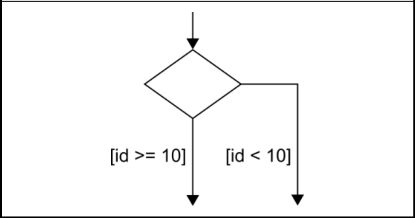 | Тег node с ключом dVertex,<br>принимающем значение<br>choice.<br>Геометрия элемента, задается<br>прямоугольником (rect) | <node id="choice id 1"><br>_ _<br><data key="dVertex">choice</data><br><data key="dGeometry"><br><rect x="250" y="100" width="100"<br>height="70"/><br></data><br></node> |
| Глубокая<br>история | 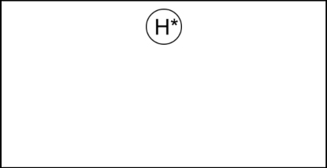 | Тег node с ключом dVertex,<br>принимающем значение<br>deepHistory.<br>Геометрия элемента, задается<br>точкой (point). Относится к<br>расширенной версии формата<br>CGML | <node id="n1"><br><data<br>key="dVertex">deepHistory</data><br><data key="dGeometry"><br><point x="100" y="200"/><br></data><br></node> |
| Завершение | 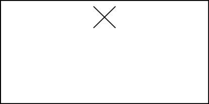 | Тег node с ключом dVertex,<br>принимающем значение<br>terminate.<br>Геометрия элемента, задается<br>точкой (point) | <node id="n term"><br>_<br><data<br>key="dVertex">terminate</data><br><data key="dGeometry"><br><point x="122.2" y="67.35"/><br></data><br></node> |

| Элемент ПРИМС в<br>диаграмме | Графическое обозначение | Представление в формате CGML | Фрагмент graphml-файла |
|---|---|---|---|
| Комментарий<br>без имени и с<br>именем<br>(человекочитаем<br>ый, без<br>предмета<br>комментировани<br>я) | 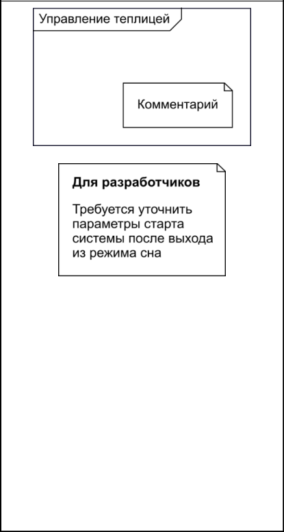 | Тег node с ключом dNote,<br>принимающем значение<br>informal, и ключем dName,<br>задающим имя элемента (при<br>наличии) и ключем dData,<br>задающем тело комментария<br>Геометрия элемента, задается<br>прямоугольником (rect) | <graph id="G" edgedefault="directed"><br><data key="dStateMachine"/><br><data key="dName">Управление<br>теплицей</data><br><node id="nComment"><br><data<br>key="dNote">informal</data><br><data<br>key="dData">Комментарий</data><br><data key="dGeometry"><br><rect x="100" y="100"<br>width="150" height="50"/><br></data><br></node><br>...<br></graph><br><node id="n22"><br><data key="dNote">informal</data><br><data key="dName">Для<br>разработчиков</data><br><data key="dData">Требуется<br>уточнить параметры старта системы<br>после выхода из режима сна</data><br><data key="dGeometry"><br><rect x="50.0" y="10.0"<br>width="300.0" height="200.0"/><br></data><br></node> |
| Комментарий<br>(машиночитаем<br>ый, без<br>предмета<br>комментиро- | 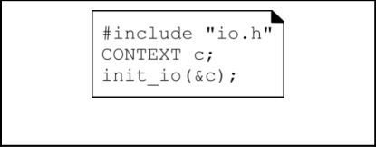 | Тег node с ключом dNote,<br>принимающем значение<br>formal.<br>Геометрия элемента, задается<br>прямоугольником (rect) | <node id="n init hal"><br>_ _<br><data key="dNote">formal</data><br><data key="dData">#include<br>&quot;io.h&quot;<br>CONTEXT c; |

| Элемент ПРИМС в<br>диаграмме | Графическое обозначение | Представление в формате CGML | Фрагмент graphml-файла |
|---|---|---|---|
| вания) |  |  | init io(&amp;c);</data><br>_<br><data key="dGeometry"><br><rect x="200" y="50" width="300"<br>height="100"/><br></data><br></node> |
| Комментарий к<br>элементу | 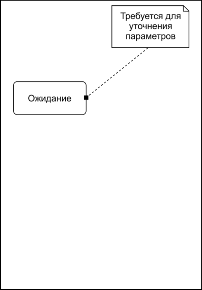 | Тег node с ключом dNote,<br>описывающий узел<br>комментария, и тег edge,<br>описывающий дугу в графе<br>между узлом комментария и<br>его предметом<br>комментирования, с ключом<br>dPivot без заданного<br>значения, связывающий узел<br>комментария с узлом<br>комментируемого элемента | <node id="n temp"><br>_<br><data key="dNote">informal</data><br><data key="dData">Требуется для<br>уточнения параметров</data><br><data key="dGeometry"><br><rect x="400" y="20" width="200"<br>height="100"/><br></data><br></node><br>...<br><node id="n1"><br><data key="dName">Ожидание</data><br><data key="dGeometry"><br><rect x="80" y="450" width="180"<br>height="80"/><br></data><br></node><br>...<br><edge id="n temp-n1" source="n temp"<br>_ _<br>target="n1"><br><data key="dPivot"/><br></edge> |

| Элемент ПРИМС в<br>диаграмме | Графическое обозначение | Представление в формате CGML | Фрагмент graphml-файла |
|---|---|---|---|
| Комментарий к<br>фрагменту | 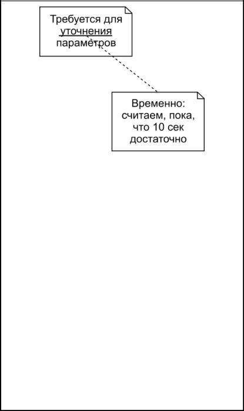 | Тег node с ключом dNote,<br>описывающий узел<br>комментария, и тег edge,<br>описывающий дугу в графе<br>между узлом комментария и<br>его предметом<br>комментирования, с ключом<br>dPivot со значением dData,<br>связывающий узел<br>комментария с конкретной<br>частью комментируемого<br>элемента, указанной в<br>дополнительном ключе<br>dChunk | <node id="nc1"><br><data key="dNote">informal</data><br><data key="dData">Требуется для<br>уточнения параметров</data><br><data key="dGeometry"><br><rect x="150" y="20" width="200"<br>height="100"/><br></data><br></node><br>...<br><node id="nc2"><br><data key="dNote">informal</data><br><data key="dData">Временно:<br>считаем, пока, что 10 сек<br>достаточно</data><br><data key="dGeometry"><br><rect x="300" y="300" width="200"<br>height="150"/><br></data><br></node><br>...<br><edge id="e1" source="nc2"<br>target="nc1"><br><data key="dPivot">dData</data><br><data key="dChunk">уточнения</data><br></edge> |
| Конечное<br>состояние | 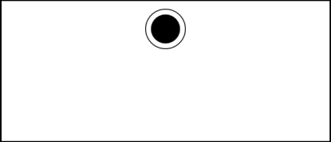 | Тег node с ключом dVertex,<br>принимающем значение<br>final.<br>Геометрия элемента, задается<br>точкой (point) | <node id="n1"><br><data key="dVertex">final</data><br><data key="dGeometry"><br><point x="10" y="10"/><br></data><br></node> |
| Локальная | 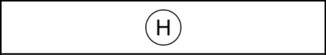 | Тег node с ключом dVertex, | <node id="n hist"><br>_ |

| Элемент ПРИМС в<br>диаграмме | Графическое обозначение | Представление в формате CGML | Фрагмент graphml-файла |
|---|---|---|---|
| история | 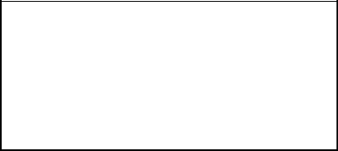 | принимающем значение<br>shallowHistory.<br>Геометрия элемента, задается<br>точкой (point). Относится к<br>расширенной версии формата<br>CGML | <data<br>key="dVertex">shallowHistory</data><br><data key="dGeometry"><br><point x="10.0" y="20.0"/><br></data><br></node> |
| Машина<br>состояний | 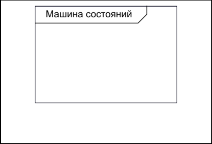 | Верхнеуровневый тег graph с<br>ключом dStateMachine и<br>заданной геометрией<br>прямоугольника (rect), если<br>машина состояния должна<br>быть видима на диаграмме | <graph id="G" edgedefault="directed"><br><data key="dStateMachine"/><br><data key="dName">Машина<br>состояний</data><br><data key="dGeometry"><br><rect x="100" y="100" width="150"<br>height="50"/><br></data><br>...<br></graph> |
| Начальное<br>псевдосостояние | 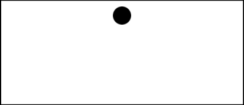 | Тег node с ключом dVertex,<br>принимающем значение<br>initial.<br>Геометрия элемента, задается<br>точкой (point) | <node id="init"><br><data key="dVertex">initial</data><br><data key="dGeometry"><br><point x="70.0" y="200.0"/><br></data><br></node> |
| Область | 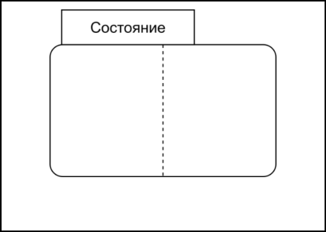 | Тег node без специальных<br>ключей. Имя состояния<br>задается ключом dName. Блок<br>декомпозиции включает одну<br>или более областей, каждая<br>из которых определяется<br>тегом graph для подграфа с<br>ключом dRegion,<br>включающего узлы, задающие<br>дочерние элементы области. | <node id="n0"><br><data key="dName">Состояние</data><br><data key="dGeometry"><br><rect x="10.0" y="10.0"<br>width="500.0" height="300.0"/><br></data><br><graph id="n0::"><br><data key="dRegion"/><br><data key="dGeometry"><br><rect x="0.0" y="0.0" |

| Элемент ПРИМС в<br>диаграмме | Графическое обозначение | Представление в формате CGML | Фрагмент graphml-файла |
|---|---|---|---|
| 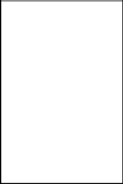 | 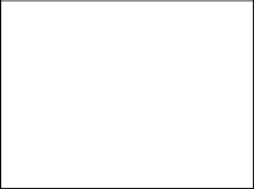 | Геометрия области, задается<br>прямоугольником (rect) | width="250.0" height="300.0"/><br></data><br></graph><br><graph id="n0::2"><br><data key="dRegion"/><br><data key="dGeometry"><br><rect x="250.0" y="0.0"<br>width="250.0" height="300.0"/><br></data><br></graph><br></node> |
| Объединение | 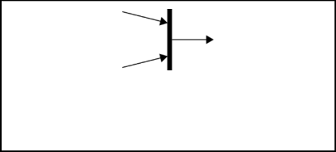 | Тег node с ключом dVertex,<br>принимающем значение join.<br>Геометрия элемента, задается<br>точкой (point). Относится к<br>будущим версиям формата<br>CGML | <node id="init"><br><data key="dVertex">join</data><br><data key="dGeometry"><br><point x="506.0" y="110.0"/><br></data><br></node> |
| Простое<br>состояние,<br>представленное<br>только именем | 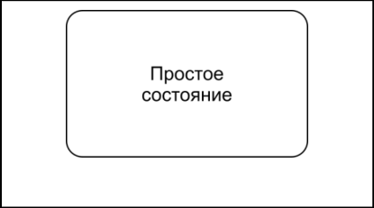 | Тег node без специальных<br>ключей. Имя состояния<br>задается ключом dName.<br>Геометрия элемента, задается<br>прямоугольником (rect) | <node id="n2::n1"><br><data key="dName">Простое<br>состояние</data><br><data key="dGeometry"><br><rect x="10" y="10" width="500"<br>height="250"/><br></data><br></node> |
| Простое<br>состояние с<br>блоками<br>внутреннего<br>поведения и<br>внутренних<br>переходов | 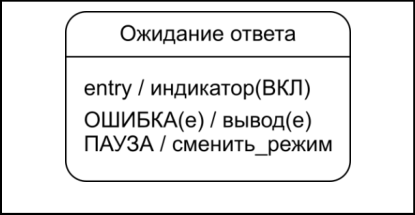 | Тег node без специальных<br>ключей. Имя состояния<br>задается ключом dName.<br>Блоки внутреннего поведения<br>и внутренних переходов<br>задаются ключом dData.<br>Геометрия элемента, задается | <node id="n1"><br><data key="dName">Ожидание<br>ответа</data><br><data key="dData">entry/<br>индикатор(ВКЛ)<br>ОШИБКА(е) / вывод(е) |

| Элемент ПРИМС в<br>диаграмме | Графическое обозначение | Представление в формате CGML | Фрагмент graphml-файла |
|---|---|---|---|
| 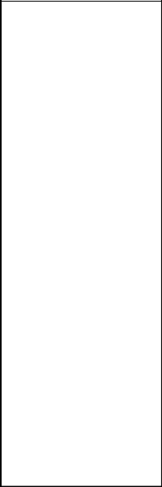 | 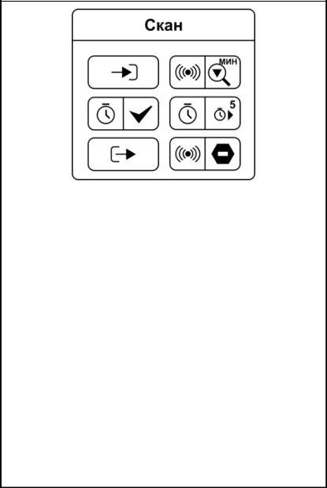 | прямоугольником (rect) | ПАУЗА / сменить режим</data><br>_<br><data key="dGeometry"><br><rect x="10" y="10" width="500"<br>height="250"/><br></data><br></node><br><node id="n2"><br><data key="dName">Скан</data><br><data key="dData">entry/<br>Сканер.ИскатьЦель(мин)<br>Таймер.Выполнен/<br>Таймер.Установить(5)<br>exit/<br>Сканер.Стоп()</data><br><data key="dGeometry"><br><rect x="10" y="10" width="400"<br>height="380"/><br></data><br></node> |
| Разветвление | 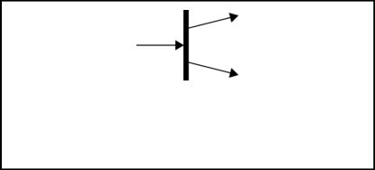 | Тег node с ключом dVertex,<br>принимающем значение fork.<br>Геометрия элемента, задается<br>точкой (point).<br>Относится к будущим версиям<br>формата CGML | <node id="init"><br><data key="dVertex">fork</data><br><data key="dGeometry"><br><point x="80.0" y="110.0"/><br></data><br></node> |

| Элемент ПРИМС в<br>диаграмме | Графическое обозначение | Представление в формате CGML | Фрагмент graphml-файла |
|---|---|---|---|
| Составное<br>состояние | 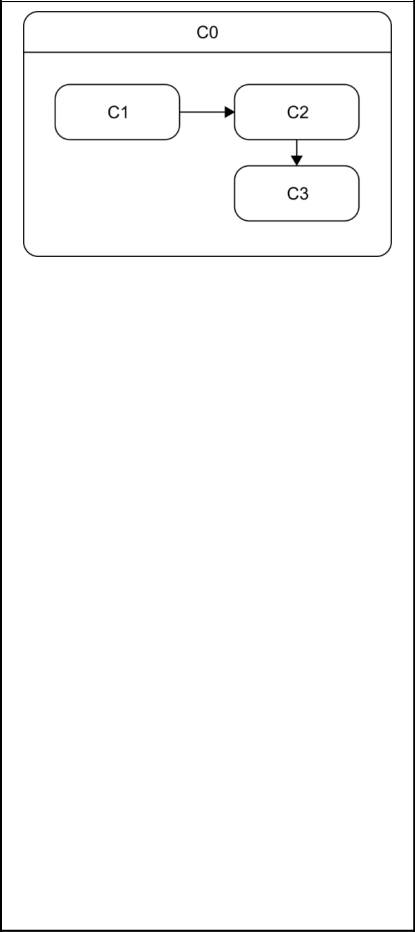 | Тег node без специальных<br>ключей. Имя состояния<br>задается ключом dName. Блок<br>декомпозиции определяется<br>тегом graph для подграфа с<br>ключом dRegion,<br>включающего узлы, задающие<br>дочерние элементы. Дуги,<br>заданные тегами edge и<br>принадлежащие подграфу,<br>описываются вместе со всеми<br>остальными дугами в конце<br>описания графа узла машины<br>состояний.<br>Геометрия элемента, задается<br>прямоугольником (rect) | <node id="n0"><br><data key="dName">C0</data><br><data key="dGeometry"><br><rect x="10.0" y="10.0"<br>width="500.0" height="300.0"/><br></data><br><graph id="n0::"><br><data key="dRegion"/><br><data key="dGeometry"><br><rect x="10.0" y="50.0"<br>width="450.0" height="240.0"/><br></data><br><node id="n0::n1"><br><data key="dName">C1</data><br><data key="dGeometry"><br><rect x="20.0" y="75.0"<br>width="150.0" height="50.0"/><br></data><br></node><br><node id="n0::n2"><br><data key="dName">C2</data><br><data key="dGeometry"><br><rect x="270.0" y="75.0"<br>width="150.0" height="50.0"/><br></data><br></node><br><node id="n0::n3"><br><data key="dName">C3</data><br><data key="dGeometry"><br><rect x="270.0" y="150.0"<br>width="150.0" height="50.0"/><br></data><br></node><br></graph><br></node> |

| Элемент ПРИМС в<br>диаграмме | Графическое обозначение | Представление в формате CGML | Фрагмент graphml-файла |
|---|---|---|---|
| 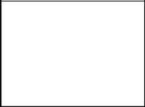 | 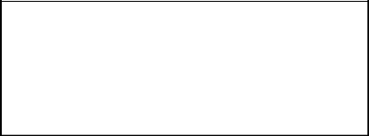 | 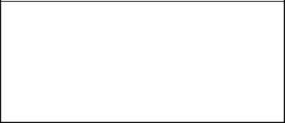 | ...<br><edge id="e1" source="n0::n1"<br>target="n0::n2"/><br><edge id="e2" source="n0::n2"<br>target="n0::n3"/> |
| Составное<br>состояние со<br>скрытым блоком<br>декомпозиции (c<br>вариантами<br>символа<br>декомпозиции) | 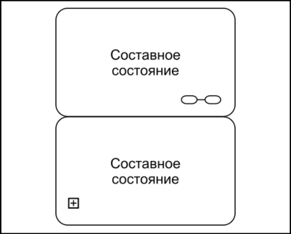 | Тег node со специальным<br>ключом dCollapsed. Имя<br>состояния задается ключом<br>dName.<br>Геометрия элемента, задается<br>прямоугольником (rect).<br>Относится к расширенной<br>версии формата CGML | <node id="n1"><br><data key="dName">Составное<br>состояние</data><br><data key="dCollapsed"/><br><data key="dGeometry"><br><rect x="10" y="10" width="500"<br>height="250"/><br></data><br></node> |
| Состояние с<br>вложенной<br>машиной<br>состояний | 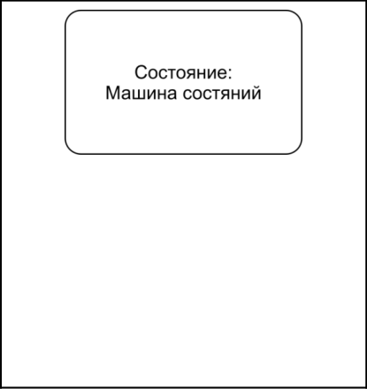 | Тег node со ключом<br>dSubmachineState, значение<br>которого указывает на<br>описание вложенной машины<br>состояний (URL или<br>идентификатор внутри<br>документа). Имя состояния<br>задается ключом dName.<br>Геометрия элемента, задается<br>прямоугольником (rect).<br>Относится к расширенной<br>версии формата CGML | ...<br><node id="SM implementation"><br>_<br><data key="dSubmachineState">Машина<br>состояний</data><br><data key="dName">Состояние</data><br><data key="dGeometry"><br><rect x="10" y="10" width="500"<br>height="250"/><br></data><br></node><br>...<br></graph><br><graph id="SM"<br>edgedefault="directed"><br><data key="dStateMachine"/> |

| Элемент ПРИМС в<br>диаграмме | Графическое обозначение | Представление в формате CGML | Фрагмент graphml-файла |
|---|---|---|---|
| 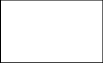 |  | 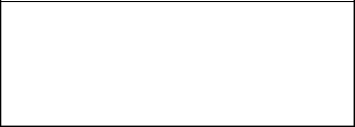 | <data key="dName">Машина<br>состояний</data><br>...<br></graph> |
| Точка входа | 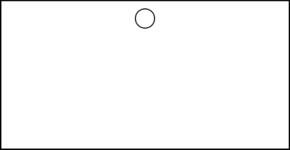 | Тег node с ключом dVertex,<br>принимающем значение<br>entryPoint.<br>Геометрия элемента, задается<br>точкой (point). Относится к<br>расширенной версии формата<br>CGML | <node id="init"><br><data<br>key="dVertex">entryPoint</data><br><data key="dGeometry"><br><point x="300.0" y="100.0"/><br></data><br></node> |
| Точка выхода | 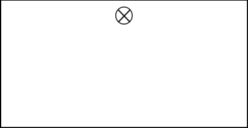 | Тег node с ключом dVertex,<br>принимающем значение<br>exitPoint.<br>Геометрия элемента, задается<br>точкой (point). Относится к<br>расширенной версии формата<br>CGML | <node id="init"><br><data<br>key="dVertex">exitPoint</data><br><data key="dGeometry"><br><point x="300.0" y="100.0"/><br></data><br></node> |
| Переход | 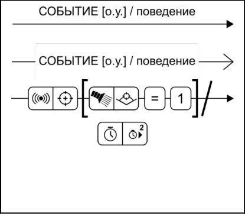 | Тег edge, описывающий дугу в<br>графе, с ключем dData,<br>содержащем возможные<br>событие, ограждающее<br>условие или действия | <edge id="e1" source="n1"<br>target="n2"><br><data key="dData">СОБЫТИЕ [о.у.]/<br>поведение</data><br></edge><br><edge id="edge-n1-n2" source="n1"<br>target="n2"><br><data<br>key="dData">Сканер.ЦельОбнаружена<br>[Пылесос.ОбъектовВЗонеДействия = 1]/<br>Таймер.Установить(2)</data><br></edge> |

## Приложение Г

(справочное)
Примеры диаграмм ПРИМС и соответствующих документов CGML

### Г.1 Минимально допустимый документ

Приведенный пример описывает минимально допустимый документ с пустой машиной
состояний.

```xml
<?xml version="1.0" encoding="UTF-8"?>
<graphml xmlns="http://graphml.graphdrawing.org/xmlns">

  <data key="gFormat">Cyberiada-GraphML-1.0</data>

  <key id="gFormat" for="graphml" attr.name="format" attr.type="string"/>
  <key id="dName" for="node" attr.name="name" attr.type="string"/>
  <key id="dStateMachine" for="graph" attr.name="stateMachine"
attr.type="string"/>
  <key id="dNote" for="node" attr.name="note" attr.type="string"/>
  <key id="dData" for="node" attr.name="data" attr.type="string"/>

  <graph id="g" edgedefault="directed">
    <data key="dStateMachine"/>
    <data key="dName">State Machine</data>
    <node id="nMeta">
      <data key="dNote">formal</data>
      <data key="dName">CGML_META</data>
      <data key="dData">standardVersion/1.0</data>
    </node>
  </graph>

</graphml>
```

### Г.2 Робот-пылесос

Приведенная схема является шаблоном поведения робота-пылесоса в игре «Академия»
Национальной киберфизической платформы «Берлога»: схема РИМС приведена на рисунке
ниже (рисунок Г.1). В документе используется базовый формат описания геометрии, узел
метаданных не отображается, поскольку не имеет геометрии.

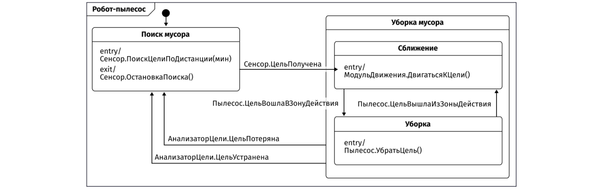

Рисунок Г.1 – Шаблон поведения робота-пылесоса

```xml
<?xml version="1.0" encoding="UTF-8"?>
<graphml xmlns="http://graphml.graphdrawing.org/xmlns">

<data key="gFormat">Cyberiada-GraphML-1.0</data>

<key id="gFormat" for="graphml" attr.name="format" attr.type="string"/>
<key id="dName" for="graph" attr.name="name" attr.type="string"/>
<key id="dName" for="node" attr.name="name" attr.type="string"/>
<key id="dStateMachine" for="graph" attr.name="stateMachine"
attr.type="string"/>
<key id="dRegion" for="graph" attr.name="region" attr.type="string"/>
<key id="dSubmachineState" for="node" attr.name="submachineState"
attr.type="string"/>
<key id="dGeometry" for="graph" attr.name="geometry"/>
<key id="dGeometry" for="node" attr.name="geometry"/>
<key id="dGeometry" for="edge" attr.name="geometry"/>
<key id="dSourcePoint" for="edge" attr.name="sourcePoint"/>
<key id="dTargetPoint" for="edge" attr.name="targetPoint"/>
<key id="dLabelGeometry" for="edge" attr.name="labelGeometry"/>
<key id="dNote" for="node" attr.name="note" attr.type="string"/>
<key id="dVertex" for="node" attr.name="vertex" attr.type="string"/>
<key id="dData" for="node" attr.name="data" attr.type="string"/>
<key id="dData" for="edge" attr.name="data" attr.type="string"/>
<key id="dPivot" for="edge" attr.name="pivot" attr.type="string"/>
<key id="dChunk" for="edge" attr.name="chunk" attr.type="string"/>
<key id="dMarkup" for="node" attr.name="markup" attr.type="string"/>
<key id="dColor" for="node" attr.name="color" attr.type="string"/>
<key id="dColor" for="edge" attr.name="color" attr.type="string"/>
<key id="dFormalName" for="graph" attr.name="formalName"
attr.type="string"/>
<key id="dFormalName" for="node" attr.name="formalName"
attr.type="string"/>

<graph id="G" edgedefault="directed">
  <data key="dStateMachine"/>
  <data key="dName">Робот-пылесос</data>
  <data key="dGeometry">
    <rect x="0.0" y="0.0" width="270.0" height="115.0"/>
  </data>

  <node id="nMeta">
    <data key="dNote">formal</data>
    <data key="dName">CGML_META</data>
    <data key="dData">platform/ BerlogaAcademyHoover

standardVersion/ 1.0

geometry/ short

name/ Стандартный пылесос

author/ Матросов В.М.

contact/ matrosov@mail.ru

description/ Пример описания схемы, который может быть многострочным,
потому что так удобнее

target/ Hoover</data>
  </node>

  <node id="init">
    <data key="dVertex">initial</data>
    <data key="dGeometry">
      <point x="50.0" y="7.0"/>
</data>
  </node>

  <node id="n0">
<data key="dName">Уборка мусора</data>
    <data key="dGeometry">
      <rect x="150.0" y="8.0" width="115.0" height="102.0"/>
    </data>
    <graph id="n0::">
      <data key="dRegion"/>
      <data key="dGeometry">
        <rect x="0.0" y="10.0" width="115.0" height="92.0"/>
</data>
      <node id="n0::n1">
        <data key="dName">Сближение</data>
        <data key="dData">entry/
МодульДвижения.ДвигатьсяКЦели()
</data>
<data key="dGeometry">
          <rect x="6.0" y="7.0" width="104.0" height="30.0" />
</data>
      </node>

      <node id="n0::n2">
        <data key="dName">Уборка</data>
        <data key="dData">entry/
Пылесос.УбратьЦель()
</data>
        <data key="dGeometry">
          <rect x="6.0" y="53.0" width="104.0" height="30.0" />
</data>
      </node>
    </graph>
  </node>

  <node id="n3">
<data key="dName">Скан</data>
    <data key="dData">entry/
Сенсор.ПоискЦелиПоДистанции(мин)

exit/
Сенсор.ОстановкаПоиска()
</data>
    <data key="dGeometry">
      <rect x="4.0" y="17.0" width="92.0" height="40.0"/>
    </data>
  </node>

  <edge id="init-n3" source="init" target="n3"/>
  <edge id="n0-n3" source="n0" target="n3">
    <data key="dData">АнализаторЦели.ЦельУстранена</data>
  </edge>
  <edge id="n0-n3" source="n0" target="n3">
    <data key="dData">АнализаторЦели.ЦельПотеряна</data>
  </edge>
<edge id="n3-n0::n1" source="n3" target="n0::n1">
    <data key="dData">Сенсор.ЦельПолучена</data>
</edge>
<edge id="n0::n1-n0::n2" source="n0::n1" target="n0::n2">
    <data key="dData">ОружиеЦелевое.ЦельВошлаВЗонуДействия</data>
</edge>
<edge id="n0::n2-n0::n1" source="n0::n2" target="n0::n1">
    <data key="dData">ОружиеЦелевое.ЦельВышлаИзЗоныДействия</data>
</edge>

</graph>
</graphml>
```

### Г.3 Мигалка на Ардуино

Данный пример содержит документ с описанием диаграммы ПРИС, которая реализует
1)
простую логику работы платы Arduino Uno (рисунок Г.2). В документе используется базовый
формат описания геометрии, а также расширения, связанные с описанием динамических
компонентов (см. 10.3).

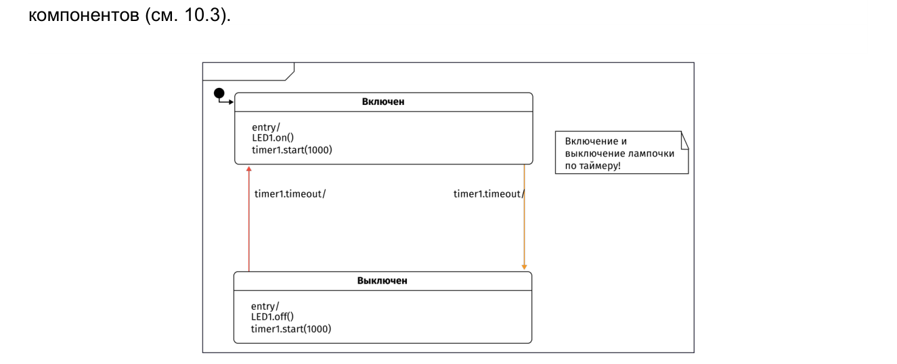

Рисунок Г.2 - Логика работы платы Arduino Uno

```xml
<?xml version="1.0" encoding="UTF-8"?>
<graphml xmlns="http://graphml.graphdrawing.org/xmlns">

<data key="gFormat">Cyberiada-GraphML-1.0</data>

<key id="gFormat" for="graphml" attr.name="format" attr.type="string"/>
<key id="dName" for="graph" attr.name="name" attr.type="string"/>
<key id="dName" for="node" attr.name="name" attr.type="string"/>
<key id="dStateMachine" for="graph" attr.name="stateMachine"
attr.type="string"/>
```

1)1)1)1)1)

Серия микроконтроллерных плат с открытым исходным кодом, основанных на широком спектре
микроконтроллеров.

```xml
<key id="dRegion" for="graph" attr.name="region" attr.type="string"/>
<key id="dSubmachineState" for="node" attr.name="submachineState"
attr.type="string"/>
<key id="dGeometry" for="graph" attr.name="geometry"/>
<key id="dGeometry" for="node" attr.name="geometry"/>
<key id="dGeometry" for="edge" attr.name="geometry"/>
<key id="dSourcePoint" for="edge" attr.name="sourcePoint"/>
<key id="dTargetPoint" for="edge" attr.name="targetPoint"/>
<key id="dLabelGeometry" for="edge" attr.name="labelGeometry"/>
<key id="dNote" for="node" attr.name="note" attr.type="string"/>
<key id="dVertex" for="node" attr.name="vertex" attr.type="string"/>
<key id="dData" for="node" attr.name="data" attr.type="string"/>
<key id="dData" for="edge" attr.name="data" attr.type="string"/>
<key id="dPivot" for="edge" attr.name="pivot" attr.type="string"/>
<key id="dChunk" for="edge" attr.name="chunk" attr.type="string"/>
<key id="dMarkup" for="node" attr.name="markup" attr.type="string"/>
<key id="dColor" for="node" attr.name="color" attr.type="string"/>
<key id="dColor" for="edge" attr.name="color" attr.type="string"/>
<key id="dFormalName" for="graph" attr.name="formalName"
attr.type="string"/>
<key id="dFormalName" for="node" attr.name="formalName"
attr.type="string"/>

<graph id="G" edgedefault="directed">
  <data key="dStateMachine"/>
  <data key="dName">Arduino Blinker</data>
  <node id="coreMeta">
    <data key="dNote">formal</data>
    <data key="dName">CGML_META</data>
    <data key="dData">platform/ ArduinoUno

geometry/ short

standardVersion/ 1.0

name/ Arduino Blinker

author/ Lapki IDE TEAM

description/ Включение и выключение лампочки по таймеру
</data>
  </node>
  <node id="cLED1">
    <data key="dNote">formal</data>
    <data key="dName"> CGML_COMPONENT </data>
    <data key="dData">id/ LED1

type/ LED

name/ Светодиод

description/ Встроенный в плату светодиод, чтобы им мигать

pin/ 12
</data>
  </node>
  <node id="ctimer1">
    <data key="dNote">formal</data>
    <data key="dName"> CGML_COMPONENT </data>
    <data key="dData">id/ timer1

type/ Timer

name/ Таймер

description/ Программный таймер.
</data>
  </node>

  <node id="init">
    <data key="dVertex">initial</data>
    <data key="dGeometry">
      <point x="72" y="37"/>
    </data>
  </node>

   <node id="diod1">
    <data key="dName">Включен</data>
    <data key="dData">entry/
LED1.on()
timer1.start(1000)
</data>
    <data key="dGeometry">
      <rect x="82" y="57" width="450.0" height="95"/>
    </data>
  </node>

  <node id="diod2">
    <data key="dName">Выключен</data>
    <data key="dData">entry/
LED1.off()
timer1.start(1000)
</data>
    <data key="dGeometry">
      <rect x="81" y="334" width="450" height="95" />
    </data>
  </node>

  <node id="commentX">
<data key="dNote">informal</data>
    <data key="dData"> Включение и выключение лампочки по таймеру! </data>
    <data key="dGeometry">
      <point x="640" y="114" />
    </data>
  </node>

  <edge id="init-edge" source="init" target="diod1"/>
  <edge id="edge3" source="diod1" target="diod2">
    <data key="dData">timer1.timeout/</data>
    <data key="dColor">#F29727</data>
    <data key="dLabelGeometry">
      <point x="457" y="173"/>
    </data>
  </edge>

  <edge id="edge4" source="diod2" target="diod1">
    <data key="dData">timer1.timeout/</data>
    <data key="dLabelGeometry">
      <point x="16" y="175"/>
    </data>
    <data key="dColor">#F24C3D</data>
</edge>

</graph>
</graphml>
```

### Г.4 Пример диаграммы с расширенной геометрией

В этом примере представлена диаграмма ПРИМС со сложной геометрией, которую
можно использовать для проверки корректности кодирования/декодирования формата CGML.
В примере используется расширенный формат описания геометрии.

На схемах примера представлена иерархическая диаграмма с указанием координат
геометрических объектов как в абсолютных координатах, так и в относительных координатах –
в соответствии со стандартом Cyberiada-GraphML-1.0. Пунктиром обозначается область в
составном состоянии.

Эта диаграмма содержит составные и простые состояние, начальное псевдосостояние и
набор переходов (рисунки Г.3, Г.4). В документе геометрия описана в расширенном формате.
Пример позволяет проверить реализацию вложенных состояний и геометрию дуг.

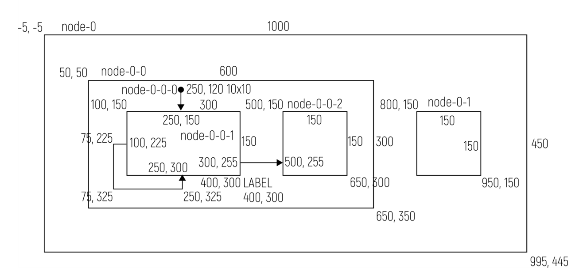

Рисунок Г.3 –. Диаграмма с составными и простыми состояниями, начальными

псевдосостояниями и набором переходов.

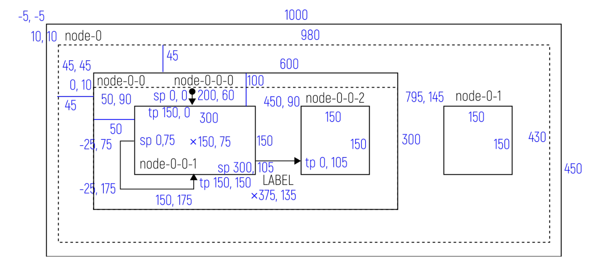

Рисунок Г.4 –. Диаграмма с составными и простыми состояниями, начальными

псевдосостояниями и набором переходов.

Документ, описывающий данную диаграмму:

```xml
<?xml version="1.0" encoding="UTF-8"?>
<graphml xmlns="http://graphml.graphdrawing.org/xmlns">
  <data key="gFormat">Cyberiada-GraphML-1.0</data>
  <key id="gFormat" for="graphml" attr.name="format" attr.type="string"/>
  <key id="dName" for="graph" attr.name="name" attr.type="string"/>
  <key id="dName" for="node" attr.name="name" attr.type="string"/>
  <key id="dStateMachine" for="graph" attr.name="stateMachine"
attr.type="string"/>
  <key id="dRegion" for="graph" attr.name="region" attr.type="string"/>
  <key id="dSubmachineState" for="node" attr.name="submachineState"
attr.type="string"/>
  <key id="dGeometry" for="graph" attr.name="geometry"/>
  <key id="dGeometry" for="node" attr.name="geometry"/>
  <key id="dGeometry" for="edge" attr.name="geometry"/>
  <key id="dSourcePoint" for="edge" attr.name="sourcePoint"/>
  <key id="dTargetPoint" for="edge" attr.name="targetPoint"/>
  <key id="dLabelGeometry" for="edge" attr.name="labelGeometry"/>
  <key id="dNote" for="node" attr.name="note" attr.type="string"/>
  <key id="dVertex" for="node" attr.name="vertex" attr.type="string"/>
  <key id="dData" for="node" attr.name="data" attr.type="string"/>
  <key id="dData" for="edge" attr.name="data" attr.type="string"/>
  <key id="dPivot" for="edge" attr.name="pivot" attr.type="string"/>
  <key id="dChunk" for="edge" attr.name="chunk" attr.type="string"/>
  <key id="dCollapsed" for="node" attr.name="collapsed"
attr.type="string"/>
  <key id="dMarkup" for="node" attr.name="markup" attr.type="string"/>
  <key id="dColor" for="node" attr.name="color" attr.type="string"/>
  <key id="dColor" for="edge" attr.name="color" attr.type="string"/>
  <key id="dFormalName" for="graph" attr.name="formalName"
attr.type="string"/>
  <graph id="G" edgedefault="directed">
    <data key="dStateMachine"/>
    <data key="dName">SM-0</data>
    <node id="nMeta">
      <data key="dNote">formal</data>
      <data key="dName">CGML_META</data>
      <data key="dData">standardVersion/ 1.0

geometry/ full

name/ test-geometry-1

transitionOrder/ actionFirst

eventPropagation/ block</data>
    </node>
    <node id="node-0">
      <data key="dName">node 0</data>
      <data key="dGeometry">
        <rect x="-5.0" y="-5.0" width="1000.0" height="450.0"/>
      </data>
      <graph id="node-0:" edgedefault="directed">
        <data key="dRegion"/>
        <data key="dGeometry">
          <rect x="10.0" y="10.0" width="980.0" height="430.0"/>
        </data>
        <node id="node-0-0">
          <data key="dName">node 0-0</data>
          <data key="dGeometry">
            <rect x="45.0" y="45.0" width="600.0" height="300.0"/>
          </data>
          <graph id="node-0-0:" edgedefault="directed">
            <data key="dRegion"/>
            <data key="dGeometry">
              <rect x="0.0" y="10.0" width="600.0" height="290.0"/>
            </data>
            <node id="node-0-0-0">
              <data key="dVertex">initial</data>
              <data key="dGeometry">
                <point x="200.0" y="70.0"/>
</data>
            </node>
            <node id="node-0-0-1">
<data key="dName">node 0-0-1</data>
              <data key="dGeometry">
                <rect x="50.0" y="90.0" width="300.0" height="150.0"/>
</data>
            </node>
            <node id="node-0-0-2">
<data key="dName">node 0-0-2</data>
              <data key="dGeometry">
                <rect x="450.0" y="90.0" width="150.0" height="150.0"/>
              </data>
            </node>
          </graph>
        </node>
        <node id="node-0-1">
          <data key="dName">node 0-1</data>
          <data key="dGeometry">
            <rect x="795.0" y="145.0" width="150.0" height="150.0"/>
          </data>
        </node>
      </graph>
    </node>
    <edge id="edge-0" source="node-0-0-1" target="node-0-0-1">
      <data key="dGeometry">
        <point x="-25.0" y="75.0"/>
        <point x="-25.0" y="175.0"/>
        <point x="150.0" y="175.0"/>
      </data>
      <data key="dSourcePoint">
         <point x="0.0" y="75.0"/>
      </data>
      <data key="dTargetPoint">
         <point x="150.0" y="150.0"/>
      </data>
    </edge>
    <edge id="edge-1" source="node-0-0-0" target="node-0-0-1">
      <data key="dSourcePoint">
        <point x="0.0" y="0.0"/>
      </data>
      <data key="dTargetPoint">
        <point x="150.0" y="0.0"/>
      </data>
    </edge>
    <edge id="edge-2" source="node-0-0-1" target="node-0-0-2">
      <data key="dData">LABEL</data>
      <data key="dSourcePoint">
        <point x="300.0" y="105.0"/>
      </data>
      <data key="dTargetPoint">
        <point x="0.0" y="105.0"/>
      </data>
      <data key="dLabelGeometry">
        <point x="375.0" y="135.0"/>
      </data>
    </edge>
  </graph>
</graphml>
```

## Библиография

[1] Основы событийного программирования и программирования расширенных

иерархических машин состояний (ПРИМС) / А.И. Воеводина, И.Г. Воеводин,

Е.С. Цырульников, К.А. Шумак; Ассоциация участников технологических

кружков, Национальная киберфизическая платформа. – Астрахань, Москва,

Уфа, 2024 – 63 с.
[2] Bazydło G. Designing Reconfigurable Cyber-Physical Systems Using Unified

Modeling Language // Energies. — 2023. — Т. 16. — №. 3.
[3] Feng Q. Algorithms for drawing clustered graphs. – Australia : University of

Newcastle, 1997.
УДК 004.85 ОКС 35.020
Ключевые слова: системы киберфизические, национальная киберфизическая платформа,
расширенная иерархическая машина состояний, РИМС
Руководитель разработки:
Президент Ассоциации участников
технологических кружков А.И.Федосеев
