# Системы киберфизические. Национальная киберфизическая платформа. Часть 3. Программирование расширенных иерархических машин состояний

**English title:** Cyber-physical systems. National Cyber-Physical Platform. Extended
hierarchical state machine programming

**Ключевые слова:** системы киберфизические, национальная киберфизическая платформа,
расширенная иерархическая машина состояний, РИМС

## Введение

Данный стандарт описывает подход к программированию и разработке киберфизических систем,
применяемый в рамках национальной киберфизической платформы, и соответствующий ему
графический язык программирования, основанный на концепции расширенных иерархических машин
состояний [1]. Стандарт развивает парадигмы автоматного [2] и событийного программирования
[3] и позволяет описать в виде визуальной диаграммы машины состояний универсальные
программы управления системами, в т.ч. программируемыми электронными приборами и
киберфизическими системами, а также протоколы и общие алгоритмы поведения систем.

Представленный в стандарте язык диаграмм расширенных иерархических машин опирается на
схемы диаграмм состояний (statecharts), введенные Дэвидом Харелом [4] и формализованные в
рамках международного стандарта [5].

## 1 Область применения

Настоящий стандарт определяет графическое описание языка диаграмм расширенных
иерархических машин состояний. Диаграммы позволяют формально описать машины состояний с
необходимыми расширениями, что позволяет применять данный язык для создания широкого
класса системных и прикладных программ с целью последующего машинного исполнения или
автоматической трансляции как в языки программирования высокого уровня (такие как C/C++
или Python), так и в различные текстовые псевдоязыки. Настоящий стандарт может быть
применен при разработке пользовательских интерфейсов графического программирования,
системных библиотек и другого программного обеспечения, связанного с разработкой
киберфизических систем и управлением системами в целом.

## 2 Нормативные ссылки

В настоящем стандарте использована нормативная ссылка на следующий стандарт:

* ПНСТ 983–2024 Системы киберфизические. Национальная киберфизическая платформа. Термины и
  определения

## 3 Термины и определения

В настоящем стандарте применены термины по ПНСТ 983–2024, а также следующие термины с
соответствующими определениями:

3.1 **активное состояние (active state):** Состояние, включая родительские состояния, если
они есть, в котором находится машина состояний.

Примечание – После вхождения управления в состояние оно становится активным и остается
таковым до выхода управления из состояния.

3.2 **блок состояния (state block):** Составляющие графического представления состояния,
обеспечивающие визуальное различие имени состояния, его внутреннего поведения, внутренних
переходов, дочерних состояний и переходов (если они есть).

3.3 **вершина (vertex):** Вершина в ориентированном графе машины состояний.

Примечания:

1. К вершинам в машинах состояний относятся состояния и псевдосостояния.
2. В общем случае вершина может быть источником или целью любого количества переходов.

3.4 **внешний переход (external transition):** Переход, который подразумевает выход из
исходного состояния.

3.5 **внутренний переход (internal transition):** Переход, который не приводит к изменению
активного состояния.

Примечание – Внутренние переходы обозначаются в теле состояния.

3.6 **псевдосостояние выбора (choice pseudostate):** Псевдосостояние, реализующее в
диаграмме машины состояний динамическое разветвление с условием, проверка которого
подразумевает ограждающие условия на исходящих переходах.

3.7 **графический язык программирования (visual programming language):** Человекочитаемый
язык, предназначенный для написания программы для компьютера или вычислительного
устройства, который обеспечивает графическую визуализацию алгоритма и предваряет его
текстовое описание.

3.8 **псевдосостояние глубокой истории (deep history pseudostate):** Псевдосостояние,
позволяющее возвращаться в последнее активное подсостояние составного состояния и в
котором учитываются все подсостояния текущего состояния.

3.9 **завершающее псевдосостояние (terminate pseudostate):** Псевдосостояние, при переходе
в которое выполнение данной машины состояний немедленно завершается.

3.10 **исходное состояние (source state):** Состояние, которое было активным в машине
состояний до перехода.

3.11 **квалифицированное имя (qualified name):** Уникальный идентификатор элемента,
который конструируется из его собственного имени и имен родительских пространств имен,
содержащих данный элемент.

3.12 **комментарий (comment):** Специальный элемент с поясняющим текстом, который может
быть присоединен к другому элементу или множеству элементов.

Примечание – Комментарий дает возможность добавлять текстовые аннотации к элементам
диаграммы машины состояний.

3.13 **комментарий машиночитаемый (формальный) (machine-readable (formal) comment):**
Комментарий, предназначенный для автоматической обработки и интерпретации при машинной
реализации машины состояний.

Примечание – Машиночитаемые комментарии предназначены в том числе для хранения
метаинформации о диаграмме машины состояний.

3.14 **комментарий человекочитаемый (неформальный) (human-readable (informal)
comment):** Комментарий, предназначенный для чтения человеком или системой, работающей с
текстами на естественном языке.

Примечание – Человекочитаемый комментарий содержит информацию о содержании диаграммы или
процессе разработки, которая предназначена для разработчиков и пользователей диаграммы.

3.15 **конечное состояние (final state):** Состояние, переход в которое означает, что
охватывающая его область завершает выполнение.

Примечание – Если охватывающая область непосредственно содержится в машине состояний, а
все остальные области в машине состояний также завершены, это означает, что вся машина
состояний завершила работу.

3.16 **контекст исполнения (execution context):** Контекст, задающий условия исполнения
конкретной машины состояний и определяющий, какие события возможны в машине состояний и
какие действия могут реализовываться в рамках поведения элементов машины состояний.

3.17 **корневое пространство имен (root namespace):** Пространство имен, которое не
содержится ни в одном другом пространстве имен.

Примечание – Как правило это область, принадлежащая самой машине состояний.

3.18 **псевдосостояние локальной истории (shallow history):** Псевдосостояние, позволяющее
возвращаться в последнее активное подсостояние составного состояния и в котором не
учитываются изменения состояний внутри вложенных состояний данного состояния.

3.19 **локальный переход (local transition):** Переход, который не приводит к выходу из
составного родительского состояния, но может привести к выходу из состояний внутри
составного состояния.

Примечание – К таким переходам, например, относится переход из родительского состояния в
одно из своих дочерних состояний.

3.20 **расширенная иерархическая машина состояний; РИМС (extended hierarchical state
machine):** Расширенная версия конечных автоматов, включающая вложенность состояний и
использование переменных, используемая для описания поведения сложных систем и
программирования их реакции на внутренние и внешние события с использованием графического
представления.

Примечания

1. Машина состояний связана с целевой платформой и целевым языком, которым размечается
   поведение в машине состояний.
2 В рамках диаграмм машин состояний элемент «Машина состояний» содержит одну или несколько
   областей, которые, в свою очередь, содержат состояния и переходы. Экземпляр машины
   состояний связывается с определенным контекстом исполнения.

3.21 **наименьший общий предок (least common ancestor):** Наименьшее составное состояние,
которое является родительским состоянием (предком) одновременно и исходного, и целевого
состояний.

3.22 **начальное псевдосостояние (initial pseudostate):** Вершина, включаемая в машину
состояний или составное состояние, обозначающая начало исполнения данной машины состояний
или состояния.

Примечание – Переход из начального псевдосостояния приводит в начальное состояние.

3.23 **начальное состояние (initial state):** Состояние, которое становится активным при
запуске машины состояний или при входе в составное состояние.

Примечание – Не следует путать с начальным псевдосостоянием.

3.24 **область (region):** Фрагмент машины состояний или составного состояния, включающий
состояния и переходы.

Примечание – Если машина состояний или составное состояние содержит более одной области,
эти области называют ортогональными (см. 3.27).

3.25 **псевдосостояние объединения (join pseudostate):** Псевдосостояние для объединения
нескольких переходов, исходящих из вершин в разных ортогональных областях.

3.26 **ограждающее условие (guard condition):** Условие, которое позволяет управлять
запуском перехода, указывается на переходе и проверяется в момент возникновения события,
связанного с данным переходом.

Примечание – Если в момент возникновения события, связанного с данным переходом,
ограждающее условие имеет значение Истина, переход разрешается и происходит; в противном
случае переход запрещается.

3.27 **ортогональные области (orthogonal regions):** Две или более области, в которых
поведение машины состояний не оказывает влияние на другие области в этом наборе.

Примечание – Ортогональные области моделируют независимое («параллельное») исполнение
составляющих машины состояний.

3.28 **отложенное событие (deferred event):** Событие с возможностью отсрочки его
обработки в машине состояний.

3.29 **парадигма программирования (programming paradigm):** Совокупность идей и понятий,
определяющих стиль написания компьютерных программ (подход к программированию), набор
концептов, определяющий организацию вычислений и структурирование работы, выполняемой
компьютером.

3.30 **переход (transition):** Направленная связь между исходной вершиной и целевой
вершиной.

Примечания:

1. Переход может быть частью составного перехода, который переводит машину состояний из
   одного состояния в другое, позволяя машине состояний совершать действия в ответ на
   возникновение определенных событий.
2. В частном случае переход может не приводить к изменению активного состояния (см. 3.5).

3.31 **переход завершения (completion transition):** Неявный переход, выполняемый при
завершении состояния.

3.32 **поведение (behavior):** Форма описания действий, которые совершает машина
состояний.

Примечание – Поведение связано с определенным для машины состояний языком целевой
платформы: псевдокодом или кодом на языке программирования, который должен исполниться в
момент запуска данного поведения.

3.33 **поведение входа (entry behavior (entry activity)):** Опциональное поведение в
рамках состояний, которое выполняется всякий раз, когда происходит вход в это состояние,
независимо от перехода, по которому это состояние было достигнуто.

Примечание – Если определено, действия входа всегда выполняются до выполнения любого
внутреннего поведения или переходов, выполняемых в пределах состояния.

3.34 **поведение выхода (exit behavior (exit activity)):** Опциональное поведение, которое
выполняется всякий раз, когда происходит выход из этого состояния, независимо от того,
какой по какому переходу был выход из этого состояния.

Примечание – Если определено, действия выхода всегда выполняются только после завершения
выполнения всех внутренних действий и действий перехода.

3.35 **поведение исполнения (do behavior (do activity)):** Опциональное поведение, которое
выполняется, когда состояние активно, начинается при входе в это состояние и
останавливается в зависимости от того, что наступит раньше, либо при завершении поведения,
либо при выходе из состояния.

3.36 **порядок выполнения перехода (transition order):** Вариант конфигурации машины
состояний, задающий порядок по умолчанию для выполнения действий на внешних переходах
сразу после проверки ограждающего условия или после выхода из исходного состояния.

3.37 **процедура передачи событий между уровнями (event propagation procedure):** Вариант
конфигурации машины состояний, задающий порядок по умолчанию для обработки событий,
обработанных в дочерних состояниях, и определяющий, необходимо ли передавать на более
высокие уровни иерархии состояний обработанное событие или необходимо его блокировать.

3.38 **предмет комментирования (subject of the comment):** Часть комментария, связывающая
комментарий с элементом или другой составляющей (например, текстом состояния или
комментария) диаграммы, которая сопровождается данным комментарием.

3.39 **программирование расширенных иерархических машин состояний (extended hierarchical
state machine programming):** Программирование посредством создания и исполнения диаграмм
машин состояний.

3.40 **простое состояние (simple state):** Состояние, у которого нет дочерних состояний, в
т.ч. областей и вложенных машин состояний.

3.41 **пространство имен (namespace):** Элемент машины состояний, который объединяет
другие элементы, идентифицируемые по имени.

3.42 **псевдосостояние (pseudostate):** Общее описание набора типов вершин в графе машины
состояний, которые выполняют функции, связанные с переходами в машине состояний.

Примечание – Семантика и графическое представление псевдосостояния зависит от его
конкретного типа.

3.43 **псевдосостояние разветвления (fork pseudostate):** Псевдосостояние для разделения
входящего перехода на два или более переходов, заканчивающихся в ортогональных областях.

3.44 **событие (event, trigger):** Описание происшествия в рамках машины состояний,
влияющие на ее поведение.

Примечания:

1. Событие (event) потенциально может стать источником (trigger) срабатывающих переходов
   машины состояний.
2. В машине состояний все события глобальны и различимы по имени.

3.45 **событие завершения (completion event):** Событие, запускающее переход завершения.

3.46 **составное состояние (composite state):** Состояние, которое либо содержит одну
область, либо распадается на две или более ортогональных области.

Примечание – Каждая такая область может иметь набор дочерних вершин и переходов.

3.47 **составной переход (compound transition):** Один или несколько переходов в графе
машин состояний, вместе представляющих собой семантически завершенный путь, исходящих из
набора состояний и нацеленных на некий набор состояний.

3.48 **состояние (state):** Ситуация в машине состояний, в течение которой выполняется
некоторое внешнее условие, которое может быть неявным.

Примечания:

1. Пока машина состояний находится в каком-то состоянии, внешних событий нет, или они игнорируются.
2. Из перехода между состояниями складывается процесс исполнения машины состояний.

3.49 **состояние с вложенной машиной состояний (submachine state):** Состояние,
представляющее собой выполняющийся экземпляр определенной в другом месте машины состояний.

3.50 **псевдосостояние точки входа (entry point pseudostate):** Псевдосостояние, задающее
специальный отдельный вход в машину состояний или составное состояние.

3.51 **псевдосостояние точки выхода (exit point pseudostate):** Псевдосостояние, задающее
специальный отдельный выход из машины состояний или составного состояния.

3.52 **точка семантической вариации (semantic variation point):** Ситуация, в которой
переход завершается на охватывающем состоянии, а вложенные в него области не имеют
начальных псевдосостояний.

3.53 **целевое состояние (target state):** Состояние, которое становится активным в машине
состояний после совершения перехода.

3.54 **целевая платформа (target platform):** Цифровая система управления, которая
управляется программой.

Примечание – Машине состояний соответствует целевая платформа и ее язык управления.

3.55 **элементарный шаг (run-to-completion step):** Обработка единичного события машиной
состояний, которая не может быть прервана другими событиями.

3.56 **элемент (element):** Базовая составляющая машины состояний, которая может содержать
в себе другие элементы.

## 4 Сокращения

В настоящем стандарте применены следующие сокращения:

* **КА** – конечный автомат;
* **КФ** – киберфизический;
* **КФС** – киберфизическая система;
* **МС** – машина состояний;
* **OMG UML** – унифицированный язык моделирования консорциума Группа управления объектами
  (Object Management Group Unified Modeling Language);
* **XML** – расширяемый язык разметки, текстовый формат для представления
  структурированных данных.

## 5 Обзор расширенных иерархических машин состояний

Расширенные иерархические машины состояний (РИМС) – это расширенная версия конечных
автоматов (КА), включающая вложенность состояний и использование переменных. РИМС
используются для описания поведения сложных систем и программирования их реакции на
внутренние и внешние события с использованием графического представления. Концепция машины
состояний (разновидности КА) делает обработку событий зависимой как от типа события, так и
от контекста исполнения, в том числе от состояния всей системы. РИМС позволяют преодолеть
традиционные ограничения КА для создания универсальных программ при сохранении преимуществ
КА: РИМС поддерживают и действия, которые зависят от текущего состояния системы и внешних
событий, как в автоматах Мили, и характерные для автомата Мура действия, связанные с
состояниями, а не переходами.

РИМС (далее – машина состояний) содержит набор элементов, который позволяет моделировать
дискретное поведение системы с помощью переходов между конечным числом состояний. Машина
состояний (МС) – это эффективный способ смоделировать ограничения в поведении
системы. Пребывание в состоянии означает, что система реагирует только на подмножество
всех разрешенных событий, производит только подмножество возможных реакций и меняет
состояние только на подмножество возможных состояний.

Машины состояний применяются для описания поведения КФС или КФ среды. Язык диаграмм машин
состояний подходит и для описания организационно-деятельностных систем, но наиболее
распространенное применение машин состояний – управление цифровыми КФС. Ключевым
компонентом КФС является целевая платформа управления, которая управляется программой,
представленной последовательностью команд, заданных на языке целевой платформы (языке
ассемблера, языке высокого уровня или псевдоязыке). Языком целевой платформы должен быть
формальный язык, позволяющий описать ограждающие условия и поведение машины
состояний. Связь между управляемой КФС, целевой платформой и диаграммой машины состояний
показана на рисунке 1.

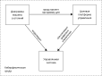

Рисунок 1 – Связь между управляемой КФС, целевой платформой и диаграммой МС

Математически машина состояний представляет собой ориентированный мультиграф с
иерархически вложенными связными подграфами, специально заданными типами вершин (например,
состояний) и дуг (переходов), и правилами разметки состояний и переходов событиями,
ограждающими условиями и поведением, принадлежащим соответствующему языку целевой
платформы.

Примечание – Мультиграф в отличие от графа допускает наличие кратных ребер/дуг – более
одного ребра/дуги с общими начальной и конечной вершинами.

На рисунке 2 представлен пример машины состояний (а), размеченной языком целевой
платформы, который представляет собой псевдоязык, и соответствующий ей неразмеченный
ориентированный граф с подграфами, вложенными в вершины верхнеуровневого графа (б).

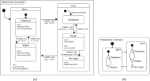

Рисунок 2 – Пример машины состояний (а) и соответствующего ей ориентированного графа (б)

Машина состояний включает в себя события, выраженные в диаграмме через имена событий на
переходах, ограждающие условия и действия, которые могут быть представлены в текстовой
форме (в рамках заданного языка целевой платформы) или графической форме, когда
компонентам каждого события, условия или поведения – пиктограмме – ставится в соответствие
определенное текстовое выражение или команда из языка целевой платформы.

Диаграмма машины состояний должна соответствовать ряду требований, которые определены в
описании элементов машин состояний (см. раздел 7). К таким требованиям относятся в том
числе:

- наличие хотя бы одной начальной вершины;
- глобальность событий и, соответственно, единая интерпретация событий для всей машины состояний;
- уникальность имен состояний в рамках соответствующего уровня иерархии машины состояний
  (составного состояния).

Форматы цифрового представления машины состояний должны содержать структуру мультиграфа
машины состояний, его разметку на языке целевой платформы, а также метаинформацию, которая
включает в себя по меньшей мере:

- версию настоящего стандарта;
- ссылку на целевую платформу и язык целевой платформы;
- флаги, определяющие поведение и характер исполнения машины состояний, в т.ч. порядок
  выполнения перехода (см. 7.6) или процедура передачи событий между уровнями (см. 7.4).

Для хранения и работы с метаинформацией рекомендуется использовать машиночитаемые
комментарии к диаграмме (см. 7.2).

Для файлового представления машины состояний рекомендуется использовать открытые стандарты
сериализации, такие как XML.

Реализация машины в рамках целевой платформы состояний подразумевает поддержание
определенного контекста исполнения, который задает, какие события определены для машины
состояний и какие действия будут доступны в поведении машины состояний (см. 7.4).

## 6 Состав машины состояний

На рисунке 3 представлены отношения между элементами и другими сущностями графического
языка диаграмм машин состояний (см. раздел 7). Для графического обозначения отношений
между сущностями и типов этих отношений используются стандартные обозначения диаграмм
классов стандарта OMG UML. Серый цвет на рисунке обозначает составляющие машин состояний,
которые не присутствуют в качестве отдельных объектов на диаграмме машины состояний, но
служат для корректного определения других объектов диаграммы.

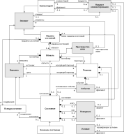

Рисунок 3 – Отношение между составляющими машины состояний

Выделяют три группы составляющих машин состояний:

- элементы, являющиеся вершинами в графе машины состояний. Как любые элементы, они могут
  иметь имена и включаться в другие элементы или включать их. К таким элементам относятся
  состояния и псевдосостояния;
- элементы, которые не являются вершинами в графе машины состояний. К ним относятся
  пространства имен (области и переходы) и непосредственно машина состояний;
- сущности, которые не являются элементами, но включены в состав отдельных элементов. К
  ним относятся события, условия, поведение и предметы комментирования.

При определении одних элементов машин состояний через другие в тексте стандарта
используется наследование типов элементов: наследование атрибутов элементов, их
ограничений и других характеристик. Более подробная информация о семантике и конкретных
графических обозначениях для каждой из составляющих машин состояний представлена в разделе
7.

## 7 Описание элементов и других сущностей машины состояний

Настоящий раздел определяет семантику и графическое обозначение элементов и других
сущностей диаграммы машины состояний. Подразделы, описывающие конкретные элементы и
сущности, приведены в алфавитном порядке.

### 7.1 Вершина

Вершины составляют основу ориентированного мультиграфа машины состояний. К вершинам
относятся состояния и псевдосостояния.

#### 7.1.1 Родительский тип элементов

Элемент (см. 7.14).

#### 7.1.2 Описание

Вершина – это абстракция узла в графе машины состояний. Вершина может быть источником или
целью любого количества переходов.

#### 7.1.3 Атрибуты

Дополнительных атрибутов нет.

#### 7.1.4 Ассоциации

**Исходящие переходы:** переход [0..*] – переходы, исходящие из этой вершины.

**Входящие переходы:** переход [0..*] – переходы, входящие в эту вершину.

**Контейнер:** область [0..1] – область, содержащая эту вершину.

#### 7.1.5 Ограничения

Дополнительных ограничений нет.

#### 7.1.6 Семантика

Вершины не обладают собственной семантикой, она определяется в производных типах элементов.

#### 7.1.7 Графическое обозначение

Вершины не имеют собственного графического обозначения, оно определяется в производных
типах элементов. В графическом исполнении диаграммы все вершины обладают геометрией:
положением и формой (размером), в зависимости от типа элемента.

### 7.2 Комментарий

Комментарий представляет собой блок поясняющего текста, который может быть присоединен к
диаграмме в целом, элементу или множеству элементов, а также фрагменту описания поведения
и другим составляющим элементов.

#### 7.2.1 Родительский тип элемента

Элемент (см. 7.14).

#### 7.2.2 Описание

Комментарий дает возможность добавлять текстовые аннотации к отдельным составляющим машины
состояний. Комментарий не имеет семантики в языке машин состояний, однако может
применяться для его расширений. Основная его функция – хранение текстов, не имеющих
подходящего места в полях элементов машины состояний. Как правило, комментарии содержат
информацию о связях диаграммы машин состояний с предметной областью, с процессом
разработки машины состояний или ее исполнения. Комментарий может относиться к различным
объектам или их составляющим, что задается через разновидности предметов комментирования.

#### 7.2.3 Атрибуты

**Тело:** строка [0..1] – определяет текст, являющийся комментарием.

**Тип:** выбор типа комментария из двух возможных вариантов:

1. **человекочитаемый (или неформальный)** – комментарий, предназначенный для чтения человеком
   или системой работы с текстами на естественном языке, содержит информацию о содержании
   диаграммы или процессе разработки, предназначенную для разработчиков и пользователей
   диаграммы (тип комментария по умолчанию);
2. **машиночитаемый (или формальный)** – комментарий, предназначенный для автоматического
   распознавания и интерпретации при машинной реализации машины состояний.

#### 7.2.4 Ассоциации

**Предметы:** предметы комментирования [0..*] – перечень ссылок на комментируемые объекты или
их составляющие, заданные конкретным видом предмета комментирования.

#### 7.2.5 Ограничения

Комментарий может не относиться ни к одному предмету комментирования, в этом случае
комментарий считается общим и относится ко всей диаграмме машин состояний.

Если комментарий содержит один или более предмет комментирования, комментарий должен
относиться к одному или более элементу или фрагменту элемента (см. 7.8).

Комментарий не содержит вложенных элементов, в т.ч. комментариев.

#### 7.2.6 Семантика

Комментарий не добавляет семантики к элементам, которые комментируются, но содержит
полезную информацию для разработчика или пользователя машины состояний. Комментарии также
могут содержать дополнительную информацию, важную для редактирования, работы контекста
исполнения данной машины состояний или генерации кода на основе машины состояний. Если
данная информация относится к машине состояний в целом, рекомендуется использовать
комментарий, не содержащий предмета комментирования.

Семантика машиночитаемых и человекочитаемых комментариев не влияет на структуру диаграммы
машины состояний. Содержание машиночитаемых комментариев интерпретируется при исполнении
машины состоянии, генерации кода на ее основе и других подобных операциях в зависимости от
выбранного языка целевой платформы.

Комментарий может стать предметом комментирования. Фрагмент тела комментария также может
стать предметом комментирования (см. рисунок 8 б).

#### 7.2.7 Графическое обозначение

Комментарий изображается в виде прямоугольника с загнутым верхним углом (этот символ также
известен как «заметка»). Прямоугольник содержит тело комментария. В зависимости от типа
комментария уголок изображается по-разному: для человекочитаемого комментария уголок имеет
тот же цвет, что и прямоугольник комментария (рисунок 4 а), для машиночитаемого – уголок
изображается черным цветом (рисунок 4 б). Рекомендуется при отображении тела
машиночитаемых комментариев использовать моноширинный шрифт.

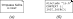

Рисунок 4 – Обозначение типов комментариев – человекочитаемого (а) и машиночитаемого (б)

Если комментарий содержит имя, то он изображается в виде прямоугольника с двумя блоками:
блока имени вверху прямоугольника и блока тела комментария ниже. Блоки могут разделяться
горизонтальной линией или видимыми отступами (см. рисунок 5).

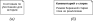

Рисунок 5 – Комментарий без имени (а) и с именем (б) в виде отдельного блока

Если комментарий не относится ни к одному предмету комментирования, он изображается в виде
отдельного прямоугольника без связей.

Если комментарий имеет один или более предмет комментирования, связь комментария и
комментируемых элементов изображается пунктирной линией (см. рисунок 6). Если комментарий
относится к элементу, явно выделяется точка комментирования, отображаемая отдельным
небольшим черным квадратом.

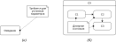

Рисунок 6 – Связь комментария одного (а) или более (б) с предметами комментирования – элементами

Если комментарий относится к фрагменту поведения в рамках элемента, комментируемый
фрагмент выделяется подчеркиванием (см. рисунок 7). Комментарий также соединяется с
комментируемым фрагментом пунктирной линией.

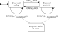

Рисунок 7 – Связь комментария с предметами комментирования – фрагментами поведения

Комментирование комментариев проводится в виде отдельных элементов диаграммы или
посредством комментирования фрагментов тела комментария (см. рисунок 8):

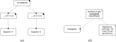

Рисунок 8 – Варианты комментирования

#### 7.2.8 Примеры

Рисунок 9 представляет пример использования комментариев с именем и без имени по отношению
к одному и тому же элементу.

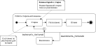

Рисунок 9 – Применение комментариев с именем и без имени

Рисунок 10 представляет пример комментариев более чем с одним предметом комментирования
(по два комментируемых элемента диаграммы и фрагмента поведения соответственно).

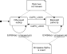

Рисунок 10 – Комментирование более одного объекта на диаграмме машин состояний

### 7.3 Конечное состояние

Особый вид состояния, обозначающий завершение работы вложенной машины состояний.

#### 7.3.1 Родительский тип элемента

Состояние (см. 7.12).

#### 7.3.2 Описание

Состояние, которое означает, что охватывающая его область завершает выполнение. Если
охватывающая область содержится в машине состояний, а все остальные области в машине
состояний также завершены, то это означает, что вся машина состояний завершила работу.

#### 7.3.3 Атрибуты

Дополнительных атрибутов нет.

#### 7.3.4 Ассоциации

Дополнительных ассоциаций нет.

#### 7.3.5 Ограничения

Конечное состояние не имеет никаких исходящих переходов.

Конечное состояние не содержит вложенных областей.

Конечное состояние не содержит вложенной машины состояний.

Конечное состояние не содержит поведения или внутренних событий.

#### 7.3.6 Семантика

Когда достигается конечное состояние, содержащая его область завершается, то есть она
удовлетворяет условию завершения. Внешнее состояние для области считается завершенным,
когда все содержащиеся в ней области завершены.

#### 7.3.7 Графическое обозначение

Графическое обозначение конечного состояния показано на рисунке 11. Соответствующий
переход завершения (см. 7.6) охватывающего состояния должен иметь в качестве обозначения
немаркированный переход.


Рисунок 11 – Конечное состояние

#### 7.3.8 Пример

Рисунок 37 показывает использование конечного состояния.

### 7.4 Машина состояний

Машина состояний может быть использована для выражения поведения системы или ее
части. Поведение системы моделируется через обход мультиграфа состояний, соединенных между
собой одной или несколькими дугами переходов. Переходы запускаются диспетчеризацией
возникающих событий. Во время этого обхода машина состояний выполняет ряд действий,
связанных с различными ее элементами.

#### 7.4.1 Родительский тип элемента

Элемент (см. 7.14).

#### 7.4.2 Описание

Машина состояний содержит одну или несколько областей, которые, в свою очередь, содержат
состояния и переходы.

Экземпляр машины состояний содержит контекст исполнения, который устанавливает, какие
события определены для машины состояний и какие действия доступны в поведении машины
состояний.

Машина состояний может содержать в себе другие машины состояний только в виде состояний с
вложенной машиной состояний. В этом случае каждая машина состояний имеет свой собственный
контекст исполнения, существующий на разных уровнях иерархии.

#### 7.4.3 Атрибуты

Дополнительных атрибутов нет.

#### 7.4.4 Ассоциации

**Области:** область [1..*] – области, напрямую относящиеся к машине состояний.

**Соединения:** псевдосостояния [0..*] – точки входа и выхода, определенные для данной
машины состояний или вложенной машины состояний данного типа.

**Состояние:** состояние [0..*] – состояние, в которое вложен экземпляр данной машины
состояний (только для состояний с вложенной машиной состояний).

#### 7.4.5 Ограничения

Машина состояний должна иметь имя, представляющее собой непустую строку.

Точки соединения машины состояний представляют собой псевдосостояния типа точки входа или
точки выхода.

#### 7.4.6 Семантика

Экземпляр машины состояний содержит пул событий в соответствии с его контекстом исполнения.

##### 7.4.6.1 Обработка событий — элементарный шаг

Возникающие события регистрируются, диспетчеризуются и затем обрабатываются машиной
состояний по очереди. Порядок обработки очереди событий не определен, что оставляет
открытой возможность реализации различных схем диспетчеризации на основе приоритетов.

Семантика обработки возникающих событий основана на предположении о выполнении до
завершения (run-to-completion), интерпретируемом как обработка события до его
завершения. Обработка до завершения означает, что событие может быть взято из очереди
событий и обработано только в том случае, если обработка предыдущего текущего события
полностью завершена. Элементарный шаг может быть реализован различными способами,
например, с помощью цикла событий, работающего в собственном потоке и считывающего события
из пула.

Обработка единичного события машиной состояний называется элементарным шагом. Прежде чем
приступить к элементарному шагу, машина состояний должна находиться в конфигурации
стабильного состояния – все действия входа/выхода [но не обязательно действия исполнения
(`do`)] или внутренние события должны быть завершены. Те же условия применяются после
завершения элементарного шага. Таким образом, возникающее событие никогда не начнет
обработку, пока машина состояний находится в некоторой промежуточной или противоречивой
ситуации. Элементарный шаг можно описать как переход между двумя конфигурациями состояний
машины состояний.

Предположение о выполнении до завершения упрощает реализацию перехода в машине состояний,
поскольку позволяет избежать конфликтов параллельной обработки в ходе обработки события,
что дает возможность машине состояний безопасно завершить элементарный шаг.

Когда событие возникает и диспетчеризуется, это может привести к активации одного или
нескольких переходов. Если никакой из переходов не разрешен ограждающим условием или
событие не находится в списке отложенных событий в конфигурации текущего состояния,
возникшее событие отбрасывается, и элементарный шаг считается законченным.

При наличии ортогональных областей можно активировать несколько переходов в результате
возникновения одного и того же события — до одного перехода в каждой области в
конфигурации текущего состояния. В случае, когда разрешены один или несколько переходов,
машина состояний выбирает подмножество переходов и запускает их. Какой из разрешенных
переходов действительно сработает, определяется алгоритмом выбора перехода
(см. 7.4.6.5). Порядок срабатывания выбранных переходов не определен.

Каждая ортогональная область в конфигурации активного состояния, которая не содержит в
себе другие ортогональные области (т. е. области «нижнего уровня», например, вложенные в
дочерние составные состояния), может активировать не более одного перехода в результате
возникновения текущего события. Когда все ортогональные области завершают выполнение
перехода, текущее событие считается полностью обработанным, и элементарный шаг
заканчивается.

Во время перехода может быть выполнен ряд действий. Если такое действие представляет собой
синхронный вызов в том же процессе, в котором диспетчеризуется машина состояний, то шаг
перехода не завершается до тех пор, пока вызов не завершится и, таким образом, не
завершится элементарный шаг.

##### 7.4.6.2 Элементарные шаги и параллелизм

Допустимо определить семантику машины состояний, так, что элементарные шаги будут
исполняться независимо друг от друга (ортогонально) в соответствующих ортогональных
областях составного состояния, а не в машине состояний в целом. Это позволяет ослабить
ограничение последовательности событий. Однако такая семантика является сложной в
реализации. Таким образом, динамическая семантика, определенная в настоящем стандарте,
основана на предпосылке, что один элементарный шаг применяется ко всей машине состояний и
включает в себя шаги, выполняемые ортогональными областями в конфигурации активного
состояния.

При представлении процесса исполнения машины состояний в виде набора потоков (threads)
исполнения, необходимо отличать понятие элементарного шага от концепта вытеснения
потока. А именно, обработка событий элементарного шага выполняется потоком, который может
быть вытеснен, а его выполнение приостановлено в пользу другого потока, выполняющегося на
том же узле обработки (например, вследствие политики планирования базовой среды потоков, в
частности, операционной системы) Когда приостановленному потоку снова назначается
процессорное время, он возобновляет обработку событий с точки вытеснения и, в конечном
итоге, завершает свою обработку события.

##### 7.4.6.3 Конфликтующие переходы

При наличии более одного перехода переходы будут конфликтовать друг с другом. Например,
рассмотрим случай двух переходов, исходящих из одного и того же состояния, вызываемых
одним и тем же событием, но с разными ограждающими условиями. Если это событие происходит
и оба ограждающих условия истинны, должен сработать только один переход. Другими словами,
в случае конфликтующих переходов только один из них сработает за один элементарный шаг.

Два перехода конфликтуют, если они оба выходят из одного и того же состояния и, если
пересечение множества состояний, из которых они выходят, непусто. Могут быть запущены
одновременно только переходы, которые происходят во взаимно ортогональных областях. Это
ограничение гарантирует, что новая конфигурация активного состояния, возникающая в
результате выполнения набора переходов, будет корректно сформирована.

Внутренний переход в состоянии конфликтует только с внешними переходами.

##### 7.4.6.4 Приоритеты запуска

При наличии конфликтующих переходов выбор запускаемых переходов основан на неявном
приоритете. Приоритеты позволяют разрешить некоторые конфликты переходов. Приоритеты
конфликтующих переходов основаны на их относительном положении в иерархии
состояний. Переход, исходящий из вложенного состояния, имеет более высокий приоритет, чем
конфликтующий с ним переход, исходящий из какого-либо из его родительских состояний.

Приоритет перехода определяется на основе его исходного состояния. Приоритет объединенных
переходов основан на приоритете перехода с наиболее транзитивно вложенным исходным
состоянием.

Если `t1` – это переход, исходным состоянием которого является `s1`, а `t2` имеет источник `s2`, то:

- если `s1` является прямым или транзитивно вложенным подсостоянием `s2`, то `t1` имеет
  более высокий приоритет, чем `t2`;
- если `s1` и `s2` не находятся в одной и той же конфигурации состояний, то между `t1` и `t2`
  нет разницы в приоритете.

##### 7.4.6.5 Алгоритм выбора перехода

Множество срабатывающих переходов – это максимальное множество переходов, удовлетворяющее
следующим условиям:

- все переходы в этом множестве разрешены;
- внутри множества нет конфликтующих переходов.

Переход вне множества не может иметь более высокий приоритет, чем переход внутри множества
(то есть разрешенные переходы с наивысшими приоритетами входят в множество, в то время как
конфликтующие переходы с более низкими приоритетами не входят).

Это поведение быть легко реализовано с помощью жадного алгоритма выбора с прямым обходом
конфигурации активного состояния. Состояния в конфигурации активного состояния обходятся,
начиная с самых внутренних вложенных простых состояний и двигаясь наружу. Для каждого
состояния на заданном уровне оцениваются все исходящие переходы, чтобы определить,
разрешены ли они. Этот обход гарантирует, что принцип приоритета не будет
нарушен. Единственной нетривиальной проблемой является разрешение конфликтов перехода
между ортогональными состояниями на всех уровнях. Это решается путем завершения поиска в
каждом ортогональном состоянии после запуска перехода внутри любого из его компонентов.

##### 7.4.6.6 Обработка событий на разных уровнях иерархии

В иерархической машине состояний может быть использован вариант обработки событий, при
котором события, обработанные в дочерних состояниях, также могут быть переданы для
обработки в родительские состояния. Это бывает необходимо в случаях, когда нужно
гарантировать выполнение действий выхода при завершении составного состояния, в котором
есть риск обработки событий, приводящих к выходу из состояния, на более глубоких уровнях
иерархии состояний (см. рисунок 24). Если исполнение машины состояний предполагает, что
родительские состояния не получают уже обработанное дочерними состояниями события, то это
может создавать непрозрачное поведение машины состояний.

В целях избежать этой ситуации, для машины состояний должна быть явным образом определена
процедура передачи событий между уровнями иерархии. Для машины состояний должен быть
определен один из двух вариантов обработки событий по умолчанию:

- передача обработанных в дочерних состояниях событий на более высокие уровни иерархии;
- блокировка событий, обработанных в дочерних состояниях.

Вариант обработки событий должен быть задан для всей машины состояний, для чего он должен
быть определен в метаинформации о машине состояний.

При этом для отдельных переходов и соответствующих событий может быть отдельно указан
альтернативный вариант обработки событий (см. 7.6).

##### 7.4.6.7 Специальные события

Реализация машины состояний может подразумевать введение специальных событий, которые
позволяют обобщить реакцию машины состояний на группу событий без их непосредственного
перечисления. Примером подобных событий могут быть специальные событие «любое событие»
(«`ANY`»), соответствующие срабатыванию любого события из пула событий машины состояний, или
«неизвестное событие» («`UNKNOWN`»), описывающее ситуацию срабатывания события, не
предусмотренного заданным пулом событий машины состояний.

#### 7.4.7 Графическое обозначение

Диаграмма машины состояний — это ориентированный мультиграф, представляющий данную машину
состояний. Состояния и различные другие типы вершин (псевдосостояний) в графе машины
состояний отображаются с помощью соответствующих символов состояний и
псевдосостояний. Переходы, как правило, отображаются с помощью направленных дуг, которые
их соединяют.

Машина состояний на диаграмме может отдельно обозначаться прямоугольником с закрепленным в
левом верхнем углу выделенным рамкой именем (см. рисунок 12).


Рисунок 12 – Обозначение машины состояний

Диаграмма, не имеющая ни одного элемента машины состояний, считается отдельной обрамляющей
машиной состояний. В этом случае она не имеет имени. Альтернативно имя такой машины
состояний может быть задано через специально определенный блок метаинформации.

#### 7.4.8 Пример

Рисунок 13 показывает пример диаграммы машины состояний для проводного телефона. Помимо
начального псевдосостояния машина состояний имеет точку входа с именем «сигнализация», а
помимо конечного состояния в машине состояний есть точка выхода с именем «прервать».

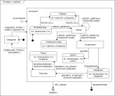

Рисунок 13 – Пример машины состояний

Рисунок 14 представляет пример машины состояний с языком целевой платформы, представляющей
собой псевдокод. Рисунок 15 представляет пример той же машины состояний, состояния и
переходы в которой размечены посредством набора графических пиктограмм, соответствующих
псевдокоду языка целевой платформы.

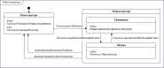

Рисунок 14 – Пример машины состояний с псевдокодом в качестве языка целевой платформы

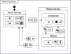

Рисунок 15 – Пример машины состояний, в которой язык целевой платформы представлен в виде
пиктограмм, а не текста

### 7.5 Область

Область включает в себя состояния и переходы.

#### 7.5.1 Родительский тип элемента

Пространство имен (см. 7.9).

#### 7.5.2 Описание

Область является частью составного состояния или частью машины состояний и содержит
состояния и переходы.

#### 7.5.3 Атрибуты

Дополнительных атрибутов нет.

#### 7.5.4 Ассоциации

**Машина состояний:** машина состояний [0..1] – машина состояний, которой принадлежит
область. Если область принадлежит машине состояний, то она не может также принадлежать
состоянию (следующая ассоциация состояние пуста).

**Состояние:** состояние [0..1] – составное состояние, которому принадлежит область. Если
область принадлежит состоянию, то она не может также принадлежать машине состояний
(предыдущая ассоциация машина состояний пуста).

**Переходы:** переход [0..*] – множество переходов, принадлежащих данной области.

**Вершины:** вершина [0..*] – множество вершин, принадлежащих данной области.

#### 7.5.5 Ограничения

Область может иметь максимум одно начальное псевдосостояние.

Область может иметь максимум одну вершину с глубокой историей.

Область может иметь максимум одну вершину с локальной историей.

Если область принадлежит машине состояний, то она не может также принадлежать состоянию и наоборот.

#### 7.5.6 Семантика

Семантика областей связана с состояниями или машинами состояний, содержащими области, и
поэтому определяется как часть семантики для состояния и машины состояний.

#### 7.5.7 Графическое обозначение

Составное состояние или машина состояний с областями показывается путем разбиения
прямоугольника состояния/машины состояний пунктирными линиями на области (см. рисунок
16). Каждая область может иметь опциональное имя и содержать вложенные непересекающиеся
состояния и переходы между ними. Текстовые блоки, общие для всего состояния, отделены от
ортогональных областей сплошной линией.

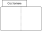

Рисунок 16 – Обозначение для составного состояния с двумя областями

Области могут иметь имена, в этом случае имя отображается в верхней части области в
отдельном блоке, отделенном от содержания области линией или отступом (см. рисунок 17) по
аналогии с именем состояния (см. 7.12).

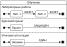

Рисунок 17 – Обозначение для именованных областей

Составное состояние или машина состояний с единственной областью показывается
непосредственно путем отображения подсостояний и вложенных переходов внутри прямоугольника
состояния или машины состояний соответственно.

#### 7.5.8 Пример

Рисунок 38 показывает пример составного состояния с тремя областями.

### 7.6 Переход

Переходы связывают состояния и другие вершины в машине состояний и описывают изменение
системы в связи с возникающими событиями.

#### 7.6.1 Родительский тип элемента

Пространство имен (см. 7.9).

#### 7.6.2 Описание

Переход – это направленная связь между исходной вершиной и целевой вершиной. Он может быть
частью составного перехода, который переводит машину состояний из одной конфигурации
состояния в другую, позволяя машине состояний совершать действия в ответ на возникновение
события определенного типа.

#### 7.6.3 Атрибуты

Тип перехода – определяет точный тип перехода из доступного перечня типов: внешний,
внутренний, локальный. Значение по умолчанию — внешний.

#### 7.6.4 Ассоциации

**События:** событие [0..*] – список событий, инициирующих переход и относящихся к перечню
существующих в системе событий. События перехода являются пространством имен, таким
образом список событий должен содержать неповторяющийся набор имен событий.

**Ограждающее условие:** условие [0..1] – это ограничение, которое позволяет управлять
запуском перехода. Ограждающее условие проверяется, когда машина состояний отправляет
сообщение о возникновении события. Если в это время ограждающее условие имеет значение
Истина, переход может быть разрешен; в противном случае он запрещен. Ограждающие условия
должны быть ясными выражениями без побочных эффектов.

**Эффект:** поведение [0..1] – определяет опциональное поведение, которое должно выполняться
при срабатывании перехода.

**Источник:** вершина [1] – обозначает исходную вершину (состояние или псевдосостояние) для
перехода.

**Цель:** вершина [1] – обозначает целевую вершину, которая достигается при выполнении
перехода.

**Контейнер:** область [1] – обозначает область, которой принадлежит этот переход.

#### 7.6.5 Ограничения

Сегмент разветвления не должен иметь событий или ограждающих условий.

Сегмент объединения не должен иметь событий или ограждающих условий.

Сегмент разветвления должен иметь целевое состояние.

Сегмент объединения должен исходить из состояния.

Переходы, исходящие из псевдосостояний, не имеют событий.

Переход из начального состояния не имеет событий и ограждающего условия.

#### 7.6.6 Семантика

##### 7.6.6.1 Типы переходов

Семантика переходов зависит от его типа.

Внутренний переход подразумевает, что переход происходит без выхода из исходного состояния
или входа в новое состояние, то есть не вызывает изменения состояния. Это верно, даже если
машина состояний находится во вложенном состоянии внутри этого состояния. Это означает,
что поведение входа (`entry`) или выхода (`exit`) исходного состояния не будет выполняться в
ходе такого перехода. Внутренний переход может быть выполнен, даже если машина состояний
находится в одной или нескольких областях, вложенных в это состояние.

Локальный переход подразумевает, что данный переход не приведет к выходу из составного
родительского состояния, но может привести к выходам из состояний внутри составного
состояния.

Внешний переход подразумевает, что данный переход приводит к выходу из исходного состояния.

##### 7.6.6.2 Высокоуровневые переходы

Переходы, исходящие из составных состояний, называются высокоуровневыми или групповыми
переходами. При срабатывании они приводят к выходу из всех подсостояний составного
состояния, выполняя поведение выхода (exit), начиная с самых внутренних состояний в
конфигурации активного состояния. С точки зрения семантики выполнения высокоуровневый
переход не добавляет дополнительную семантику, а отражает семантику выхода из составного
состояния. Высокоуровневый переход с целью, находящейся вне составного состояния,
подразумевает выполнение поведения выхода (exit) из составного состояния. Высокоуровневый
переход с целью, находящейся внутри составного состояния, не подразумевает выполнение
поведения выхода (exit) из составного состояния.

##### 7.6.6.3 Составные переходы

Составной переход – это производное семантическое понятие, представляющее собой
«семантически завершенный» путь, состоящий из одного или нескольких переходов, исходящих
из набора состояний (в отличие от псевдосостояний) и нацеленных на некий набор
состояний. Семантика выполнения перехода, описанная в настоящем пункте, относится к
составным переходам.

Составной переход – это ациклическая непрерывная цепь переходов, соединенных
псевдосостояниями объединения, выбора или разветвления, которые определяют путь от
множества исходных состояний (минимум одного) к множеству целевых состояний (минимум
одному). Для переходов в себя одно и то же состояние действует как в качестве исходного,
так и в качестве целевого состояния. Таким образом, простой переход, соединяющий два
состояния, является частным случаем составного перехода.

Конец составного перехода может иметь несколько переходов, исходящих из набора
ортогональных областей, которые соединены точкой объединения. Начало составного перехода
может иметь несколько переходов, исходящих из псевдосостояния разветвления, нацеленных на
набор ортогональных областей.

В составном переходе, где несколько исходящих переходов исходят из общей точки выбора,
будет выбран исходящий переход, ограждающее условие которого является истинным на момент
достижения точки выбора. Если для нескольких переходов ограждающие условия имеют значение
Истина, выбирается один переход из этого набора. Алгоритм выбора этого перехода не
указан. Если после достижения точки выбора ни одно из ограждающих условий не имеет
значения Истина, машина состояний считается некорректно сформулированной.

Владелец перехода явно не ограничен, тем не менее область должна принадлежать прямо или
косвенно контексту конечной машины-владельца. Предполагаемым владельцем перехода является
наименьший общий предок исходной и целевой вершин.

##### 7.6.6.4 Переходы завершения и события завершения

Переход завершения – это переход, выполняемый при завершении состояния. Он исходит из
состояния или точки выхода, но не содержит явного события, хотя для него может быть
определено ограждающее условие. Переход завершения неявно запускается событием
завершения. В случае состояния без исходящих переходов [листа в мультиграфе машины
состояний (вершины без исходящих дуг)] событие завершения генерируется после завершения
действий входа и внутренних действий [действия исполнения (`do`)]. Если нет никаких действий
или активности, событие завершения генерируется при входе в такое состояние. Если
состояние является составным состоянием или состоянием с вложенной машиной состояний,
событие завершения генерируется тогда, когда либо вложенная машина состояний, либо
содержащаяся в ней область достигли конечного состояния, и внутренние действия состояния
завершены. Это событие отправляется раньше любых других событий в пуле и не имеет
связанных параметров. Например, переход завершения, исходящий из ортогонального составного
состояния, будет выполнен автоматически, как только все ортогональные области достигнут
своего конечного состояния.

Если для состояния определено несколько переходов завершения, то они должны иметь
взаимоисключающие ограждающие условия.

##### 7.6.6.5 Разрешенные (составные) переходы

Переход разрешен тогда и только тогда, когда:

- все его исходные состояния находятся в конфигурации активного состояния;
- возникшее в системе событие соответствует хотя бы одному из указанных на переходе
  событий;
- если существует хотя бы один полный путь от конфигурации исходного состояния либо к
  конфигурации целевого состояния, либо к точке динамического выбора, для которого все
  ограждающие условия истинны (переходы без ограждающих условий рассматриваются так, как
  если бы их ограждающие условия всегда были истинны).
  
Поскольку одним и тем же событием может быть разрешено более одного перехода, разрешение
является необходимым, но недостаточным условием для срабатывания перехода.

##### 7.6.6.6 Ограждающие условия

В простом переходе ограждающее условие проверяется до того, как переход сработает.
	
В составных переходах, включающих несколько ограждающих условий, все ограждающие условия
проверяются до запуска перехода, если только на одном или нескольких путях нет точек
выбора. Порядок оценки ограждающих условий не определен.

Если в составном переходе есть точки выбора, в соответствии с 7.6.6.5 проверяются только
ограждающие условия, предшествующие точке выбора. Ограждающие условия ниже точки выбора
оцениваются, если и когда точка выбора достигнута (используя то же правило, что и
выше). Другими словами, для оценки ограждающего условия точка выбора имеет тот же эффект,
что и состояние.

Ограждающие условия не должны включать выражения, вызывающие побочные эффекты. В обратном
случае машины состояний считаются некорректно сформулированными.

##### 7.6.6.7 Последовательность выполнения перехода

Каждый переход, за исключением внутренних и локальных переходов, вызывает выход из
исходного состояния и вход в целевое состояние. Эти два состояния, которые могут быть
составными, обозначены как основной источник и основная цель перехода. Рисунок 18
демонстрирует пример перехода, который включает в себя выполнение следующих действий в
следующей последовательности:

а) вычисление истинности связанного с переходом ограждающего условия и выполнение
следующих шагов, только если значение ограждающего условия равно Истина;

б) выход из исходного состояния;

в) выполнение связанных с переходом действий;

г) вход в целевое состояние.

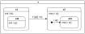

Рисунок 18 – Последовательность действий при переходе

Последовательность переходов определяется, когда и главный источник, и главная цель
перехода находятся на одном уровне вложенности. В примере на рисунке 18 событие `T` вызывает
проверку истинности ограждающего условия `g();` за ним следует последовательность действий
`a(); b(); t(); c(); d(); e();`, при условии, что значение ограждающего условия равно
Истина. Альтернативная конфигурация машины состояний может выполнять действие, связанное с
переходом (здесь – `t()`), в том же контексте, в котором проходила проверка ограждающего
условия (здесь – `g()`), то есть сразу после совершенной проверки: `t(); a(); b(); c(); d(); e();`.
Поскольку представленные варианты реализации конфигурации машины состояний и
соответствующие последовательности переходов не совместимы в рамках одной машины
состояний, необходимо указывать в метаинформации, связанной с машиной состояний, какой
порядок выполнения перехода принят для данной машины состояний.

В случае, когда основной источник и основная цель перехода вложены на разных уровнях
иерархии состояний, не всегда очевидно, сколько уровней вложенности необходимо
покинуть. Переход между состояниями включает в себя выход из всех вложенных состояний,
начиная с текущего активного состояния (может быть прямым или транзитивным подсостоянием
основного исходного состояния) и заканчивая (но не включая) состоянием наименьшего общего
предка основного исходного состояния и основного целевого состояния. Состояние наименьшего
общего предка (составного) перехода — это наименьшее составное состояние, которое является
родительским состоянием (предком) одновременно и исходного, и целевого состояний. Если
наименьший общий предок является областью, то основным источником является
непосредственная подвершина области, содержащая исходные состояния, а основной целью
является дочерняя вершина области, содержащей целевые состояния. В случае, когда
наименьший общий предок является ортогональным состоянием, основной источник и основная
цель представлены самим ортогональным состоянием. Причина в том, что переход, пересекающий
области ортогонального состояния, приводит к выходу из всего ортогонального состояния и
повторному входу во все его области.

##### 7.6.6.8 Обработка событий на разных уровнях иерархии

Заданные для машины состояний варианты обработки событий по умолчанию предполагают
передачу обработанных событий на более высокие уровни иерархии состояний или блокировку
таких событий для верхнеуровневых состояний после обработки (см. 7.4). На переходе с
помощью зарезервированных слов «`propagate`» и «`block`» может быть указан вариант обработки
событий, отличающийся от выбранного варианта обработки по умолчанию.

Зарезервированное слово «`propagate`» подразумевает, что данное событие после обработки
должно быть передано на более высокие уровни иерархии состояний, даже если для машины
состояний задан другой вариант обработки по умолчанию.

Зарезервированное слово «`block`» подразумевает, что данное событие после обработки должно
быть заблокировано и не должно передаваться на более высокие уровни иерархии состояний,
даже если для машины состояний задан другой вариант обработки по умолчанию.

Указанные зарезервированные слова указываются на переходе только при наличии имени события
после ограждающего условия, но до опционального поведения при переходе (см. 7.6.7.2).

#### 7.6.7 Графическое обозначение

##### 7.6.7.1 Типы переходов

Обозначение переходов зависит от типа переходов. Внутренние переходы обозначаются в теле
состояния наряду с внутренними действиями [входа (`entry`), выхода (`exit`) и исполнения
(`do`)]. Внутренние переходы указываются в специальном блоке исходного состояния,
см. рисунок 41.

Локальные и внешние переходы обозначаются однонаправленными стрелками с пометкой из имени
события, ограждающего условия и опционального действия (см. рисунок 19):

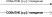

Рисунок 19 – Варианты обозначения для локальных и внешних переходов

Локальные переходы будут находиться внутри рамки составного состояния, оставляя границу
исходного состояния или одну из его точек входа, и заканчиваться в вершине внутри
родительского составного состояния. В случае локального перехода в себя целью может быть
само исходное состояние или точка выхода из исходного состояния. Все переходы на рисунке
20 являются локальными.

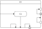

Рисунок 20 – Локальные переходы

Внешние переходы могут быть нацелены на любую вершину, находящуюся внутри исходной вершины
или вне ее. Хотя бы часть дуги, обозначающей внешний переход, должна быть нарисована за
пределами границы исходной вершины. В случае внешнего перехода в себя, когда источником
является состояние или точка выхода из состояния, он может быть нацелен на само состояние
или точку входа в состояние и будет нарисован полностью за пределами границы
состояния. Все переходы на рисунке 21 являются внешними.

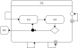

Рисунок 21 – Внешние переходы

##### 7.6.7.2 Обозначение перехода

По умолчанию переход может иметь следующее обозначение, определяемое выражением в форме Бэкуса-Наура:

```
<переход> ::= [<событие> [‘,’ <событие>]* [‘[‘ <ограждающее условие>’]’]
[< propagate | block >] [‘/’ <выражение действия>]]
```

Ограждающее условие — это логическое выражение, записанное в терминах параметров
инициирующего события, а также текущего контекста исполнения машины состояний. Ограждающее
условие может также включать в себя проверки ортогональных состояний текущей машины
состояний или явно обозначенных состояний некоторой доступной области/машины состояний
(например, «`в Состоянии1`» или «`не в Состоянии2`»). Имена состояний могут быть заданы в виде
полного пути с вложенными состояниями и областями, которые их содержат, в следующей форме
«`ОбластьИлиСостояние1::ОбластьИлиСостояние2::Состояние3`». Такую запись можно использовать
в случае, если одно и то же имя состояние встречается в разных областях составного
состояния. Ограждающее условие может содержать единственное ключевое слово «`else`», если, и
только если существуют другие переходы из данного состояния по тому же набору событий,
содержащие ограждающие условие без «`else`». Переход по условию «`else`» исполняется в случае,
если ни одно из прочих ограждающих условий не получило значение Истина.

Одно из двух зарезервированных слов «`propagate`» или «`block`» (если указано)
используется для задания варианта обработки указанного события в иерархической машине
состояний (см. 7.6.6.8).

Опциональное выражение действия выполняется только при срабатывании перехода. Оно может
быть написано с использованием параметров инициирующего события и других действий в рамках
контекста исполнения машины состояний. Выражение для поведения может представлять собой
последовательность действий, содержащую ряд отдельных действий, включая действия, которые
явно генерируют события, такие как отправка сигналов или вызов операций. Детали этого
выражения зависят от языка целевой платформы данной машины состояний.

Если языку целевой платформы, используемому для разметки переходов машины состояний,
ставится в соответствие графический язык пиктограмм, то события, ограждающее условие и
выражение действия обозначаются в виде графических элементов с сохранением базовых
символов в выражении перехода (см. рисунок 22).


Рисунок 22 – Варианты обозначения перехода в случае использования пиктограмм,
соответствующих языку целевой платформы

##### 7.6.7.3 Обозначение составных переходов

Составные переходы обозначаются как последовательность простых переходов, соединенных
символами соответствующих псевдосостояний: объединения, выбора или разветвления
(см. раздел 7.10).

##### 7.6.7.4 Отложенные события

Событие, для которого задана отсрочка событий, отображается как внутреннее событие, за
таким событием следует косая черта и специальная операция, обозначаемая зарезервированным
словом «`defer`». Если такое событие происходит, оно сохраняется и повторяется при переходе
объекта в другое состояние, где его можно снова отложить. Когда объект достигает
состояния, в котором событие не откладывается, оно должно быть принято или
отброшено. Такое обозначение может быть помещено в составное состояние или его
эквиваленты, состояния с вложенной машиной состояний, и в этом случае возможность отсрочки
остается, пока это составное состояние активно. Содержащийся внутри переход может быть
инициирован отложенным событием, после чего он удаляется из пула событий. Пример
использования отложенного события приведен на рисунке 23.


Рисунок 23 – Машина состояний с отложенным событием

##### 7.6.7.5 Примеры

Пример обозначения для перехода в оконном интерфейсе с использованием языка целевой
платформы в виде псевдокода:

```
НАЖАТИЕ_ПРАВОЙ_КНОПКИ_МЫШИ(координаты) [окно.содержит(координаты)]/ объект:= выбрать_объект(координаты); объект.выделить()
```

Рисунок 24 приводит пример фрагмента машины состояний микроволновой печи с применением
внешних и локальных переходов. Действие выхода (`exit`) гарантирует выключение печи при
наступлении событий, приводящих к внешнему переходу и, соответственно, выходу из
состояния.

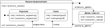

Рисунок 24 – Машина состояний с локальными и внешними переходами

Рисунок 13 представляет пример использования внешних переходов.

Рисунок 15 представляет пример использования пиктограмм при обозначении переходов.

### 7.7 Поведение

Поведение описывает действия, которые может выполнять машина состояний.

#### 7.7.1 Родительский тип элемента

Не имеет родительского типа элемента.

#### 7.7.2 Описание

Поведение – форма описания действий, которые совершает машина состояний. Поведение связано
с определенным для машины состояний языком целевой платформы: псевдокодом или кодом на
языке программирования, который должен исполниться в момент запуска данного
поведения. Поведение может быть задано в состояниях машины состояний или быть связано с
переходами.

#### 7.7.3 Атрибуты

Дополнительных атрибутов нет.

#### 7.7.4 Ассоциации

Дополнительных ассоциаций нет.

#### 7.7.5 Ограничения

Поведение должно представлять собой набор корректных выражений на языке целевой платформы,
не содержащий двойного переноса строки («`\n\n`»).

Поведение может совпадать с единственным зарезервированным слово «`defer`» исключительно в
случае отложенного события (см. 7.6 и 7.12).

#### 7.7.6 Семантика

Семантика поведения зависит от выбранного языка целевой платформы. В машинах состояний
поведение считается последовательным и непрерывным.

#### 7.7.7 Графическое обозначение

Поведение задается текстом после специального символа ‘`/`’ в блоках внутреннего поведения и
внутренних переходов исполнения состояния или на переходах машины состояний.

### 7.8 Предмет комментирования

Предмет комментирования – часть комментария, направленная на другой элемент или
составляющую диаграммы.

#### 7.8.1 Родительский тип элемента

Не имеет родительского типа элемента.

#### 7.8.2 Описание

Предмет комментирования представляет собой часть комментария, которая предназначена для
указания элемента или другой составляющей диаграммы, которая сопровождается данным
комментарием. Одному комментарию может соответствовать один или более предмет
комментирования, если комментарий имеет отношение одновременно ко всем комментируемым
объектам.

#### 7.8.3 Атрибуты

Вид – выбор разновидности предмета комментирования из набора доступных вариантов:

а) указатель на элемент – предназначен для комментирования элемента в целом;

б) указатель на фрагмент – предназначен для комментирования фрагмента поведения или другой
составляющей элемента, например, части текста на языке целевой платформы.

#### 7.8.4 Ассоциации

**Комментарий:** комментарий [1] – комментарий, который включает данный предмет комментирования.

**Элемент:** элемент [0..1] – комментируемый элемент.

**Фрагмент:** строка [0..1] – строка, принадлежащая событию, условию или поведению, –
комментируемый фрагмент поведения или другой составляющей элемента.

#### 7.8.5 Ограничения

Предмет комментирования должен указывать на минимум один объект (элемент или его
составляющую) в рамках диаграммы.

Предмет комментирования, отмечающий элемент, не может указывать на фрагмент
поведения. Предмет комментирования, отмечающий фрагмент поведения, не может указывать на
элемент.

#### 7.8.6 Семантика

Предмет комментирования следует рассматривать в контексте комментария. Комментарий может
относиться к одному или более предмету комментирования. Семантика предмета комментирования
зависит от его разновидности: элемент в целом или фрагмент его содержания.

Комментарий, включающий более одного предмета комментирования, предназначен для описания
сложного содержания, которое имеет отношение одновременно к нескольким сущностям на
диаграмме. Комментарий при необходимости может сочетать предметы комментирования различных
видов.

#### 7.8.7 Графическое обозначение

Предмет комментирования непосредственно не представлен на диаграмме машины состояний и
является частью графического обозначения комментария.

#### 7.8.8 Примеры

Примеры использования различных предметов комментирования представлены в 7.2.

### 7.9 Пространство имен

Пространство имен – это элемент машины состояний, который объединяет набор элементов,
идентифицируемых по имени.

#### 7.9.1 Родительский тип элемента

Элемент (см. 7.14).

#### 7.9.2 Описание

Пространство имен – это элемент, который объединяет другие элементы. Каждый элемент может
принадлежать не более чем одному пространству имен. Пространство имен служит для
однозначной идентификации элементов машины состояний по имени. Элементы могут быть
идентифицированы по имени в пространстве имен либо через непосредственную принадлежность
пространству имен, либо через иерархию вложенных пространств имен. Пространство имен – это
абстрактный тип, в диаграммах состояний применяются его производные.

#### 7.9.3 Атрибуты

Не имеет специальных атрибутов.

#### 7.9.4 Ассоциации

**Элементы:** элементы [0..*] – все элементы, идентифицируемые в данном пространстве имен либо
через принадлежность к данному пространству имен или через наследование.

**Принадлежащие элементы:** элементы [0..*] – элементы, принадлежащие непосредственно данному
пространству имен.

#### 7.9.5 Ограничения

Все элементы пространства имен различимы внутри него.

Если элементы пространства имен поименованы, эти имена не могут совпадать.

#### 7.9.6 Семантика

Пространство имен представляет собой контейнер для элементов. Оно обеспечивает способ
определения составных квалифицированных имен с использованием специального символа
разделителя «`::`», например «`имя1::имя2::имя3`». Элемент с именем «`х`» в пространстве имен с
именем «`N`» имеет составное имя вида «`N::x`». Если элемент или какое-либо из содержащих его
пространств имен не имеет имени, квалифицированное имя такого элемента не может быть
построено.

Элементы могут различаться в пространстве имен согласно правилу, которое определяет
отличие одного принадлежащего элемента от другого. Правило по умолчанию подразумевает
следующее: два элемента различны, если они имеют различные имена, или оба не имеют
имени. Это правило может быть переопределено при необходимости. Машина состояний, которая
имеет более одного элемента с одинаковыми именами, непосредственно принадлежащих одному
пространству имен, считается некорректно сформулированной.

Если имена у элементов отсутствуют, они считаются различимыми.

#### 7.9.7 Графическое обозначение

Пространство имен не имеет специального графического обозначения. Каждый из производных
типов элементов представляет собственное графическое обозначение.

### 7.10 Псевдосостояние

Псевдосостояние – это абстракция, которая охватывает различные типы переходных вершин в
графе машины состояний.

#### 7.10.1 Родительский тип элемента

Вершина (см. 7.1).

#### 7.10.2 Описание

Как правило, псевдосостояния используются для соединения нескольких переходов в более
сложные пути перехода между состояниями. Например, путем комбинирования перехода,
входящего в псевдосостояние разветвления, с набором переходов, выходящих из
псевдосостояния разветвления, может быть определен составной переход, который приводит к
набору ортогональных целевых состояний.

#### 7.10.3 Атрибуты

Тип псевдосостояния – определяет точный тип псевдосостояния из доступного перечня типов:
начальное, глубокая история, локальная история, разветвление, объединение, выбор, точка
входа, точка выхода, завершающее. Значение по умолчанию — начальное.

#### 7.10.4 Ассоциации

**Машина состояний:** машина состояний [0..1] – машина состояний, по отношению к которой
определено это псевдосостояние. Это применимо только к псевдосостояниям типа точка входа и
точка выхода.

**Состояние:** состояние [0..1] – составное состояние, к которому принадлежит это
псевдосостояние. Это применимо только к псевдосостояниям типа точка входа и точка выхода.

#### 7.10.5 Ограничения

Начальное псевдосостояние может иметь не более одного исходящего перехода.

Псевдосостояние истории может иметь не более одного исходящего перехода.

Псевдосостояние объединения должно иметь по меньшей мере два входящих перехода и в
точности один исходящий переход.

Переходы, поступающие в псевдосостояние объединения, должны происходить из разных областей
ортогонального состояния.

Псевдосостояние разветвления должно иметь по меньшей мере два исходящих перехода и в
точности один входящий переход.

Переходы, исходящие из псевдосостояния разветвления, должны быть нацелены на состояния в
разных областях ортогонального состояния.

Псевдосостояние выбора должно иметь один входящий и минимум один исходящий переход.

Исходящий переход из начального псевдосостояния может иметь действия, но не событие или
ограждающее условие.

#### 7.10.6 Семантика

Конкретная семантика псевдосостояния зависит от значения его атрибута «тип»:

- начальное псевдосостояние представляет собой вершину по умолчанию, которая является
  источником для единственного перехода в стартовое состояние (состояние по умолчанию)
  внутри составного состояния. В области допускается не более одного начального
  псевдосостояния. Исходящий переход от начальной вершины может иметь действия, но не
  событие или ограждающее условие;
- глубокая история представляет собой последнюю активную конфигурацию составного
  состояния, непосредственно содержащего данное псевдосостояние (например, конфигурацию
  состояния, которая была активна при последнем выходе из данного составного
  состояния). Составное состояние может иметь не более одной вершины глубокой истории. Из
  вершины глубокой истории может выходить не более одного перехода в состояние по
  умолчанию для глубокой истории этого состояния, этот переход осуществляется в том
  случае, если составное состояние никогда раньше не было активным. При восстановлении
  истории выполняются все входные поведения состояний, которые входят в последовательность
  состояний, представленных глубокой историей. Поведение входа выполняется только один раз
  для каждого из состояний в восстанавливаемой конфигурации активного состояния;
- локальная история представляет самое последнее активное подсостояние содержащего его
  состояния (но не вложенных состояний этого состояния). Составное состояние может иметь
  не более одной вершины локальной истории. Переход в вершину локальной истории
  эквивалентен переходу в самое последнее активное подсостояние данного состояния. Из
  вершины локальной истории может происходить не более одного перехода в состояние по
  умолчанию для локальной истории этого состояния, этот переход осуществляется в том
  случае, если составное состояние никогда раньше не было активным. При восстановлении
  истории выполняется поведение входа состояния, представленного локальной историей;
- псевдосостояние объединения служит для объединения нескольких переходов, исходящих из
  вершин в разных ортогональных областях. Переходы, входящие в вершину объединения, не
  могут иметь ограждающих условий или событий;
- псевдосостояние разветвления служит для разделения входящего перехода на два или более
  переходов, заканчивающихся на ортогональных целевых вершинах (т.е. вершинах в разных
  областях составного состояния). Сегменты, исходящие из вершины разветвления, не должны
  иметь ограждающих условий или событий;
- псевдосостояние выбора, при достижении которого происходит динамическая проверка
  ограждающих условий исходящих переходов. Выбор реализует динамическое разветвление с
  условием. Это позволяет разделить переходы на несколько исходящих путей, и решение о
  том, какой путь выбрать, может зависеть от результатов предыдущих действий, совершенных
  на том же элементарном шаге (см. 7.4). Если более чем одно из ограждающих условий
  проверяется как Истина, выбирается произвольное. Если ни одно из ограждающих условий не
  проверяется как Истина, модель считается плохо согласованной. Чтобы избежать этого,
  рекомендуется определить один исходящий переход с предопределенным ограждающим условием
  «`else`» для каждой вершины выбора;
- псевдосостояние точки входа — это точка входа машины состояний или составного
  состояния. В каждой области машины состояний или составного состояния имеется не более
  одного перехода из псевдосостояния входа внутри одной и той же области;
- псевдосостояние точки выхода – это точка выхода машины состояний или составного
  состояния. Переход в точку выхода в пределах любой области составного состояния или
  вложенной машины состояний подразумевает выход из этого составного состояния или
  состояния с вложенной машиной состояний и запуск следующего перехода, имеющего эту точку
  выхода в качестве источника в машине состояний, охватывающей вложенную машину состояний
  или составное состояние;
- вход в завершающее псевдосостояние означает, что выполнение данной машины состояний
  немедленно завершается. При этом машина состояний не выходит из каких-либо состояний и
  не выполняет никаких действий по выходу, кроме тех, которые связаны с переходом, ведущим
  к завершающему состоянию.

#### 7.10.7 Графическое обозначение

Графическое обозначение псевдосостояния различается в зависимости от его типа. Графическое
обозначение начального псевдосостояния представлено на рисунке 25.


Рисунок 25 – Начальное псевдосостояние

Графическое обозначение локальной истории представлено на рисунке 26 (буква «`H`» от
англ. history). Это псевдосостояние относится к области состояния, которая
непосредственно ее окружает. Опционально псевдосостояние локальной истории может быть
изображено на границе соответствующей диаграммы машины состояний или составного состояния,
если они содержат только одну область.

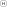

Рисунок 26 – Псевдосостояние локальной истории

Графическое обозначение глубокой истории представлено на рисунке 27 (буква «`H*`» со
звездочкой). Это псевдосостояние относится к области состояния, которая непосредственно ее
окружает. Опционально псевдосостояние глубокой истории может быть изображено на границе
соответствующей диаграммы машины состояний или составного состояния, если они содержат
только одну область.

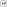

Рисунок 27 – Псевдосостояние глубокой истории

Графическое обозначение псевдосостояния точки входа представлено на рисунке 28. Данное
обозначение располагают на границе диаграммы машины состояний или составного состояния с
соответствующим именем. Опционально точка входа может быть размещена как внутри диаграммы
машины состояний или составного состояния, так и за пределами границы диаграммы машины
состояний или составного состояния.


Рисунок 28 – Псевдосостояние точки входа

Рисунок 29 представляет пример точки входа, расположенной на границе фигуры машины
состояний (а) или вложенной машины состояний (б).

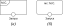

Рисунок 29 – Обозначения точек входа на границе машины состояний (а) и вложенной машины состояний (б)

Графическое обозначение псевдосостояния точки выхода представлено на рисунке 30. Данное
обозначение располагают на границе диаграммы машины состояний или составного состояния с
соответствующим именем. Опционально точка выхода может быть размещена как внутри диаграммы
машины состояний или составного состояния, так и за пределами границы диаграммы машин
состояний или составного состояния.


Рисунок 30 – Псевдосостояние точки выхода

Пример точки выхода, расположенной на границе фигуры машины состояний (а) или вложенной
машины состояний (б), представляет рисунок 31.

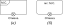

Рисунок 31 – Обозначения выходных соединений (точек выхода) машины состояний (а) и
вложенной машины состояний (б)

Графическое обозначение псевдосостояния выбора представлено на рисунке 32.


Рисунок 32 – Варианты изображения псевдосостояния выбора с условиями на переходах (а) и с разделением операндов (б)

Если все ограждающие условия, ассоциированные с переходами, выходящими из псевдосостояние
выбора, являются бинарными выражениями, которые используют общий левый операнд, то
обозначение псевдосостояния выбора может быть упрощено. Левый операнд может быть помещен
внутри ромбовидного символа, а остальные ограждающие выражения расположены на исходящих
переходах (см. рисунок 32 б).

Графическое обозначение для разветвления и объединения представлено на рисунке 33. К
центральной черте могут быть направлены одна или несколько стрелок от исходных состояний
(при представлении объединения). От центральной черты могут быть направлены одна или
несколько стрелок к состояниям (при представлении разветвления). Рядом с центральной
чертой может быть изображен текст, соответствующий переходу.


Рисунок 33 – Псевдосостояния разветвления (а) и объединения (б)

Псевдосостояние завершение изображается в виде креста (см. рисунок 34).


Рисунок 34 – Псевдосостояние завершения

#### 7.10.8 Примеры

Рисунок 35 иллюстрирует применение псевдосостояния локальной истории. Переход между
псевдосостоянием локальной истории и состоянием «`Стирка`» задает это состояние как
состояние по умолчанию, в котором машина состояний окажется, если в истории еще не было
сохранено последнее активное состояние.

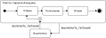

Рисунок 35 – Применение псевдосостояния локальной истории

Рисунки 36 и 37 иллюстрируют отображение псевдосостояний точек входа и выхода в составных
состояниях и машинах состояний. Рисунки 47 и 48 представляют пример машины состояний с
точкой выхода.

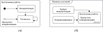

Рисунок 36 – Варианты изображения точки входа в составных состояниях (а) и машинах состояний (б)

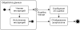

Рисунок 37 – Точка выхода в составных состояниях

Рисунок 38 иллюстрирует применения псевдосостояний разветвления и объединения вместе с ортогональными состояниями.

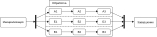

Рисунок 38 – Применение псевдосостояний разветвления и объединения

### 7.11 Событие

События описывают внешние и внутренние причины, влияющие на поведение машины состояний.

#### 7.11.1 Родительский тип элемента

Не имеет родительского типа элементов.

#### 7.11.2 Описание

Событие описывает происшествия в рамках машины состояний, влияющие на ее
поведение. Событие потенциально может стать источником срабатывающих переходов машины
состояний. В машине состояний все события глобальны и различимы по имени.

#### 7.11.3 Атрибуты

Дополнительных атрибутов нет.

#### 7.11.4 Ассоциации

Дополнительных ассоциаций нет.

#### 7.11.5 Ограничения

В рамках машины состояний все наименования событий различимы.

Наименование события не может совпадать с зарезервированными словами «`do`», «`else`»,
«`entry`», «`exit`».

#### 7.11.6 Семантика

Семантика событий в машине состояний подробно описана в разделе 7.4. События имеют
уникальные имена в рамках пространства имен машины состояний.

Целевая платформа, соответствующая описанной в диаграмме машине состояний, помимо
заданного списка событий может также вводить специальные события-агрегаторы, такие как:

- «любое событие» («`ANY`»), обозначающее срабатывание любого из событий имен в соответствующем пространстве имен машины состояний;
- «неизвестное событие» («`UNKNOWN`»), обозначающее срабатывание события, которое не было описано в рамках пространства имен машины состояний.

#### 7.11.7 Графическое обозначение

Изображение события в машине состояний зависит от языка целевой платформы. События в
рамках машины состояний изображаются на переходах (см. 7.6). Рекомендуется выбирать
наименование для событий, позволяющее отличать их от возможных действий в целевой
платформе, к примеру, указывать имена событий заглавными буквами.

### 7.12 Состояние

Состояние моделирует ситуацию, в течение которой машина состояний соответствует какому-то
(часто неявному) условию и может при этом выполнять какие-то определенные
действия. Последовательность состояний формирует процесс функционирования машины
состояний.

#### 7.12.1 Родительский тип элемента

Вершина (см. 7.1).

#### 7.12.2 Описание

Состояние – ключевой элемент машины состояний, который моделирует ситуацию, в течение
которой машина состояний соответствует какому-то (часто неявному) условию и может при этом
выполнять какие-то определенные действия. Данное условие может представлять статическую
ситуацию, такую как объект, ожидающий наступления какого-либо внешнего события. Оно также
может моделировать динамическую ситуацию, например, выполнение некоторого поведения
(т.е. рассматриваемая машина состояний входит в состояние, когда поведение начинается, и
покидает его, как только поведение завершается):

Различают следующие виды состояний:

- простое состояние (вид по умолчанию);
- составное состояние;
- состояние с вложенной машиной состояний.

Составное состояние – это либо простое составное состояние (только с одной областью), либо
ортогональное состояние (с несколькими областями).

##### 7.12.2.1 Простое состояние

Простое состояние – это состояние, у которого нет дочерних состояний, в т. ч. у него нет
областей и нет вложенных машин состояний.

##### 7.12.2.2 Составное состояние

Составное состояние либо содержит одну область, либо распадается на две или более
ортогональных области. Каждая такая область может иметь набор дочерних вершин и набор
переходов. Состояние может быть разбито на регионы только таким образом. На рисунке 45
состояние «`Прохождение курса`» является примером составного состояния с одной областью,
тогда как состояние «`Обучение`» – это составное состояние, содержащее три области.

Любое состояние, заключенное в область составного состояния, называется подсостоянием (или
дочерним состоянием) данного составного состояния. Оно называется непосредственным
подсостоянием, когда оно не содержится в каком-либо другом состоянии; в противном случае
оно называется косвенным подсостоянием.

Каждая область составного состояния может иметь начальное псевдосостояние и конечное
состояние. Переход к охватывающему состоянию представляет собой переход к исходному
псевдосостоянию в каждой области. При первом вхождении в состоянии используются самые
верхнеуровневые переходы по умолчанию, которые исходят из самых верхнеуровневых начальных
псевдосостояний каждой области.

Переход к конечному состоянию представляет собой завершение действий в окружающей его
области. Когда завершаются все ортогональные области, завершается и охватывающее их
состояние, т.е. запускается событие завершения в родительском состоянии. Состояние
считается завершенным, когда завершились все вложенные в него состояния.

Псевдосостояние входа используется для соединения внешнего перехода, заканчивающегося в
этой точке входа, с внутренним переходом, исходящим из этой точки входа. Псевдосостояние
выхода используется для соединения внутреннего перехода, заканчивающегося в этой точке
выхода, с внешним переходом, исходящим из этой точки выхода. Основная цель таких точек
входа и выхода состоит в явном выполнении действий входа в состояние и выхода из него
соответственно в промежутках между действиями, которые связаны с объединенными переходами.

Если переход завершается на охватывающем состоянии и внутренние области не имеют
начального псевдосостояния, то интерпретация этой ситуации является точкой семантической
вариации (правило входа по умолчанию). В некоторых интерпретациях это считается плохо
согласованной моделью, в таких случаях начальное псевдосостояние является
обязательным. Альтернативная интерпретация допускает такую ситуацию и означает, что при
таком переходе машина состояний остается в составном состоянии, не входя ни в одну из
областей или их подсостояний.

##### 7.12.2.3 Состояние с вложенной машиной состояний

Состояние с вложенной машиной состояний определяется как реализация вложенной машины
состояний внутри данного состояния. Машина состояний, содержащая состояние с вложенной
машиной состояний, называется содержащей машиной состояний. Одна и та же машина состояний
может быть вложенной машиной состояний более одного раза в контексте исполнения содержащей
машины состояний.

Состояние с вложенной машиной состояний семантически эквивалентно составному
состоянию. Области вложенной машины состояний являются областями составного
состояния. Вход, выход, поведение и внутренние переходы определяются как часть
состояния. Состояние с вложенной машиной состояний представляет собой механизм
декомпозиции, который позволяет создавать более общие варианты поведения и использовать их
повторно.

Переходы в содержащей машине состояний могут иметь точки входа/выхода вложенной машины
состояний в качестве целей/источников. Состояния с вложенной машиной состояний с
использованием точек входа и выхода, определенными в соответствующей машине состояний дают
возможность легче масштабировать машины состояний и обеспечить инкапсуляцию.

#### 7.12.3 Атрибуты

Дополнительных атрибутов нет.

#### 7.12.4 Ассоциации

**Соединения:** псевдосостояния [0..*] – псевдосостояния точек соединения составного состояния
или вложенной машины состояний. Это могут быть только псевдосостояния точек входа или
выхода, и у них должны быть разные имена.

**Отложенные события:** событие [0..*] – список имен событий, связанных с событиями, которые
являются кандидатами для сохранения машиной состояний, если они не запускают переходов из
состояния (не используются). Отложенное событие сохраняется до тех пор, пока машина
состояний не достигнет конфигурации состояния, в которой он больше не откладывается и
может быть инициирован.

**Поведение исполнения (do):** поведение [0..1] – опциональное поведение, которое выполняется,
когда состояние активно. Выполнение начинается при входе в это состояние и останавливается
либо само по себе, либо при выходе из состояния, в зависимости от того, что наступит
раньше.

**Поведение входа (entry):** поведение [0..1] – опциональное поведение, которое выполняется
всякий раз, когда происходит вход в это состояние, независимо от перехода, по которому это
состояние было достигнуто. Если определено, действия входа всегда выполняются до
завершения до любого внутреннего поведения или переходов, выполняемых в пределах
состояния.

**Поведение выхода (exit):** поведение [0..1] – опциональное поведение, которое выполняется
всякий раз, когда происходит выход из этого состояния, независимо от того, какой по какому
переходу был выход из этого состояния. Если определено, действия выхода всегда выполняются
только после завершения выполнения всех внутренних действий и действий перехода.

**Области:** область [0..*] – области, непосредственно принадлежащие состоянию.

**Вложенная машина состояний:** машина состояний [0..1] – тип машин состояний, к которым
относится данное состояния (для состояний с вложенной машиной состояний).

#### 7.12.5 Ограничения

Состояние должно иметь имя, представляющее собой непустую строку.

Состояние не может иметь одновременно и вложенную машину состояний, и области.

Только состояние со вложенной машиной состояний может ссылаться на машину состояний.

Только составные состояния или состояния вложенной машины состояний могут иметь точки
входа и выхода.

#### 7.12.6 Семантика

##### 7.12.6.1 Состояния в целом

Состояния в целом включают:

- активные состояния. Состояние может быть активным или неактивным во время
  выполнения. Состояние становится активным при входе в него в результате какого-либо
  перехода и становится неактивным при выходе из него в результате перехода. Из состояния
  можно выйти и войти в него в результате одного и того же перехода (например, перехода в
  себя);
- вход и выход из состояния. Когда происходит вход в состояние, оно выполняет свое
  поведение входа (`entry`) до выполнения любого другого действия. И наоборот, всегда, когда
  происходит выход из состояния, оно выполняет свое поведение выхода (`exit`) как последний
  шаг перед выходом из состояния;
- поведение исполнения в состоянии (`do`). Поведение представляет собой выполнение
  действий, которые происходят, пока машина состояний находится в соответствующем
  состоянии. Поведение начинает выполняться при входе в состояние, следуя за поведением
  входа. Если поведение завершается, пока состояние все еще активно, оно вызывает событие
  завершения. В случае исходящего перехода завершения (см. ниже) произойдет выход из
  состояния. При выходе поведение исполнения завершается до того, как будет выполнено
  поведение выхода. Если выход из состояния происходит в результате срабатывания
  исходящего перехода до завершения поведения, поведение прерывается до его завершения;
- отложенные события. Состояние может определять набор событий, которые могут быть
  отложены в этом состоянии. Событие, которое не вызывает никаких переходов в текущем
  состоянии, не будет отправлено, если его тип соответствует одному из типов в наборе
  отложенных событий этого состояния. Вместо этого оно остается в пуле событий, в то время
  как вместо него отправляется другое неотложенное событие. Эта ситуация сохраняется до
  тех пор, пока не будет достигнуто состояние, в котором либо событие больше не
  откладывается, либо событие запускает переход.

##### 7.12.6.2 Составные состояния

Составные состояния включают:

а) конфигурации активного состояния. В иерархической машине состояний одновременно может
быть активными более одного состояния. Если машина состояний находится в простом
состоянии, которое содержится в составном состоянии, то все составные состояния, которые
прямо или транзитивно содержат простое состояние, также активны. Поскольку машина
состояний в целом и некоторые составные состояния в этой иерархии могут быть
ортогональными (т. е. содержать области), текущее активное состояние фактически
представлено набором деревьев состояний, начиная с самого верхнеуровневого состояния
корневых областей вплоть до самого внутреннего активного подсостояния. Такое дерево
состояний называют конфигурацией состояний.

За исключением выполнения перехода, к конфигурациям состояний применяются следующие
универсальные требования:

- если составное состояние активно и не ортогонально, активным является не более одного из
  его подсостояний;
- если составное состояние активно и ортогонально, все его области активны, причем в
  каждой области не более одного подсостояния.
  
Вход в неортогональное составное состояние. При переходе в составное состояние различают следующие случаи:

- вход по умолчанию: графически это обозначается входящим переходом, который заканчивается
  на внешней границе составного состояния. В этом случае применяется правило входа по
  умолчанию, см. выше про Точку семантических вариаций (правило входа по умолчанию). Если
  на переходе стоит ограждающее условие, оно должно быть удовлетворено (Истина). (Закрытый
  условием начальный переход — это некорректно определенное состояние выполнения, и его
  обработка не определена.) Поведение входа (entry) в составное состояние выполняется до
  поведения, связанного с начальным переходом;
- явный вход: если переход ведет в подсостояние составного состояния, то это подсостояние
  становится активным, и его код входа выполняется после выполнения кода входа составного
  состояния. Это правило применяется рекурсивно, если переход завершается в транзитивно
  вложенном подсостоянии;
- вход с локальной историей: если переход завершается на псевдосостоянии с локальной
  историей, активным подсостоянием становится самое последнее активное подсостояние перед
  входом, если только самое последнее активное подсостояние не является конечным
  состоянием или если это первый вход в это состояние. В последних двух случаях
  производится вход в состояние с историей по умолчанию. Это подсостояние, являющееся
  целью специального перехода, происходящего из псевдосостояния истории. (Если такой
  переход не указан, ситуация является некорректно определенной, и ее обработка не
  определена.) Если активное подсостояние, определенное историей, является составным
  состоянием, то оно продолжается с входом по умолчанию;
- вход с глубокой историей: правило входа с глубокой историей представляет собой правило
  входа с локальной историей, применяемое рекурсивно ко всем уровням в конфигурации
  активного состояния ниже текущего;
- вход через точку входа: если переход входит в составное состояние через псевдосостояние
  точки входа, то поведение входа выполняется до действия, связанного с внутренним
  переходом, исходящим из точки входа;

б) вход в ортогональное составное состояние. Каждый раз, когда происходит вход в
ортогональное составное состояние, также происходит вход в каждое из его ортогональных
областей, либо по умолчанию, либо явно. Если переход завершается на границе составного
состояния, то во все области вход осуществляется с использованием входа по умолчанию. Если
переход явно входит в одну или несколько областей (в случае разветвления), в эти области
происходит вход явно, а в остальные – по умолчанию;

в) выход из неортогонального состояния. При выходе из составного состояния активные
подсостояния завершаются рекурсивно. Это означает, что действия выхода (`exit`) выполняются
последовательно, начиная с самого внутреннего активного состояния в конфигурации текущего
состояния.

Если в составном состоянии выход происходит через псевдосостояние точки выхода, поведение
выхода из состояния выполняется после поведения, связанного с переходом, приходящим в
точку выхода;

г) выход из ортогонального состояния. При выходе из ортогонального состояния происходит
выход из каждой из его областей. После этого выполняются действия по выходу из состояния;

д) отложенные события. Составные состояния приводят к потенциальным конфликтам с отсрочкой
событий. Каждое из подсостояний может откладывать или обрабатывать событие, потенциально
конфликтующее с составным состоянием (например, подсостояние имеет отложенное событие, в
то время как составное состояние обрабатывает его, или наоборот). В случае составного
ортогонального состояния подсостояния ортогональных областей также могут приводить к
конфликтам отсрочки событий. Разрешение конфликта осуществляется в соответствии с
приоритетами запуска, где вложенные состояния имеют больший приоритет перед охватывающими
состояниями. В случае конфликта между состояниями в разных ортогональных областях
обрабатываемое событие имеет больший приоритет перед отложенным.

##### 7.12.6.3 Состояния с вложенной машиной состояний

Состояние с вложенной машиной состояний семантически эквивалентно составному состоянию,
определенному данной машиной состояний. Вход и выход из этого составного состояния
осуществляется через точки входа и выхода.

Во вложенную машину состояний можно войти через его псевдосостояние по умолчанию
(начальное) или через любую из его точек входа (т.е. это может подразумевать вход в
неортогональное или ортогональное составное состояние с областями). Вход через точку входа
подразумевает, что выполняется поведение входа составного состояния, за которым следует
частичный(е) переход(ы) от точки входа к целевому(ым) состоянию(ям) внутри составного
состояния. Что касается начальных переходов по умолчанию, ограждающие условия, связанные с
этими переходами в точки входа, должны иметь значение Истина, иначе машина состояний
является некорректно определенной.

Аналогичным образом, из состояния с вложенной машины состояний можно выйти в результате
достижения его конечного состояния посредством «группового» перехода, который применяется
ко всем подсостояниям составного состоянии вложенной машины состояний, или через любую из
его точек выхода. Выход через точку выхода подразумевает, что сначала выполняется
поведение перехода с точкой выхода в качестве цели, за которым следует поведение выхода из
составного состояния.

#### 7.12.7 Графическое обозначение

##### 7.12.7.1 Состояния в целом

Состояние в целом отображается в виде прямоугольника с закругленными углами, а имя
состояния отображается внутри прямоугольника (см. рисунок 39). Альтернативным способом
обозначения состояния является прямоугольник со скошенными углами или простой
прямоугольник – при условии, что все состояния в машине состояний изображаются
единообразно.

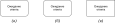

Рисунок 39 – Варианты изображения простого состояния

Опционально к нему может быть прикреплена вкладка с именем, см. рисунок 40. Вкладка с
именем представляет собой прямоугольник, расположенный за пределами верхней части
состояния, и содержит имя этого состояния. Как правило, вкладка с именем используется для
хранения имени составного состояния, имеющего ортогональные области, но может
использоваться и в других случаях.

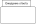

Рисунок 40 – Состояние с вкладкой, содержащей имя

Состояние может быть разделено на несколько блоков, отделенных друг от друга
горизонтальной линией, отступом или другим очевидным образом, см. рисунок 41:

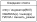

Рисунок 41 – Состояние с блоками

К возможным видам блоков состояния относятся:

- блок для имени состояния;
- блок для внутреннего поведения;
- блок для внутренних переходов.

Кроме того, составное состояние имеет блок декомпозиции.

Рекомендуется следующий порядок отображения блоков (при наличии) в состоянии
(сверху-вниз):

а) блок имени;

б) блок внутреннего поведения входа (`entry`);

в) блок внутреннего поведения исполнения (`do`);

г) блок для внутренних переходов;

д) блок декомпозиции или заменяющий его символ скрытой декомпозиции;

е) блок внутреннего поведения выхода (`exit`).

Каждый из видов блоков подробнее описан далее:

- **Блок для имени состояния**

В этом блоке хранится (опционально) имя состояния в виде строки. Состояния без имени
являются анонимными, и все различны. Не рекомендуется показывать одно и то же именованное
состояние дважды на одной и той же диаграмме во избежание путаницы. Блок для имени не
следует использовать, если используется вкладка с именем, и наоборот.

В случае состояния вложенной машины состояний имя машины состояний, на который дается
ссылка, отображается в виде строки, следующей за знаком «`:`» после имени самого состояния
(см. рисунок 45).

- **Блок внутреннего поведения**

В этом блоке хранится список поведений исполнения, которые выполняются, пока данное
состояние активно.

Метка действия определяет обстоятельства, при которых будет вызвано поведение, указанное в
выражении действия. Выражение поведения может использовать любые атрибуты и ассоциируемые
объекты, находящиеся в области действия данного состояния. Для элементов списка, за
которыми следует пустое выражение, разделитель в виде обратной косой черты не является
обязательным.

В этом блоке могут использоваться метки действий, зарезервированные для специальных целей
и поэтому не используемые в качестве имен событий. Ниже приведены зарезервированные метки
действий и их значение:

* вход (`entry`) — эта метка идентифицирует поведение, заданное соответствующим выражением,
которое выполняется при входе в состояние (поведение входа);
* выход (`exit`) — эта метка идентифицирует поведение, заданное соответствующим выражением,
которое выполняется при выходе из состояния (поведение выхода)
* исполнение (`do`) — эта метка идентифицирует поведение исполнения, которое выполняется до
тех пор, пока машина состояний находится в данном состоянии или до тех пор, пока не
завершится вычисление, указанное выражением (последнее может привести к созданию события
завершения).

- **Блок внутренних переходов**

Этот блок содержит список внутренних переходов, где каждый элемент имеет форму, описанную
в типе элемента переход (см. 7.6).

Имя каждого события может появляться более одного раза для каждого состояния, если
ограждающие условия различны. Параметры события и ограждающие условия являются
необязательными. Если у события есть параметры, их можно использовать в выражении через
текущую переменную события.

##### 7.12.7.2 Использование пиктограмм

Если языку целевой платформы, используемому для разметки переходов машины состояний,
ставится в соответствие графический язык пиктограмм, то внутреннее поведение и события,
ограждающие условия и выражения действий обозначаются в виде графических элементов
(см. рисунок 42).

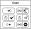

Рисунок 42 – Варианты обозначения состояния в случае использования пиктограмм,
соответствующих языку целевой платформы

В данном примере также установлены специальные пиктограммы для действий входа (`entry`) и
выхода (`exit`).

##### 7.12.7.3 Составное состояние

- **Блок декомпозиции**

В этом блоке показана структура состояния с точки зрения областей, подсостояний и
переходов. Помимо (опционального) имени, блока внутреннего поведения и блока внутренних
переходов, состояние может иметь дополнительный блок, содержащий вложенную диаграмму. Для
удобства и внешнего вида текстовые блоки можно сжимать по горизонтали внутри графической
области.

В некоторых случаях удобно скрыть декомпозицию составного состояния. Например, внутри
составного состояния может быть большое количество состояний, и они могут просто не
поместиться в графическое пространство, доступное для диаграммы. В этом случае составное
состояние может быть представлено графически как простое состояние со специальным символом
скрытой декомпозиции, обычно расположенным в левом верхнем или правом нижнем углу блока, в
зависимости от выбранного символа (см. рисунок 44). Этот символ, состоящий из двух
горизонтально расположенных и связанных состояний или представляющий собой «плюсик»,
является опциональным визуальным сигналом о том, что состояние имеет декомпозицию, которая
в настоящий момент не показано на этой конкретной диаграмме машины состояний. При этом
«скрытие» является чисто вопросом графического удобства и не имеет значения с точки зрения
ограничения доступа к элементам при исполнении машины состояний.

Составное состояние может иметь одну или несколько точек входа и выхода на внешней границе
или в непосредственной близости от этой границы (внутри или снаружи).

##### 7.12.7.4 Состояние с вложенной машиной состояний

Состояние с вложенной машиной состояний изображается как обычное состояние, в котором
строка в блоке имени для имеет следующий синтаксис:

```
<имя состояния> ‘:’ <имя машины состояний>
```

Фигура состояния вложенной машины состояний может содержать одну или несколько точек входа
и на одну или несколько точек выхода – соответствующих псевдосостояний точек входа/выхода
на границе состояния с вложенной машиной состояний. Точки входа/выхода могут иметь имена,
соответствующие именам точек входа/выхода, определенным в указанной машине состояний.

Если вход во вложенную машину состояний осуществляется через начальное псевдосостояние по
умолчанию или выход из нее происходит в результате завершения работы вложенной машины
состояний, нет необходимости использовать обозначение точки входа/выхода. Аналогично,
точка выхода не требуется, если выход происходит через явный «групповой» переход,
исходящий от границы состояния с вложенной машиной состояний (подразумевается, что он
применяется ко всем подсостояниям вложенной машины состояний).

Состояния с вложенной машиной состояний, ссылающиеся на одну и ту же вложенную машину
состояний, могут появляться несколько раз на одной и той же диаграмме машины состояний,
при этом точки входа и выхода являются частью разных переходов.

#### 7.12.8 Пример

Рисунки 43 и 44 представляют примеры составного состояния в различных вариантах
изображения блока декомпозиции.

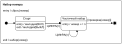

Рисунок 43 – Составное состояние с двумя подсостояниями

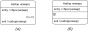

Рисунок 44 – Варианты изображения составного состояния с символом, указывающим на скрытую декомпозицию

Рисунок 45 представляет пример составного состояния с дочерним составным состоянием, содержащим ортогональные области.

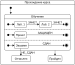

Рисунок 45 – Ортогональное состояние с областями

Рисунок 46 показывает фрагмент схемы машины состояний, в котором есть состояние с
вложенной машиной состояний. Вложенная машина состояний определяется в некотором
охватывающем или импортированном пространстве имен.

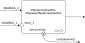

Рисунок 46 – Состояние с вложенной машиной состояний

В примере на рисунке 46 переход, вызванный событием «`ОШИБКА_1`», завершится в точке входа
«`проц_1`» машины состояний «`МашинаОбработкиОшибок`». Событие перехода «`ОШИБКА_3`»
подразумевает использование перехода по умолчанию для состояния «`ОбработкаОшибок`».

Переход, исходящий из точки выхода «проц_выход» вложенной машины состояний, будет
выполнять действие «`исправлено()`» в дополнение к тому, что выполняется в машине состояний
«`ОбработкаОшибок`». Этот переход должен был быть запущен внутри машины состояний
«`ОбработкаОшибок`». Наконец, переход, исходящий из границы состояния с вложенной машиной
состояний, принимается за результат события завершения, генерируемого, когда
«`МашинаОбработкиОшибок`» достигает своего конечного состояния.

Аналогичные обозначения будут применены к составным состояниям, за исключением того, что в
имени состояния не будет ссылки на исходную машину состояний.

Рисунок 47 показывает пример машины состояний, определенной с точкой выхода. Точки входа и
выхода могут быть показаны как на рамке, так и на диаграмме состояния. На рисунке 47 а
показан пример машины состояний, определенной с точкой выхода на диаграмме состояний. На
рисунке 47 б показана та же машина состояний с использованием обозначения точки выхода на
рамке машины состояний.

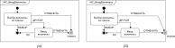

Рисунок 47 – Машина состояний с вариантами расположения выходящие соединения (точки
выхода)

Рисунок 48 представляет машину состояний, в которую входит состояние с вложенной машиной
состояний, которую представляет рисунок 47.

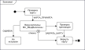

Рисунок 48 – Машина состояний, включающая состояние с вложенной машиной состояний

### 7.13 Условие

Условие – это логическое выражение, принимающее значения Истина или Ложь.

#### 7.13.1 Родительский тип элемента

Не имеет родительского типа элемента.

#### 7.13.2 Описание

Условие – логическое выражение на языке целевой платформы, которое используется для
изменения поведения машины состояний.

#### 7.13.3 Атрибуты

Дополнительных атрибутов нет.

#### 7.13.4 Ассоциации

Дополнительных ассоциаций нет.

#### 7.13.5 Ограничения

Дополнительных ограничений нет.

#### 7.13.6 Семантика

Условия используются в ограждающих условиях переходов. Текст условия зависит от выбранного
языка целевой платформы машины состояний и должен содержать логическое выражение. Условия
не должны включать выражения, вызывающие побочные эффекты. Машины состояний, нарушающие
это правило, считаются некорректно сформулированными.

#### 7.13.7 Графическое обозначение

См. 7.6.

### 7.14 Элемент

Элементы – это базовые составляющие машины состояний. Каждый элемент может иметь имя.

#### 7.14.1 Родительский тип элементов

Не имеет родительского типа элементов.

#### 7.14.2 Описание

Элемент – наиболее абстрактный тип для элементов, составляющих машины состояний. Он
используется в качестве родительского типа для всех видимых элементов диаграммы. Элемент
может содержать имя (название). Имя используется для идентификации элемента в рамках
определенного пространства имен. Имя элемента может быть представлено в виде
непротиворечивого квалифицированного имени элемента в соответствии с иерархией вложенных
пространств имен. В диаграммах состояний присутствуют не элементы непосредственно, а
производные от него типы.

При машинной реализации диаграмм машин состояний возможно введение дополнительных
служебных идентификаторов элементов диаграммы машин состояний, которые могут не
отображаться на диаграмме, но позволяют однозначно разделять элементы между собой, а также
производить операцию сериализации и десериализации графов диаграмм машин состояний. Такие
идентификаторы не следует путать с именами элементов, которые отображаются в диаграмме
состояний непосредственно.

#### 7.14.3 Атрибуты

**Имя:** строка [0..1] – имя (название) элемента, может быть задано или не задано.

**Квалифицированное имя:** строка [0..1] – уникальное имя, которое позволяет
идентифицировать элемент в иерархии вложенных пространств имен. Квалифицированное имя
является уникальным идентификатором элемента, которое конструируется из имен
соответствующих пространств имен, начиная с корня иерархии и заканчивая именем самого
элемента непосредственно, путем объединения символами ‘::’ (см. 7.9). Может отсутствовать,
если не может быть сконструировано.

#### 7.14.4 Ассоциации

**Пространство имен:** пространство имен [0..1] – определяет пространство имен, к которому
относится данный элемент. Если элемент не принадлежит ни одному пространству имен,
считается, что он находится в корневом пространстве имен, не имеющем имени.

#### 7.14.5 Ограничения

Элемент не может непосредственно или косвенно включать себя.

Квалифицированное имя можно построить только для тех элементов, для которых задано имя, а
также задано имя для всех содержащих его вложенных пространств имен.

Элемент, который не относится к какому-либо пространству имен (как правило — это корневой
элемент), не может стать видимым в диаграмме.

#### 7.14.6 Семантика

Имя элемента используется для идентификации элемента в тех пространствах имен, в которых
этот элемент доступен. Допускается отсутствие имени элемента, в этом случае считается, что
все неименованные элементы различимы между собой.

Производные от элемента типы обеспечивают уникальную семантику в зависимости от той
концепции, которую они представляют в диаграмме.

Элемент может быть предметом комментирования. Комментарии к элементу не имеют
дополнительной семантики и лишь представляют полезную для машинной реализации или для
пользователя машины состояний информацию о данном элементе.

#### 7.14.7 Графическое обозначение

Не существует общего графического обозначения для элементов. Каждый из производных типов
элементов представляет собственное графическое обозначение.

В зависимости от графического обозначения производного типа элемента, имя элемента, если
оно задано, может отображаться внутри элемента, в виде отдельного блока в верхней части
элемента (рисунок 49) или рядом с элементом (рисунок 49 в для псевдосостояния точки
входа). Если имя элемента было задано, оно должно отображаться.


Рисунок 49 – Примеры отображения имени различных элементов

## 8 Диаграмма

Диаграммы машин состояний определяют машины состояний. В этом разделе перечисляются
графические элементы, которые могут отображаться на диаграммах машин состояний, и
приводятся ссылки на разделы документа, в которых можно найти подробную информацию о
семантике, конкретных обозначениях для каждого из элементов и примерах, иллюстрирующих,
как графические элементы могут быть собраны в диаграммы машин состояний.

### 8.1 Графические узлы

В таблице 1 представлены графические узлы, которые могут быть включены в диаграмму машины
состояний. Графические узлы представляют собой вершины ориентированного мультиграфа,
составляющего машину состояний.

**Таблица 1 – Графические узлы, которые могут быть включены в машину состояний**

| Тип узла | Графическое обозначение | Ссылка на описание |
|---|---|---|
| Выбор | 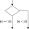 | 7.10 Псевдосостояние |
| Глубокая история |  | 7.10 Псевдосостояние |
| Завершение |  | 7.10 Псевдосостояние |
| Комментарий без имени и с именем (человекочитаемый, без предмета комментирования) |  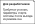 | 7.2 Комментарий |
| Комментарий (машиночитаемый, без предмета комментирования) | 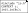 | 7.2 Комментарий |
| Комментарий к элементу | 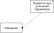 | 7.2 Комментарий |
| Комментарий к фрагменту | 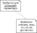 | 7.2 Комментарий |
| Конечное состояние |  | 7.3 Конечное состояние |
| Локальная история |  | 7.10 Псевдосостояние |
| Машина состояний |  | 7.4 Машина состояний |
| Начальное псевдосостояние |  | 7.10 Псевдосостояние |
| Область |  | 7.5 Область |
| Объединение |  | 7.10 Псевдосостояние |
| Простое состояние | 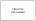 | 7.12 Состояние |
| Разветвление |  | 7.10 Псевдосостояние |
| Составное состояние | 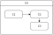 | 7.12 Состояние |
| Составное состояние (с вариантами символа декомпозиции) | 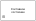 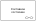 | 7.12 Состояние |
| Состояние с вложенной машиной состояний | 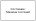 | 7.12 Состояние |
| Состояние с обозначением поведения и событий пиктограммами |  | 7.12 Состояние |
| Точка входа |  | 7.10 Псевдосостояние |
| Точка выхода |  | 7.10 Псевдосостояние |

### 8.2 Графические соединения

В таблице 2 представлены графические соединения, которые могут быть включены в диаграмму
машины состояний. Графические соединения представляют собой дуги ориентированного
мультиграфа, составляющего машину состояний.

**Таблица 2 – Графические соединения, которые могут быть включены в машину состояний**

| Тип узла | Графическое обозначение | Ссылка на описание |
|---|---|---|
| Переход (внешний или локальный) |  | 7.6 Переход |
| Переход (внешний или локальный) – при использовании графического языка разметки |  | 7.6 Переход |

## Библиография

1. Samek M. Practical UML statecharts in C/C++: event-driven programming for embedded
   systems. – CRC Press, 2008
2. Шалыто А.А. Switch-технология. Алгоритмизация и программирование задач логического
   управления. – СПб.: Наука, 1998. – 628 с.
3. Непейвода Н. Н. Стили и методы программирования. Курс лекций. – 2005
4. Harel, David, “Statecharts: A Visual Formalism for Complex Systems”, Science of
   Computer Programming, 8, 1987, pp. 231-274
5. ИСО/МЭК 19505-2:2012 Информационные технологии. Унифицированный язык моделирования
   группы по управлению объектами (OMG UML). Часть 2. Сверхструктура (ISO/IEC
   19505-2:2012) (Information technology Object Management Group Unified Modeling
   Language (OMG UML) — Part 2: Superstructure)

## Отличия от ISO/IEC 19505-2:2012 (UML 2.4.1, раздел 15 «State Machines»)

Эта глава не входит в текст стандарта. В ней собраны отличия стандарта ПНСТ 984—2024
от раздела 15 «State Machines» стандарта ISO/IEC 19505-2:2012 (OMG UML 2.4.1
Superstructure), на который стандарт опирается (библиография [5]). Ссылки вида «15.3.12»
указывают на подраздел UML.

Ядро ПНСТ 984—2024 представляет собой перевод описаний из раздела 15 стандарта UML 2.4.1:
Vertex, FinalState, Region, StateMachine, Transition/TransitionKind,
Pseudostate/PseudostateKind и State вместе с их ограничениями, семантикой, обозначениями и
примерами.

Ключевые отличия:

- При переводе из стандарта UML исключены протокольные машины состояний, механизм
  расширения и переопределения, элемент junction, списки состояний (state list),
  ConnectionPointReference, явно определенное событие TimeEvent, которое только
  предусматривается в ПНСТ и фигурирует в примерах, производные атрибуты и инвариант
  состояния (stateinvariant), символы приёма/отправки сигналов.
- ПНСТ добавляет новые сущности: комментарии с предметами комментирования, целевую
  платформу и её язык, пиктограммы, метаинформацию, передачу событий между уровнями
  (propagate/block), выбираемый порядок выполнения перехода, специальные события
  ANY/UNKNOWN, глобальные имена событий, «else» на переходах, обязательные имена, элементы
  нотации (именованные области, формы состояния, порядок блоков, символ декомпозиции «плюс»).
- Семантические расхождения, на которые следует обратить внимание, — различия
  в семантике переходов и управления переходами в диаграмме.

### Терминология

Английский эквивалент приведён так, как он дан в разделе 3 стандарта ПНСТ 984; в третьем
столбце — имя класса, атрибута или понятия UML 2.4.1.

| Термин ПНСТ (3.N) | Эквивалент по ПНСТ | Термин/имя в UML 2.4.1 | Примечание |
|---|---|---|---|
| 3.1 активное состояние | active state | active state, active state configuration (15.3.11) | определение ПНСТ «включая родительские состояния» соответствует конфигурации состояний |
| 3.2 блок состояния | state block | compartment (15.3.11 Notation) | «internal activities compartment» → «блок внутреннего поведения» |
| 3.3 вершина | vertex | Vertex (15.3.16) | |
| 3.4 внешний переход | external transition | TransitionKind::external (15.3.15) | |
| 3.5 внутренний переход | internal transition | TransitionKind::internal | |
| 3.6 псевдосостояние выбора | choice pseudostate | PseudostateKind::choice | |
| 3.7 графический язык программирования | visual programming language | — | |
| 3.8 псевдосостояние глубокой истории | deep history pseudostate | PseudostateKind::deepHistory | |
| 3.9 завершающее псевдосостояние | terminate pseudostate | PseudostateKind::terminate | |
| 3.10 исходное состояние | source state | Transition::source; main source (15.3.14) | в UML источник — вершина, не только состояние |
| 3.11 квалифицированное имя | qualified name | NamedElement::qualifiedName (Kernel) | |
| 3.12 комментарий | comment | Comment (Kernel) | |
| 3.13 комментарий машиночитаемый (формальный) | machine-readable (formal) comment | — | |
| 3.14 комментарий человекочитаемый (неформальный) | human-readable (informal) comment | — | |
| 3.15 конечное состояние | final state | FinalState (15.3.2) | |
| 3.16 контекст исполнения | execution context | behaviored classifier context (15.3.12) | в UML — классификатор с приёмами и операциями |
| 3.17 корневое пространство имен | root namespace | — | ближайшее: верхняя область машины (`top`, 15.3.14 [6]) |
| 3.18 псевдосостояние локальной истории | shallow history | PseudostateKind::shallowHistory | |
| 3.19 локальный переход | local transition | TransitionKind::local | |
| 3.20 расширенная иерархическая машина состояний; РИМС | extended hierarchical state machine | StateMachine (15.3.12); hierarchical state machine (15.3.11, с. 30) | «extended» в UML означает расширение машины (`extendedStateMachine`) |
| 3.21 наименьший общий предок | least common ancestor | LCA(s1,s2) (15.3.12 Additional Operations; 15.3.14) | UML: область или ортогональное состояние; ПНСТ: наименьшее составное состояние |
| 3.22 начальное псевдосостояние | initial pseudostate | PseudostateKind::initial | |
| 3.23 начальное состояние | initial state | — | ближайшее: default state (15.3.8) |
| 3.24 область | region | Region (15.3.10) | |
| 3.25 псевдосостояние объединения | join pseudostate | PseudostateKind::join | |
| 3.26 ограждающее условие | guard condition | Transition::guard: Constraint; `<guard-constraint>` | |
| 3.27 ортогональные области | orthogonal regions | orthogonal regions; State::isOrthogonal | |
| 3.28 отложенное событие | deferred event | State::deferrableTrigger; deferrable trigger (15.3.14 Notation) | |
| 3.29 парадигма программирования | programming paradigm | — | |
| 3.30 переход | transition | Transition (15.3.14) | |
| 3.31 переход завершения | completion transition | completion transition (15.3.14) | |
| 3.32 поведение | behavior | Behavior (Common Behaviors); entry/exit/doActivity/effect | |
| 3.33 поведение входа | entry behavior (entry activity) | State::entry; метка `entry` | |
| 3.34 поведение выхода | exit behavior (exit activity) | State::exit; метка `exit` | |
| 3.35 поведение исполнения | do behavior (do activity) | State::doActivity; метка `do` | |
| 3.36 порядок выполнения перехода | transition order | — | в UML порядок единственный (15.3.14) |
| 3.37 процедура передачи событий между уровнями | event propagation procedure | — | |
| 3.38 предмет комментирования | subject of the comment | Comment::annotatedElement (Kernel) | ПНСТ добавляет указатель на фрагмент |
| 3.39 программирование расширенных иерархических машин состояний | extended hierarchical state machine programming | — | |
| 3.40 простое состояние | simple state | simple state; State::isSimple | |
| 3.41 пространство имен | namespace | Namespace (Kernel); обобщение Region, State, Transition | |
| 3.42 псевдосостояние | pseudostate | Pseudostate (15.3.8) | |
| 3.43 псевдосостояние разветвления | fork pseudostate | PseudostateKind::fork | |
| 3.44 событие | event, trigger | Event, Trigger (Common Behaviors); Transition::trigger | ПНСТ объединяет два понятия |
| 3.45 событие завершения | completion event | completion event (15.3.14) | |
| 3.46 составное состояние | composite state | composite state; State::isComposite | |
| 3.47 составной переход | compound transition | compound transition (15.3.14) | |
| 3.48 состояние | state | State (15.3.11) | |
| 3.49 состояние с вложенной машиной состояний | submachine state | submachine state; State::submachine | |
| 3.50 псевдосостояние точки входа | entry point pseudostate | PseudostateKind::entryPoint | |
| 3.51 псевдосостояние точки выхода | exit point pseudostate | PseudostateKind::exitPoint | |
| 3.52 точка семантической вариации | semantic variation point | semantic variation point (default entry rule, 15.3.11) | ПНСТ сводит общее понятие к одному случаю |
| 3.53 целевое состояние | target state | Transition::target; main target | |
| 3.54 целевая платформа | target platform | — | |
| 3.55 элементарный шаг | run-to-completion step | run-to-completion step (15.3.12) | |
| 3.56 элемент | element | Element, NamedElement (Kernel) | элемент ПНСТ имеет имя, т. е. соответствует NamedElement |

Дополнительные термины, не вошедшие в перечень терминов стандарта ПНСТ 984:

| Термин ПНСТ (3.N) | Эквивалент по ПНСТ | Термин/имя в UML 2.4.1 | Примечание |
| вкладка с именем | name tab | name tab (15.3.11) | |
| конфигурация состояний | state configuration | — |  |
| метаинформация | meta-iformation | — |  |
| переход в себя | self-transition | self-transition (15.3.14) |  |
| пиктограмма | icon | control icons (15.3.14 Presentation options) |  |
| пул событий | event pool | event pool (15.3.12) |  |
| язык целевой платформы | platform language | action language chosen for the model (15.3.14) |  |

### Соответствие элементов стандартов

| ПНСТ 984-2024 | UML 2.4.1 | Характер соответствия |
|---|---|---|
| 7.1 Вершина | 15.3.16 Vertex | перевод |
| 7.2 Комментарий | Comment (Kernel) | новая сущность с расширенной семантикой |
| 7.3 Конечное состояние | 15.3.2 FinalState | перевод с объединением ограничений |
| 7.4 Машина состояний | 15.3.12 StateMachine | перевод семантики элементарного шага; расширение и переопределение исключены; добавлены 7.4.6.6–7.4.6.7 |
| 7.5 Область | 15.3.10 Region | перевод без переопределения |
| 7.6 Переход | 15.3.14 Transition + 15.3.15 TransitionKind | перевод с изменённой последовательностью выполнения; добавлены propagate/block |
| 7.7 Поведение | Behavior (Common Behaviors) | собственное определение |
| 7.8 Предмет комментирования | — (Comment::annotatedElement) | только в ПНСТ |
| 7.9 Пространство имен | Namespace (Kernel) | собственное определение |
| 7.10 Псевдосостояние | 15.3.8 Pseudostate + 15.3.9 PseudostateKind (+ 15.3.1 ConnectionPointReference) | перевод; junction исключён |
| 7.11 Событие | Event/Trigger (Common Behaviors), 15.3.13 TimeEvent | собственное определение; TimeEvent исключён |
| 7.12 Состояние | 15.3.11 State | перевод; производные атрибуты и инварианты исключены; добавлены пиктограммы |
| 7.13 Условие | Constraint (Kernel), guard в 15.3.14 | собственное определение |
| 7.14 Элемент | Element + NamedElement (Kernel) | объединение двух классов |
| — | 15.3.3 Interface | только в UML |
| — | 15.3.4 Port | только в UML |
| — | 15.3.5 ProtocolConformance | только в UML |
| — | 15.3.6 ProtocolStateMachine | только в UML |
| — | 15.3.7 ProtocolTransition | только в UML |

### Сущности, добавленные в ПНСТ

- **Альтернативный порядок выполнения перехода** (7.6.6.7, рисунок 18): наряду с
  порядком UML (выход — действия перехода — вход) допускается выполнение действия
  перехода сразу после проверки ограждающего условия; вариант реализации фиксируется в
  метаинформации.
- **Глобальность и уникальность имён событий** (раздел 5, 7.11.2, 7.11.5–7.11.6), вводится
  зарезервированное слово «else» как имя события и как единственное ограждающее условие
  перехода из состояния (7.6.7.2; в UML «else» определён только для junction и choice,
  15.3.8).
- **Комментарий и предмет комментирования** (7.2, 7.8, термины 3.12–3.14, 3.38):
  человекочитаемые и машиночитаемые комментарии, именованные комментарии,
  комментирование элементов (точка комментирования — чёрный квадрат), фрагментов
  поведения (подчёркивание) и других комментариев; четыре строки таблицы 1;
  рисунки 4–10. В UML Comment (Kernel) — только `body` и `annotatedElement`.
- **Метаинформация машины состояний** (раздел 5, 7.4.7): версия стандарта, ссылка на
  платформу и язык, флаги «порядок выполнения перехода» (3.36) и «процедура передачи
  событий между уровнями» (3.37); рекомендуется хранить в машиночитаемых
  комментариях; рекомендован XML для файлового представления.
- **Нотация**: именованные области (рисунок 17), варианты формы простого состояния
  (рисунок 39 б, в), рекомендуемый порядок блоков состояния а)–е) (7.12.7.1), второй
  символ скрытой декомпозиции «плюс» в левом верхнем углу (7.12.7.3, рисунок 44),
  история на границе машины/составного состояния с одной областью (7.10.7).
- **Передача событий между уровнями иерархии** (7.4.6.6, 7.6.6.8): варианты по умолчанию
  «передача» / «блокировка» обработанных событий и их переопределение на переходе
  зарезервированными словами «propagate» / «block» (см. `[< propagate | block >]` в
  7.6.7.2). В UML обработанное событие считается полностью потреблённым (15.3.12).
- **Поведение** (7.7): ограничение синтаксиса «без двойного переноса строки»,
  «defer» как значение поведения, поведение «последовательное и непрерывное»
  (в UML do-activity выполняется параллельно и может быть прервана, 15.3.11).
- **Обязательные имена** машины состояний и состояния (7.4.5, 7.12.5) — при этом
  7.12.7.1 сохраняет перевод правила UML о безымянных (анонимных) состояниях.
- **Пиктограммы** (раздел 5, 7.6.7.2, 7.12.7.2, рисунки 15, 22, 42; строки таблиц 1 и 2):
  графическая замена лексем языка платформы в событиях, условиях и поведении.
- **Специальные события** «ANY» и «UNKNOWN» (7.4.6.7, 7.11.6); «ANY» близок к
  AnyReceiveEvent (15.3.14) без правила приоритета явных триггеров, «UNKNOWN»
  аналога не имеет.
- **Требования к диаграмме** (раздел 5): хотя бы одна начальная вершина, уникальность
  имён состояний на уровне иерархии; служебные идентификаторы элементов для
  сериализации (7.14.2); правила отображения имён (7.14.7, рисунок 49).
- **Целевая платформа и язык целевой платформы** (3.54, раздел 5, рисунок 1):
  поведение, условия и события записываются на языке платформы (псевдокод, язык
  программирования).
